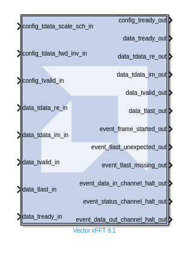
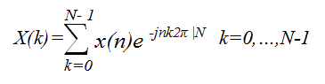
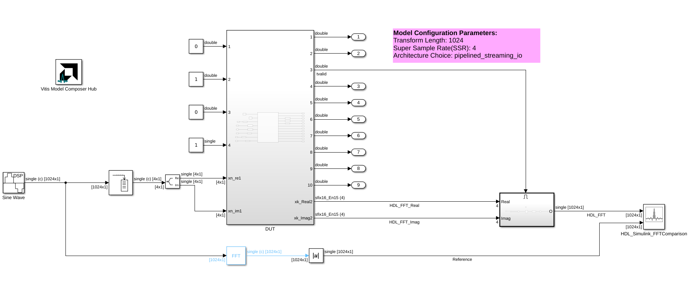
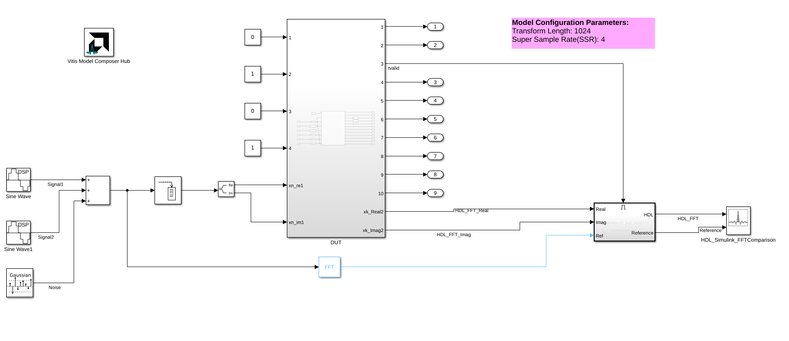

# Vector xFFT 9.1

The Vector xFFT 9.1 block is functionally equivalent to the
FastFourierTransform 9.1 block and implements the Cooley-Tukey FFT
algorithm, a computationally efficient method for calculating the
Discrete Fourier Transform (DFT). It is provided for vector data
processing to reduce the number of input ports when SSR > 1, while
retaining an AXI4-Stream-compliant interface.

## Library

HDL/SSR/DSP/AXI-S

## Description

The block has an AXI4-Stream–compliant interface. Real and imaginary
samples are presented on the DATA input channel; for `SSR = N`, the
channel is split into `N` parallel real/imaginary lane pairs (see
[AXI Ports](#axi-ports-that-are-unique-to-this-block) below). The
`data_tvalid_in` signal indicates that the lanes hold a valid input
sample on the current clock; `data_tvalid_out` indicates a valid output
sample. There is no back-pressure flow control on the data path: once
an FFT transform starts, `N` complex samples must be supplied on each
of the `SSR` lane pairs every clock for `N/SSR` consecutive clocks,
where `N` is the FFT length.

For back-to-back transforms, the valid control input can remain high
without gaps. Per-rank scaling is controlled by `config_tdata_scale_sch`
on the CONFIG input channel; overflow is reported (when **Scaling
Options** is set to *Scaled*) on the `event_*` output channel and the
`OVFLO` field.

The FFT computes an `N`-point forward DFT or inverse DFT (IDFT) where
`N = 2^m`, `m = 3..16`. For fixed-point inputs, each input sample is a
pair of `bₓ`-bit two's-complement values (one for the real and one for
the imaginary component), where `bₓ` is in the range 8 to 34 bits,
inclusive. The phase factors `bw` can likewise be 8 to 34 bits wide.

For single-precision floating-point inputs (enable via **Native
Floating Point Data Format**), each input sample is a pair of 32-bit
IEEE-754 floats and the phase factors are 24- or 25-bit fixed-point
numbers.

## Theory of Operation

The FFT is a computationally efficient algorithm for computing a
Discrete Fourier Transform (DFT) of sample sizes that are a positive
integer power of 2. The DFT of a sequence is defined as:

  

  

where N is the transform length and j is the square root of -1. The
inverse DFT (IDFT) is defined as:

  

  

## AXI Ports that are Unique to this Block

This System Generator block exposes the AXI CONFIG channel as a group of
separate ports based on sub-field names. The sub-field ports are
described as follows:

Configuration Channel Input Signals:

|                        |                                                                                                                                                                                                                                                                                                                          |
|------------------------|--------------------------------------------------------------------------------------------------------------------------------------------------------------------------------------------------------------------------------------------------------------------------------------------------------------------------|
| config_tdata_scale_sch | A sub-field port that represents the Scaling Schedule field in the Configuration Channel vector. Refer to the document Fast Fourier Transform LogiCORE IP Product Guide ([PG109](https://docs.amd.com/r/en-US/pg109-xfft)) for an explanation of the bits in this field.              |
| config_tdata_fwd_inv   | A sub-field port that represents the Forward Inverse field in the Configuration Channel vector. Refer to the document Fast Fourier Transform LogiCORE IP Product Guide ([PG109](https://docs.amd.com/r/en-US/pg109-xfft)) for an explanation of the bits in this field.               |
| config_tdata_nfft      | A sub-field port that represents the Transform Size (NFFT) field in the Configuration Channel vector. Refer to the document Fast Fourier Transform LogiCORE IP Product Guide ([PG109](https://docs.amd.com/r/en-US/pg109-xfft)) for an explanation of the bits in this field.         |
| config_tdata_cp_len    | A sub-field port that represents the Cyclic Prefix Length (CP_LEN) field in the Configuration Channel vector. Refer to the document Fast Fourier Transform LogiCORE IP Product Guide ([PG109](https://docs.amd.com/r/en-US/pg109-xfft)) for an explanation of the bits in this field. |

Notes on the table above:
- `config_tdata_nfft` appears only when **Run Time Configurable Transform Length** is enabled.
- `config_tdata_cp_len` appears only when **Cyclic Prefix Insertion** is enabled.

This HDL block exposes the AXI DATA channel as separate ports based on
the real and imaginary sub-field names. With **Display shortened port
names** (`trim_axipin_name`) checked, port labels are abbreviated as
shown below; with it unchecked, the full AXI-stream names
(`s_axis_data_…`, `m_axis_data_…`) are displayed.

For `SSR = 1`, the data channel exposes a single re/im pair. For
`SSR = N > 1`, the channel is vectorized into `N` parallel lane pairs
named `data_tdata_vect<i>_xn_re_in` / `data_tdata_vect<i>_xn_im_in` (and
`..._out`) for `i = 0 … N−1`, plus a common `data_tvalid` / `data_tready`
/ `data_tlast` handshake.

DATA Channel Input Signals:

|                  |                                                                                                                                                                                                                                                                                                                                                                                                                                                                                          |
|------------------|----------------------------------------------------------------------------------------------------------------------------------------------------------------------------------------------------------------------------------------------------------------------------------------------------------------------------------------------------------------------------------------------------------------------------------------------------------------------------------------|
| data_tdata_re_in | Real component of an input data sample. The driving signal must be a signed type of width `S` with the binary point at `S-1`, where `S` is between 8 and 34, inclusive (e.g., `Fix_8_7`, `Fix_34_33`). `re_in` and `im_in` must share the same type. For `SSR > 1`, this becomes `data_tdata_vect<i>_xn_re_in` for each lane `i`. Refer to [PG109](https://docs.amd.com/r/en-US/pg109-xfft) for an explanation of the bits in this field. |
| data_tdata_im_in | Imaginary component of an input data sample. Same type rules as `data_tdata_re_in`. For `SSR > 1`, this becomes `data_tdata_vect<i>_xn_im_in` for each lane `i`.                                                                                                                                                                                                                                                                                                                       |
| data_tvalid_in   | Asserted by the source to indicate that the current re/im lane samples are valid. There is no flow control on the data path — once a transform begins, valid must remain asserted for `N/SSR` consecutive cycles.                                                                                                                                                                                                                                                                       |
| data_tlast_in    | Marks the last sample of a frame on the input channel.                                                                                                                                                                                                                                                                                                                                                                                                                                   |
| data_tready_in   | Allows the downstream block to back-pressure the output data channel.                                                                                                                                                                                                                                                                                                                                                                                                                    |
| aclken_in        | Optional clock-enable input. Present only when **ACLKEN** is checked.                                                                                                                                                                                                                                                                                                                                                                                                                    |
| aresetn_in       | Optional active-low synchronous reset input. Present only when **ARESETn** is checked. Must be asserted for at least two cycles.                                                                                                                                                                                                                                                                                                                                                         |

DATA Channel Output Signals:

|                                |                                                                                                                                                                                                                |
|--------------------------------|----------------------------------------------------------------------------------------------------------------------------------------------------------------------------------------------------------------|
| data_tdata_re_out              | Real component of an output transform sample. For `SSR > 1`, becomes `data_tdata_vect<i>_xn_re_out` per lane.                                                                                                  |
| data_tdata_im_out              | Imaginary component of an output transform sample. For `SSR > 1`, becomes `data_tdata_vect<i>_xn_im_out` per lane.                                                                                             |
| data_tdata_xk_index_out        | Sample-index output. Present only when **XK_INDEX** is checked. See the parameter description for ordering semantics.                                                                                          |
| data_tdata_ovflo_out           | Per-frame overflow flag. Present only when **OVFLO** is checked (and **Scaling Options** is *Scaled*).                                                                                                         |
| data_tvalid_out                | Asserted while transform output samples are present on the re/im lanes.                                                                                                                                        |
| data_tlast_out                 | Marks the last sample of an output frame.                                                                                                                                                                      |
| data_tready_out                | Indicates the core is ready to accept input samples.                                                                                                                                                           |
| config_tready_out              | Indicates the core has consumed the CONFIG channel word.                                                                                                                                                       |

Event Output Signals (always present):

|                                       |                                                                                                                                            |
|---------------------------------------|--------------------------------------------------------------------------------------------------------------------------------------------|
| event_frame_started_out               | Pulses high at the start of an output frame.                                                                                               |
| event_tlast_unexpected_out            | Asserted if an unexpected `tlast` was seen on the input channel.                                                                            |
| event_tlast_missing_out               | Asserted if `tlast` was not asserted on the expected final sample.                                                                          |
| event_data_in_channel_halt_out        | Asserted when the input data channel is halted (handshake stall).                                                                          |
| event_status_channel_halt_out         | Asserted when the status channel is halted.                                                                                                |
| event_data_out_channel_halt_out       | Asserted when the output data channel is halted by downstream back-pressure.                                                               |

## Parameters

### Basic tab  
Parameters specific to the Basic tab are as follows.

#### Transform Length  
##### Transform_length  
One of N = 2^((3..16)) = 8 - 65536.

#### Architecture Configuration  
##### Target Clock Frequency(MHz)  
Enter the target clock frequency.

##### Target Data Throughput(MSPS)  
Enter the target throughput.

##### Architecture Choice  
Choose one of the following.

- automatically_select
- pipelined_streaming_io
- radix_4_burst_io
- radix_2_burst_io
- radix_2_lite_burst_io

#### Transform Length Options  
Run Time Configurable Transform Length  
The transform length can be set through the nfft port if this option is
selected. Valid settings and the corresponding transform sizes are
provided in the section titled Transform Size in the associated document
Fast Fourier Transform LogiCORE IP Product Guide
([PG109](https://docs.amd.com/r/en-US/pg109-xfft)).

### Advanced tab  
Parameters specific to the Advanced tab are as follows.

#### Super Sample Rate (SSR)
The number of parallel re/im lane pairs on the data channel. SSR must
be a power of two (1, 2, 4, 8, 16, 32, or 64). With `SSR = N > 1`,
the input and output data sub-fields are vectorized into `N` lanes
(see [AXI Ports](#axi-ports-that-are-unique-to-this-block)).

#### Native Floating Point Data Format
Checkbox (`enable_ssr` in the mask). When enabled, input samples are
interpreted as pairs of 32-bit IEEE-754 floats and phase factors as
24- or 25-bit fixed-point numbers. When disabled, samples are
fixed-point with the precision controlled by the input signal types
and **Phase Factor Width**.

#### Precision Options
##### Phase Factor Width
Choose a value between 8 and 34, inclusive to be used as bit widths for
phase factors.

#### Scaling Options
Select between Unscaled, Scaled, and Block Floating Point output data
types.

#### Rounding Modes
Applied at the output of each rank when **Scaling Options** is *Scaled*.

- *Truncation* — drop fractional bits.
- *Convergent Rounding* — round half to even.

#### Control Signals
##### ACLKEN
Enables the clock enable (`aclken_in`) pin on the core. All registers in
the core are enabled by this control signal.

##### ARESETn
Active-low synchronous clear input (`aresetn_in`) that always takes
priority over ACLKEN. A minimum ARESETn active pulse of two cycles is
required, since the signal is internally registered for performance. A
pulse of one cycle resets the core, but the response to the pulse is
not in the cycle immediately following.

#### Output Ordering
Choose between Bit/Digit Reversed Order or Natural Order output.
(Bit-reversed for radix-2 architectures, digit-reversed for radix-4.)

#### Cyclic Prefix Insertion
Cyclic prefix insertion takes a section of the output of the FFT and
prefixes it to the beginning of the transform. The resultant output data
consists of the cyclic prefix (a copy of the end of the output data)
followed by the complete output data, all in natural order. Cyclic
prefix insertion is only available when **Output Ordering** is set to
*Natural Order*.

When cyclic prefix insertion is used, the length of the cyclic prefix
can be set frame-by-frame without interrupting frame processing. The
cyclic prefix length can be any number of samples from zero to one less
than the point size. The cyclic prefix length is set by the CP_LEN field
in the Configuration channel. For example, when N = 1024, the cyclic
prefix length can be from 0 to 1023 samples, and a CP_LEN value of
0010010110 produces a cyclic prefix consisting of the last 150 samples
of the output data.

#### Throttle Schemes  
Select the tradeoff between performance and data timing requirements.

##### Real Time  
This mode typically gives a smaller and faster design, but has strict
constraints on when data must be provided and consumed.

##### Non Real Time  
This mode has no such constraints, but the design might be larger and
slower.

#### Optional Output Fields  
##### XK_INDEX  
The XK_INDEX field (if present in the Data Output channel) gives the
sample number of the XK_RE/XK_IM data being presented at the same time.
In the case of natural order outputs, XK_INDEX increments from 0 to
(point size) -1. When bit reversed outputs are used, XK_INDEX covers the
same range of numbers, but in a bit (or digit) reversed manner.

##### OVFLO  
The Overflow (OVFLO) field in the Data Output and Status channels is
only available when the Scaled arithmetic is used. OVFLO is driven High
during unloading if any point in the data frame overflowed.

For a multichannel core, there is a separate OVFLO field for each
channel. When an overflow occurs in the core, the data is wrapped rather
than saturated, resulting in the transformed data becoming unusable for
most applications

#### Block Icon Display  
##### Display shortened port names  
On by default. When unchecked, data_tvalid, for example, becomes
m_axis_data_tvalid.

### Implementation tab  
Parameters specific to the Implementation tab are as follows.

#### Memory Options  
##### Data  
Option to choose between Block RAM and Distributed RAM. This option is
available only for sample points 8 through 1024. This option is not
available for Pipelined Streaming I/O implementation.

##### Phase Factors  
Choose between Block RAM and Distributed RAM. This option is available
only for sample points 8 till 1024. This option is not available for
Pipelined Streaming I/O implementation.

##### Number Of Stages Using Block RAM  
Store data and phase factor in Block RAM and partially in Distributed
RAM. This option is available only for the Pipelined Streaming I/O
implementation.

##### Reorder Buffer  
Choose between Block RAM and Distributed RAM up to 1024 points transform
size.

##### Hybrid Memories  
Click check box to Optimize Block RAM Count Using Hybrid Memories.

#### Optimize Options  
##### Complex Multipliers  
Choose one of the following.

- Use CLB logic
- Use 3-multiplier structure (resource optimization)
- Use 4-multiplier structure (performance optimization)

##### Butterfly Arithmetic  
Choose one of the following:

- Use CLB logic
- Use XTremeDSP Slices

Other parameters used by this block are explained in the topic [Common
Options in Block Parameter Dialog
Boxes](../../GEN/common-options/README.md).

## Block Timing

To better understand the FFT blocks control behavior and timing, please
consult the core data sheet.

## Examples

***Click on the images below to open each model.***

## LogiCORE Documentation

Fast Fourier Transform LogiCORE IP Product Guide
([PG109](https://docs.amd.com/r/en-US/pg109-xfft))

Floating-Point Operator LogiCORE IP Product Guide
([PG060](https://docs.amd.com/v/u/en-US/pg060-floating-point))

--------------
Copyright (C) 2026 Advanced Micro Devices, Inc.
All rights reserved.

SPDX-License-Identifier: MIT
