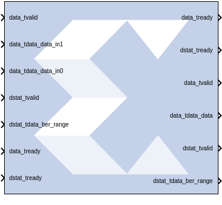

# Viterbi Decoder 9.1

Note: This block goes into the FPGA fabric and is a Licensed Core.
Please visit the Xilinx web site to purchase the appropriate core
license.

Data encoded with a convolution encoder can be decoded using the
Viterbi decoder block. This block adheres to the AXI4-Stream standard.

## Description

There are two steps to the decode process. The first weighs the cost of
incoming data against all possible data input combinations; either a
Hamming or Euclidean metric can be used to determine the cost. The
second step traces back through the trellis and determines the optimal
path. The length of the trace through the trellis can be controlled by
the traceback length parameter.

The decoder achieves minimal error rates when using optimal convolution
codes; the table below shows various optimal codes. For correct
operation, convolution codes used for encoding must match with that for
decoding.

| Constraint Length | Optimal Convolution Codes for 1/2 rate (octal) | Optimal Convolution Codes for 1/3 Rate (octal) |
|:-----------------:|:----------------------------------------------:|:----------------------------------------------:|
|         3         |                    \[7 5\]                     |                   \[7 7 5\]                    |
|         4         |                   \[17 13\]                    |                  \[17 13 15\]                  |
|         5         |                   \[37 33\]                    |                  \[37 33 25\]                  |
|         6         |                   \[57 65\]                    |                  \[57 65 71\]                  |
|         7         |                  \[117 127\]                   |                \[117 127 155\]                 |
|         8         |                  \[357 233\]                   |                \[357 233 251\]                 |
|         9         |                  \[755 633\]                   |                \[755 633 447\]                 |

### Block Interface

The Viterbi Decoder 9.1 block is AXI4 compliant. The following
describes the standard AXI channels and pins on the interface.

#### S_AXIS_DATA Channel  
##### s_axis_data_tvalid  
TVALID for S_AXIS_DATA channel. Input pin, always available. This port
indicates the values presents on the input data ports are valid.

##### s_axis_data_tready  
TREADY for S_AXIS_DATA. Output pin, always available. This port
indicates that the core is ready to accept data.

##### s_axis_data_tdata  
Input TDATA. Different input data ports are available depending on the
Viterbi Type selected on Page1 tab of the Block Parameters dialog box.

When Trellis Mode is selected, 5 input data pins become available –
these are s_axis_data_tdata_tcm00, s_axis_data_tdata_tcm01,
s_axis_data_tdata_tcm10, s_axis_data_tdata_tcm11 and
s_axis_data_tdata_sector.

The width of the Trellis mode inputs (s_axis_data_tdata_tcm\*\*) can
range from 4 to 6 corresponding to a data width (Soft_Width value on
Page2 tab) of 3 to 5. s_axis_data_tdata_sector is always 4-bit wide. The
decoder always functions as a rate 1/2 decoder when Trellis mode is
selected.

For any other Viterbi Type (Standard/Multi-Channel/Dual Decoder), the
Decoder supports rates from 1/2 to 1/7. Therefore, the block can have 2
to 7 input data ports labeled s_axis_data_tdata_data_in0 …-
s_axis_data_tdata_data_in6. Hard Coding requires each tdata_data_in\<n\>
port to be 1 bit wide. Soft Coding allows these widths to be between 3
to 5 bits (inclusive).

##### s_axis_data_tuser  
TUSER for S_AXIS_DATA. These ports are only present if External
Puncturing is selected or it is a Dual Decoder or Block Valid signal is
used with the core.

###### s_axis_data_tuser_erase  
Port becomes available, when External Puncturing is selected (on Page2
tab). This input bus is used to indicate the presence of a null-symbol
on the corresponding data_in buses. For e.g. tuser_erase(0) corresponds
to data_in0, tuser_erase(1) corresponds to data_in1 etc. If an erase bit
is high, the data on the corresponding data_in bus is treated as a
null-symbol internally to the decoder. The width of the erase bus is
equal to the output rate of the decoder with a maximum value of 7.

###### s_axis_data_tuser_sel  
Port becomes available when Dual Decoder is selected. This is used to
select the correct set of convolution codes for the decoding of the
input data symbols in the dual decoder case. When SEL is low, the input
data is decoded using the first set of convolution codes. When it is
high, the second set of convolution codes is applied.

###### s_axis_data_tuser_block_in  
Port becomes available when Block Valid option is selected on Page 5
tab.

#### M_AXIS_DATA Channel  
m_axis_data_tvalid  
TVALID for M_AXIS_DATA channel. Output pin, always available. It
indicates whether the output data is valid or not.

##### m_axis_data_tready  
TREADY for M_AXIS_DATA channel. Do not enable or tie high if downstream
slave is always able to accept data. It becomes available when TREADY
option is selected on Page 5 tab.

##### m_axis_data_tdata  
Decoded TDATA for output data channel.

##### m_axis_data_tdata_data  
Port represents the decoded output data and it is always 1 bit wide.

###### m_axis_data_tdata_sector  
Port becomes available for Trellis Mode decoder. This port is always
4-bit wide. The output SECTOR is a delayed version of the input SECTOR
bus. Both buses have a fixed width of 4 bits. The delay equals the delay
through the Trellis Mode decoder.

##### m_axis_data_tuser  
TUSER for M_AXIS_DATA channel. These ports are only present if the block
is a Dual Decoder or it has normalization signal present or it has Block
Valid option checked.

###### m_axis_data_tuser_sel  
Port becomes available when the block is configured as a Dual Decoder.
This signal is a delayed version of the input s_axis_data_tuser_sel
signal. The delay equals to the delay through the Dual Decoder.

###### m_axis_data_tuser_norm  
Port becomes available when NORM option is checked on Page 5 tab. This
port indicates when normalization has occurred within the core. It gives
an immediate indication of the rate of errors in the channel.

###### m_axis_data_tuser_block_out  
Port becomes available when Block Valid option is checked on Page 5 tab.
This signal is a delayed version of the input s_axis_data_tuser_block_in
signal. The BLOCK_OUT signal shows the decoded data corresponding to the
original BLOCK_IN set of data points. The delay equals the delay through
the decoder.

#### S_AXIS_DSTAT Channel  
**Note**: These ports become available when Use BER Symbol Count is selected
on Page 5 tab.

##### s_axis_dstat_tvalid  
TVALID for S_AXIS_DSTAT channel.

##### s_axis_dstat_tready  
TREADY for S_AXIS_DSTAT channel. Indicates that the core is ready to
accept data. Always high, except after a reset if there is not a TREADY
on the output.

##### s_axis_dstat_tdata_ber_range  
TDATA for S_AXIS_DSTAT channel. This is the number of symbols over which
errors are counted in the BER block.

#### M_AXIS_DSTAT Channel  
**Note**: These ports become available when Use BER Symbol Count is selected
on Page 5 tab.

##### m_axis_dstat_tvalid  
TVALID for M_AXIS_DSTAT channel.

##### m_axis_dstat_tready  
TREADY for M_AXIS_DSTAT channel. Do not enable or tie high if downstream
slave is always able to accept data. It becomes available when TREADY
option is selected on Page 5 tab.

##### m_axis_dstat_tdata_ber  
TDATA for M_AXIS_DSTAT channel. The Bit Error Rate (BER) bus output
(fixed width 16) gives a measurement of the channel bit error rate by
counting the difference between the re-encoded DATA_OUT and the delayed
DATA_IN to the decoder.

#### Other Optional Pins  
##### aresetn  
The synchronous reset (aresetn) input can be used to re-initialize the
core at any time, regardless of the state of aclken signal. aresetn
needs to be asserted low for at least two clock cycles to initialize the
circuit. This pin becomes available if ARESETN option is selected on the
Page 5 tab. It must be of type Bool. If this pin is not selected, Model
Composer ties this pin to inactive (high) on the core.

##### aclken  
Carries the clock enable signal for the decoder. The signal driving
aclken must be `Bool`. This pin becomes available if ACLKEN option is
selected on Page 5 tab.

## Parameters

### Page1 tab  
Parameters specific to the Page1 tab are as follows.
#### Viterbi Type  
##### Number of Channels  
Used with the Muli-Channel selection, the number of channels to be
decoded can be any value between 2 and 32.

##### Standard  
This type is the basic Viterbi Decoder.

##### Multi-Channel  
This type allows many interlaced channels of data to be decoded using a
single Viterbi Decoder.

##### Trellis Mode  
This type is a trellis mode decoder using the TCM and SECTOR_IN inputs.

##### Dual Decoder  
When selected, the block behaves as a dual decoder with two sets of
convolutional codes. This makes the sel input port available.

#### Decoder Options  
##### Use Reduced Latency  
The latency of the block depends on the traceback length and the
constraint length. If this reduced latency option is selected, then the
latency of the block is approximately halved and the latency is only 2
times the traceback length.

##### Constraint length  
Equals n+1, where n is the length of the constraint register in the
encoder.

##### Traceback length  
Length of the traceback through the Viterbi trellis. Optimal length is 5
to 7 times the constraint length.

### Page2 tab  
#### Architecture  
##### Parallel  
Large but fast Viterbi Decoder.

##### Serial  
Small but processes the input data in a serial fashion. The number of
clock cycles needed to process each set of input symbols depends on the
output rate and the soft width of the data.

#### Best State  
##### Use Best State  
Gives improved BER performance for highly punctured data.

##### Best State Width  
Indicates how many of the least significant bits to ignore when saving
the cost used to determine the best state.

#### Puncturing  
##### None  
Input data has not been punctured.

##### External (Erased Symbols)  
When selected an erase port is added to the block. The presence of
null-symbols (that is, symbols which have been deleted prior to
transmission across the channel) is indicated using the erasure input
erase.

#### Coding  
##### Soft Width  
The input width of soft-coded data can be anything in the range 3 to 5.
Larger widths require more logic. If the block is implemented in serial
mode, larger soft widths also increase the serial processing time.

##### Soft Coding  
Uses the Euclidean metric to cost the incoming data against the branches
of the Viterbi trellis.

##### Hard Coding  
Uses the Hamming difference between the input data bits and the branches
of the Viterbi trellis. Hard coding is only available for the standard
parallel block.

#### Data Format  
##### Signed Magnitude  

##### Offset Binary (available for soft coding only)  

See Table 1 in the associated LogiCORE™ Product Specification for the
Signed Magnitude and Offset-Binary data format for Soft Width 3.

### Page3 tab  
#### Convolution 0  
##### Output Rate 0  
Output Rate 0 can be any value from 2 to 7.

##### Convolution Code 0 Radix  
The convolutional codes can be input and viewed in binary, octal, or
decimal.

##### Convolution Code Array (0-6)  
First array of convolution codes. Output rate is derived from the array
length. Between 2 and 7 (inclusive) codes can be entered. When dual
decoding is used, a value of 0 (low) on the sel port corresponds to this
array.

### Page4 tab  
The options on this tab are activated when you select Dual Decoder as
the Viterbi Type on the Page1 tab.

#### Convolution 1  
##### Output Rate 1  
Output Rate 1 can be any value from 2 to 7. This is the second output
rate used if the decoder is dual. The incoming data is decoded at this
rate when the SEL input is high. Output Rate 1 is not used for the
non-dual decoder.

##### Convolution Code 1 Radix  
The convolutional codes can be input and viewed in binary, octal, or
decimal.

### Page5 tab  
#### BER Options  
##### Use BER Symbol Count  
This bit-error-rate (BER) option monitors the error rate on the
transmission channel.

#### Optional Pins  
##### NORM  
Indicates when normalization has taken place internal to the Add Compare
Select module.

##### Block Valid  
Check this box if BLOCK_IN and BLOCK_OUT signals are required. These
signals track the movement of a block of data through the decoder.
BLOCK_OUT corresponds to BLOCK_IN delayed by the decoder latency.

##### TREADY  
Selecting this option makes m_axis_data_tready and m_axis_dstat_tready
pins available on the block.

##### ACLKEN  
Carries the clock enable signal for the block The signal driving aclken
must be Bool.

##### ARESETN  
Adds a aresetn pin to the block. This signal resets the block and must
be of type Bool. aresetn must be asserted low for at least 2 clock
periods and at least 1 sample period before the decoder can start
decoding code symbols.

Common Parameters used by this block, such as Display shortened port
names, are explained in the topic [Common Options in Block Parameter
Dialog
Boxes](../../GEN/common-options/README.md).

## LogiCORE™ Documentation

Viterbi Decoder LogiCORE IP Product Guide
([PG027](https://docs.xilinx.com/access/sources/ud/document?isLatest=true&url=pg027_viterbi_decoder&ft:locale=en-US))

--------------
Copyright (C) 2023 Advanced Micro Devices, Inc. All rights reserved.
SPDX-License-Identifier: MIT
