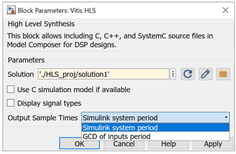

# Vitis HLS

The Vitis™ HLS block allows the functionality of a Vitis HLS
design to be included in a Model Composer design. The Vitis HLS design
can include C, C++ and System C design sources.

## Description

There are two steps to the method of including a Vitis HLS design into
Model Composer. The first step is to use the Vitis HLS RTL Packaging
feature to package the design files into a Solution directory. (Refer to
Vitis HLS documentation for more information regarding RTL Packaging.)
The second step is to place the Vitis HLS block in your Model Composer
design and specify the Vitis HDL Solution directory as the target.

## Parameters

#### Solution  
The path to the Solution space directory containing RTL packaged for
Model Composer. This path is usually the path to a directory contained
in a Vivado® HLS project. The path must be included in single quotes and
must evaluate to a string.

#### Browse  
A standard directory browse button.

#### Refresh  
Updates the block ports to the latest package contained in the solution
space.

#### Edit  
Opens the Vitis HLS project associated with solution space.

#### Use C simulation model if available  
Use the C simulation model if it is available in the Vitis HLS package.
As shown below, the simulation model being used is shown on the Vitis
HLS block. In this case, an RTL-model is used because a C simulation
model is not available.

#### Display signal types  
Signal types to be used to drive input ports and emanating from output
ports are displayed on the block icon when checked.

#### Output Sample Times  
Select either the Simulink system period or the GCD of the inputs
period.

## Data Type Translation

| Data Type Translation |                                  |
|-----------------------|----------------------------------|
| C/C++ Data Type       | Model Composer Data Type         |
| float                 | XFloat_32_23                     |
| double                | XFloat_64_52                     |
| bool                  | UFix_1_0                         |
| (unsigned) char       | (U)Fix_8_0                       |
| (unsigned) short      | (U)Fix_16_0                      |
| (unsigned) int        | (U)Fix_32_0                      |
| (unsigned) long       | (U)FIX\_\<PlatformDependent\>\_0 |
| (unsigned) long long  | (U)Fix_64_0                      |
| ap\_(u)fix\<N,M\>     | (U)Fix\_\<N\>\_\<N-M\>           |
| ap\_(u)int\<N\>       | (U)Fix_N_0                       |

## Known Issues

- It is not possible to include a purely combinational design from Vitis
  HLS. The design must synthesize into an RTL design that contains a
  Clock and a Clock Enable input.
- The top-level module cannot contain C/C++ templates.
- Composite ports will be represented as UFix\_\<N\>\_0 only where N is
  the width of the port.
- The current C simulation model only supports fixed latency and
  interval designs. The latency and interval numbers are obtained from
  the synthesis engine.
- The current C simulation model supports the default block-level
  communication protocol (ap_hs).
- The current C simulation model does not support the ‘ap_memory’ and
  ‘ap_bus’ interfaces.
- Vitis HLS block does not support combinational designs due to
  performance considerations. In the current implementation, Model
  Composer updates each HLS input port multiple times every clock cycle.
  So it is very costly to evaluate the DUT whenever inputs changes.
- The output values match RTL simulation results only when corresponding
  control signals indicate data are valid. So test bench and downstream
  blocks should read/observe data based on the communication protocol
  and control signals.
- Because the Vitis HLS block has to use the GCC shipped in the Vivado
  Design Suite to compile dll on Win-64 platform, users cannot use
  arbitrary bitwidth integers in C designs on win-64 systems.

--------------
Copyright (C) 2024 Advanced Micro Devices, Inc.
All rights reserved.
