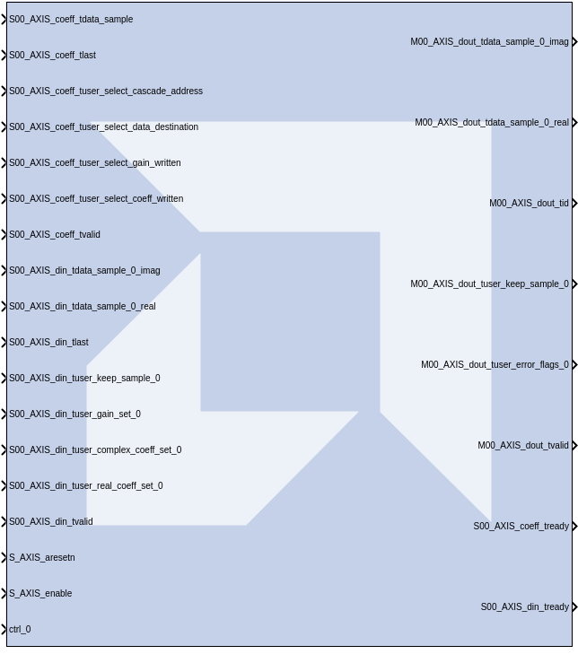

# Versal RF Channelizer

The Versal RF Channelizer block simulates the hardened Channelizer IP block from Versal RF devices.

**This block is provided as Early Access functionality in 2026.1 for the purpose of gathering customer feedback. For more information, refer to the [Versal RF Series Tools Early Access Secure Site](https://account.amd.com/en/member/versal-rf-tools-ea.html).**

## Parameters

<!--
#### Operating Mode
-->

<!--
#### Input Sample Rate
-->

<!--
#### Number of Instances
-->

<!--
#### Select the FFT Direction
-->

<!--
#### Enable the syncing of FFT when DIN tlast is received
-->

<!--
#### Selects the FIR Coefficient Type
-->

<!--
#### Max Number of Taps per Channel for the FIR
-->

<!--
#### Enable Gain Stage
-->

<!--
#### Enable Event Port
-->

<!--
#### Enable Coefficient Cascade
-->

<!--
#### Number of Taps set in FIR 0
-->

<!--
#### Number of Taps set in FIR 1
-->

<!--
#### Number of Taps set in FIR 2
-->

<!--
#### Number of Taps set in FIR 3
-->

--------------
Copyright (C) 2026 Advanced Micro Devices, Inc.
All rights reserved.

SPDX-License-Identifier: MIT
