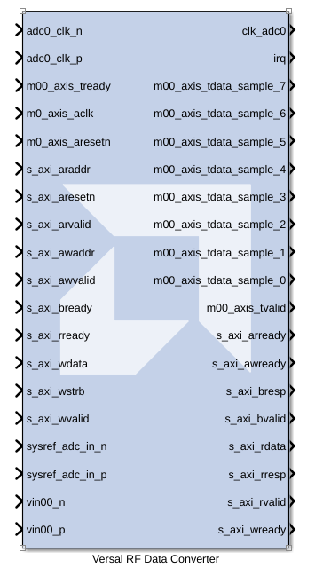

# Versal RF Data Converter

The Versal RF Data Converter block simulates the hardened Data Converter IP block from Versal RF devices.

**This block is provided as Early Access functionality in 2026.1 for the purpose of gathering customer feedback. For more information, refer to the [Versal RF Series Tools Early Access Secure Site](https://account.amd.com/en/member/versal-rf-tools-ea.html).**

## Parameters

<!--
#### Enable Multi Tile Sync
-->

<!--
#### Band
-->

<!--
#### Link Coupling
-->

<!--
#### Enable ADC
-->

<!--
#### Invert Q Output
-->

<!--
#### Dither
-->

<!--
#### Latency Mode
-->

<!--
#### Enable TDD Real Time Ports
-->

<!--
#### Datapath Mode
-->

<!--
#### Digital Output Data
-->

<!--
#### Decimation Mode
-->

<!--
#### Samples per AXI4-Stream Cycle
-->

<!--
#### Enable ADC Observation Channel Ports
-->

<!--
#### First Stage DDC Decimation
-->

<!--
#### Frequency
Specifies the frequency, either in Hertz or radians. The default is 1.
-->

<!--
#### Mixer Type
-->

<!--
#### Mixer Mode
This specifies the mixer operation modes. Two modes are supported by the Mixer function:
-->

<!--
#### NCO Frequency DDC0 (GHz)
-->

<!--
#### NCO Phase
-->

<!--
#### NCO Frequency DDC1 (GHz)
-->

<!--
#### NCO Phase NC01
-->

<!--
#### Nyquist Zone
-->

<!--
#### Calibration Mode
-->

<!--
#### Output Power
-->

<!--
#### Enable DAC
-->

<!--
#### Inverse Sinc Filter
-->

<!--
#### Analog Output Data
-->

<!--
#### Interpolation Mode
-->

<!--
#### NCO Frequency DUC0 (GHz)
-->

<!--
#### NCO Frequency DUC1 (GHz)
-->

<!--
#### Second Stage DUC Interpolation
-->

<!--
#### Decoder Mode
-->

<!--
#### AXI4-Lite Clock (MHz)
-->

<!--
#### Channelizer Enable
-->

<!--
#### Position
-->

<!--
#### Coefficient Initilization File
-->

<!--
#### Coefficient Initialization File
-->

<!--
#### Enable Real Time Ports
-->

<!--
#### Enable Cal Freeze Ports
-->

<!--
#### Enable Real Time NCO Ports
-->

<!--
#### Auto Cal Freeze
-->

<!--
#### ADC Sysref Source
-->

<!--
#### Enable Real Time Variable Output Power Ports
-->

<!--
#### DAC Sysref Source
-->

<!--
#### Sampling Rate (GSPS)
-->

<!--
#### Max Fs (GSPS)
-->

<!--
#### Reference Clock (MHz)
-->

<!--
#### PLL Ref Clock (MHz)
-->

<!--
#### Ref Clock Divider
-->

<!--
#### Fabric Clock (MHz)
-->

<!--
#### Clock Out (MHz)
-->

<!--
#### Clock Source
-->

<!--
#### Distribute Clock
-->

--------------
Copyright (C) 2026 Advanced Micro Devices, Inc.
All rights reserved.

SPDX-License-Identifier: MIT
