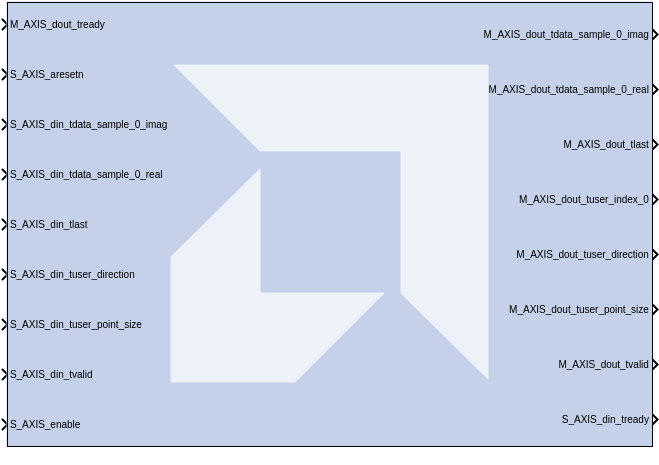

# Versal RF FFT

The Versal RF FFT block simulates the hardened FFT IP block from Versal RF devices.

**This block is provided as Early Access functionality in 2026.1 for the purpose of gathering customer feedback. For more information, refer to the [Versal RF Series Tools Early Access Secure Site](https://account.amd.com/en/member/versal-rf-tools-ea.html).**

## Parameters

<!--
#### Super Sample Rate
-->

<!--
#### Maximum FFT Point Size
-->

<!--
#### Enable FFT Scaling
-->

<!--
#### Enable FFT Reordering
-->

<!--
#### Data Width In
-->

<!--
#### Data Width Out
-->

<!--
#### Enable Event Port
-->

--------------
Copyright (C) 2026 Advanced Micro Devices, Inc.
All rights reserved.

SPDX-License-Identifier: MIT
