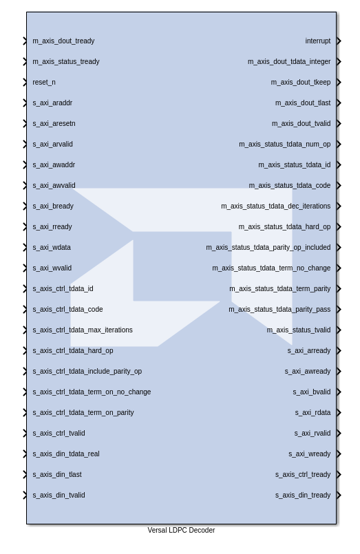

# Versal LDPC Decoder

The Versal LDPC decoder block simulates the hardened LDPC IP block from Versal RF devices.

**This block is provided as Early Access functionality in 2025.2 for the purpose of gathering customer feedback. For more information, refer to the [Versal RF Series Tools Early Access Secure Site](https://account.amd.com/en/member/versal-rf-tools-ea.html).**

--------------
Copyright (C) 2025 Advanced Micro Devices, Inc.
All rights reserved.

SPDX-License-Identifier: MIT
