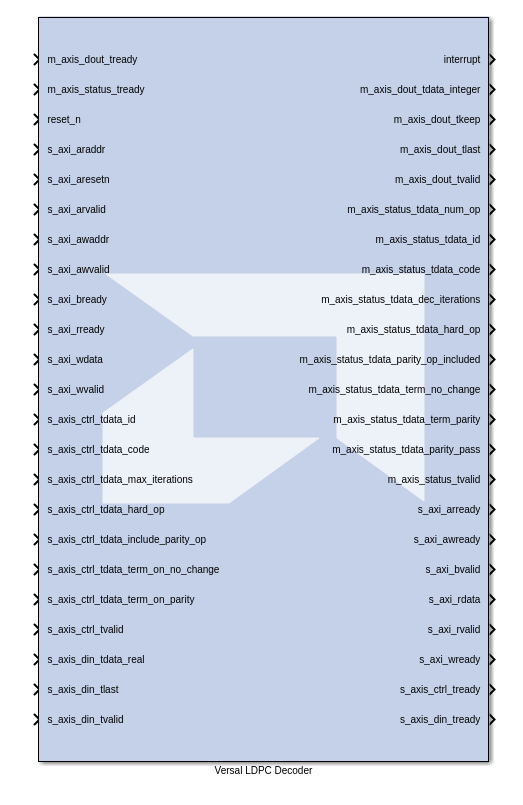

# Versal LDPC Decoder

The Versal LDPC decoder block simulates the hardened LDPC IP block from Versal RF devices.

**This block is provided as Early Access functionality in 2026.1 for the purpose of gathering customer feedback. For more information, refer to the [Versal RF Series Tools Early Access Secure Site](https://account.amd.com/en/member/versal-rf-tools-ea.html).**

## Parameters

#### Standard

Dialog parameter.

#### Algoirthm Source

Dialog parameter.

#### Algorithm Modifier Source

Dialog parameter.

#### Saturation Bits Source

Dialog parameter.

#### Max. Schedule Source

Dialog parameter.

#### Code Definition

Dialog parameter.

#### Enable: use GUI defined values

Dialog parameter.

#### Algorithm

Dialog parameter.

#### Scale/Offset

Dialog parameter.

#### Saturation Bits

Dialog parameter.

#### Max. Schedule

Dialog parameter.

#### Interface

Dialog parameter.

#### Enable I/Fs

Dialog parameter.

#### Interrupts

Dialog parameter.

#### ECC Interrupts

Dialog parameter.

#### Bypass

Dialog parameter.

#### Interface

Dialog parameter.

#### Lanes

Dialog parameter.

#### Word Configuration

Dialog parameter.

#### Number of Words

Dialog parameter.

#### Interface

Dialog parameter.

#### Lanes

Dialog parameter.

#### Word Configuration

Dialog parameter.

#### Number of Words

Dialog parameter.

#### Throughput Utilization

Dialog parameter.

--------------
Copyright (C) 2026 Advanced Micro Devices, Inc.
All rights reserved.

SPDX-License-Identifier: MIT
