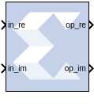
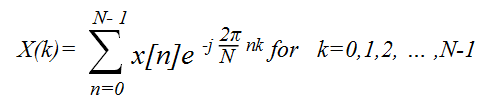
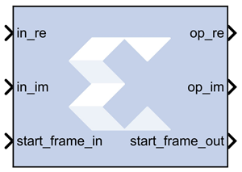
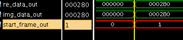

# FFT

The Fast Fourier Transform (FFT) block takes a block of time
domain waveform data and computes the frequency of the sinusoid signals
that make up the waveform.

FFT is a fast implementation of the discrete Fourier transform. The data
of the time domain signal is sampled at discrete intervals. The sampling
frequency is twice the maximum frequency that can be resolved by the
FFT, based on the Nyquist theorem. If a signal is sampled at 1 kHz, the
highest frequency that can be resolved by the FFT is 500 Hz.

f_(s) = f_(max)/2

where f_(max) = maximum resolvable frequency and f_(s) = sampling
frequency.

The duration of the data sample is inversely proportional to the
frequency resolution of the FFT. The longer the sample duration, the
higher the number of data points, and the finer the frequency
resolution. If a signal sampled at f_(s) for twice the duration, the
difference between successive frequency d_(f) is halved, resulting in an
FFT with finer frequency resolution.

d_(f) = 1/T

where d_(f) = frequency resolution of the FFT, and T= total sampling
time.

The number of samples taken over time T is N, so sampling frequency is
N/T samples/sec.

## Description

FFT is a computationally efficient implementation of the Discrete
Fourier Transform (DFT). A DFT is a collection of data points detailing
the correlation between the time domain signal and sinusoids at discrete
frequencies.

The DFT is defined by the following equation:

where N is the transform length, k is used to denote the frequency
domain ordinal, and n is used to represent the time-domain ordinal.

The FFT block is ideal for implementing simple Fourier transforms. If
your FFT implementation will use more complicated transform features
such as an AXI4-Stream-compliant interface, a real time throttle scheme,
Radix-4 Burst I/O, or Radix-2 Lite Burst I/O, use the [Fast
Fourier Transform 9.1](../../HDL/xfft_v9_1/README.md) block in your design
instead of the FFT block.

In the Vivado® design flow, the FFT block is inferred as "LogiCORE IP
Fast Fourier Transform v9.1" for code generation. Refer to the document
LogiCORE IP Fast Fourier Transform
v9.1 [(PG109](https://docs.xilinx.com/access/sources/framemaker/map?isLatest=true&ft:locale=en-US&url=pg109-xfft))
for details on this LogicCore IP.

## Parameters

Parameters specific to the Xilinx FFT block are as follows.

#### Transform Length  
Select the desired point size ranging from 8 to 65536.

#### Scale Result by FFT length  
If selected, data is scaled between FFT stages using a scaling schedule
determined by the Transform Length setting. If not selected, data is
unscaled, and all integer bit growth is carried to the output.

#### Natural Order  
If selected, the output of the FFT block will be ordered in natural
order. If not selected, the output of the FFT block will be ordered in
bit/digit reversed order.

#### Optimize for  
Directs the block to be optimized for either speed (Performance) or area
(Resources) in the generated hardware.

**Note**: If Resources is selected and the input sample period is 8 times
slower than the system sample period, the block implements Radix-2 Burst
I/O architecture. Otherwise, Pipeline Streaming I/O architecture will be
used.

#### Optional Port  
##### Provide start frame port  
Adds start_frame_in and start_frame_out ports to the block. The
signals on these ports can be used to synchronize frames at the input
and output of the FFT block. See [Adding Start Frame Ports to
Synchronize Frames](#adding-start-frame-ports-to-synchronize-frames) for a
description of the operation of these two ports.

## Context Based Pipeline vs Radix Implementation

Pipelined Streaming I/O and Radix-2 Burst I/O architectures are
supported by the FFT block. Radix-4 Burst I/O architecture is
implemented when you select Optimize for: Resources block parameter and
the sample rate of the inputs is 8 times slower than the system rate. In
all other configurations Pipelined Streaming I/O architecture is
implemented by default.

## Input Data Type Support

The FFT block accepts inputs of varying bit widths with changeable
binary point location, such as Fix_16_0 or Fix_30_10, etc. in unscaled
block configuration. For the scaled configuration, the input is
supported in the same format as the [Fast Fourier Transform
9.1](../../HDL/xfft_v9_1/README.md) block. The [Fast Fourier Transform
9.1](../../HDL/xfft_v9_1/README.md) block accepts input values only in the
normalized form in the format of Fix\_x\_\[x-1\] (for example,
Fix_16_15), so the inputs are 2's complement with a single sign/integer
bit.

## Latency Value Displayed on the Block

The latency value depends on parameters selected by the user, and the
corresponding latency value is displayed on the FFT block icon in the
Simulink model.

## Automatic Fixed Point and Floating Point Support

Signed fixed point and floating point data types are supported.

For floating point input, either scaled or unscaled data can be selected
in the FFT block parameters. In the [Fast Fourier Transform
9.1](../../HDL/xfft_v9_1/README.md) block, the floating point data type is
accepted only when the scaled configuration is selected by the user.

## Handling Overflow for Scaled Configuration

The FFT block uses a conservative schedule to avoid overflow scenarios.
This schedule sets the scaling value for the corresponding FFT stages in
a way that makes sure no overflow occurs.

## Adding Start Frame Ports to Synchronize Frames

Selecting Provide start frame port in the FFT block properties dialog
box adds start_frame_in and start_frame_out ports at the input and
output of the FFT block. These ports are used to synchronize frames at
the input and output of the FFT block.

You must provide a valid input at the start_frame_in port. When the
start_frame_in signal is asserted, an impulse is generated at the
start of every frame to signal the FFT block to start processing the
frame. The frame size is the Transform Length entered in the block
parameters dialog box.

The start_frame_out port provides the information as to when the
output frames start. An impulse at the start of every frame on the
output side helps in tracking the block behavior.

The FFT block has a frame alignment requirement and these ports help the
block operate in accordance with this requirement.

The figure below shows that as soon as the output is processed by the
FFT block the start_frame_out signal becomes High (1).

  

The following apply to the Provide start frame port option and the start
frame ports added to the FFT block when the option is enabled:

- The Provide start frame port option selection is valid only for
  Pipelined Streaming I/O architecture. See [Context Based Pipeline vs.
  Radix Implementation](#context-based-pipeline-vs-radix-implementation) for a
  description of the conditions under which Pipelined Streaming I/O
  architecture is implemented.
- The option is valid only for input of type fixed point.
- Verilog is supported for netlist generation currently, when the
  Provide start frame port option is selected.

**Note**: The first sample input to the FFT block may be ignored and users
are advised to drive the input data accordingly.

## LogiCORE Documentation

LogiCORE IP Fast Fourier Transform
v9.1([PG109](https://docs.xilinx.com/access/sources/framemaker/map?isLatest=true&ft:locale=en-US&url=pg109-xfft))
