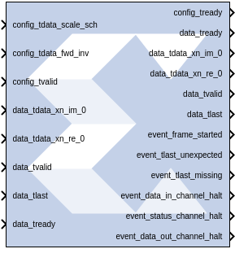
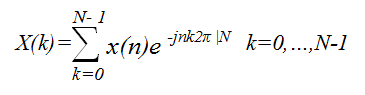
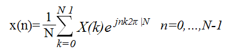

# Fast Fourier Transform 9.1

The Xilinx Fast Fourier Transform block implements the Cooley-Tukey FFT
algorithm, a computationally efficient method for calculating the
Discrete Fourier Transform (DFT). In addition, the block provides an
AXI4-Stream-compliant interface.

The FFT computes an N-point forward DFT or inverse DFT (IDFT) where, N =
2^(m), m = 3 - 16. For fixed-point inputs, the input data is a vector of
N complex values represented as dual b_(x)-bit two’s complement numbers,
that is, b^(x) bits for each of the real and imaginary components of the
data sample, where b_(x) is in the range 8 to 34 bit, inclusive.
Similarly, the phase factors b_(w) can be 8 to 34 bits wide.

For single-precision floating-point inputs, the input data is a vector
of N complex values represented as dual 32-bit floating-point numbers
with the phase factors represented as 24- or 25-bit fixed-point numbers.

## Theory of Operation

The FFT is a computationally efficient algorithm for computing a
Discrete Fourier Transform (DFT) of sample sizes that are a positive
integer power of 2. The DFT of a sequence is defined as:

  

  

where N is the transform length and j is the square root of -1. The
inverse DFT (IDFT) is defined as:

  

  

## AXI Ports that are Unique to this Block

This System Generator block exposes the AXI CONFIG channel as a group of
separate ports based on sub-field names. The sub-field ports are
described as follows:

Configuration Channel Input Signals:

|                        |                                                                                                                                                                                                                                                                                                                          |
|------------------------|--------------------------------------------------------------------------------------------------------------------------------------------------------------------------------------------------------------------------------------------------------------------------------------------------------------------------|
| config_tdata_scale_sch | A sub-field port that represents the Scaling Schedule field in the Configuration Channel vector. Refer to the document Fast Fourier Transform LogiCORE IP Product Guide ([PG109](https://docs.xilinx.com/access/sources/framemaker/map?isLatest=true&ft:locale=en-US&url=pg109-xfft)) for an explanation of the bits in this field.              |
| config_tdata_fwd_inv   | A sub-field port that represents the Forward Inverse field in the Configuration Channel vector. Refer to the document Fast Fourier Transform LogiCORE IP Product Guide ([PG109](https://docs.xilinx.com/access/sources/framemaker/map?isLatest=true&ft:locale=en-US&url=pg109-xfft)) for an explanation of the bits in this field.               |
| config_tdata_nfft      | A sub-field port that represents the Transform Size (NFFT) field in the Configuration Channel vector. Refer to the document Fast Fourier Transform LogiCORE IP Product Guide ([PG109](https://docs.xilinx.com/access/sources/framemaker/map?isLatest=true&ft:locale=en-US&url=pg109-xfft)) for an explanation of the bits in this field.         |
| config_tdata_cp_len    | A sub-field port that represents the Cyclic Prefix Length (CP_LEN) field in the Configuration Channel vector. Refer to the document Fast Fourier Transform LogiCORE IP Product Guide ([PG109](https://docs.xilinx.com/access/sources/framemaker/map?isLatest=true&ft:locale=en-US&url=pg109-xfft)) for an explanation of the bits in this field. |

This HDL block exposes the AXI DATA channel as separate ports based on
the real and imaginary sub-field names. The sub-field ports are
described as follows:

DATA Channel Input Signals:

|                        |                                                                                                                                                                                                                                                                                                                          |
|------------------------|--------------------------------------------------------------------------------------------------------------------------------------------------------------------------------------------------------------------------------------------------------------------------------------------------------------------------|
| data_tdata_xn_im | Represents the imaginary component of the Data Channel. The signal driving xn_im can be a signed data type of width S with binary point at S-1, where S is a value between 8 and 34, inclusive. eg: Fix_8_7, Fix_34_33. Both xn_re and xn_im signals must have the same data type. Refer to the document Fast Fourier Transform LogiCORE IP Product Guide ([PG109](https://docs.xilinx.com/access/sources/framemaker/map?isLatest=true&ft:locale=en-US&url=pg109-xfft)) for an explanation of the bits in this field.|
|  data_tdata_xn_re  |Represents the real component of the Data Channel. The signal driving xn_re can be a signed data type of width S with binary point at S-1, where S is a value between 8 and 34, inclusive. eg: Fix_8_7, Fix_34_33. Both xn_re and xn_im signals must have the same data type. Refer to the document Fast Fourier Transform LogiCORE IP Product Guide ([PG109](https://docs.xilinx.com/access/sources/framemaker/map?isLatest=true&ft:locale=en-US&url=pg109-xfft)) for an explanation of the bits in this field.  |

## Parameters

### Basic tab  
Parameters specific to the Basic tab are as follows.

#### Transform Length  
##### Transform_length  
One of N = 2^((3..16)) = 8 - 65536.

#### Architecture Configuration  
##### Target Clock Frequency(MHz)  
Enter the target clock frequency.

##### Target Data Throughput(MSPS)  
Enter the target throughput.

##### Architecture Choice  
Choose one of the following.

- automatically_select
- pipelined_streaming_io
- radix_4_burst_io
- radix_2_burst_io
- radix_2_lite_burst_io

#### Transform Length Options  
Run Time Configurable Transform Length  
The transform length can be set through the nfft port if this option is
selected. Valid settings and the corresponding transform sizes are
provided in the section titled Transform Size in the associated document
Fast Fourier Transform LogiCORE IP Product Guide
([PG109](https://www.xilinx.com/cgi-bin/docs/ipdoc?c=xfft;v=latest;d=pg109-xfft.pdf)).

### Advanced tab  
Parameters specific to the Advanced tab are as follows.

#### Precision Options  
##### Phase Factor Width  
Choose a value between 8 and 34, inclusive to be used as bit widths for
phase factors.

#### Scaling Options  
Select between Unscaled, Scaled, and Block Floating Point output data
types.

##### Rounding Modes  
###### Truncation  
To be applied at the output of each rank.

##### Convergent Rounding  
To be applied at the output of each rank.

#### Control Signals  
##### ACLKEN  
Enables the clock enable (aclken) pin on the core. All registers in the
core are enabled by this control signal.

##### ARESETn  
Active-low synchronous clear input that always takes priority over
ACLKEN. A minimum ARESETn active pulse of two cycles is required, since
the signal is internally registered for performance. A pulse of one
cycle resets the core, but the response to the pulse is not in the cycle
immediately following.

#### Output Ordering  
##### Cyclic Prefix Insertion  
Cyclic prefix insertion takes a section of the output of the FFT and
prefixes it to the beginning of the transform. The resultant output data
consists of the cyclic prefix (a copy of the end of the output data)
followed by the complete output data, all in natural order. Cyclic
prefix insertion is only available when output ordering is Natural
Order.

When cyclic prefix insertion is used, the length of the cyclic prefix
can be set frame-by-frame without interrupting frame processing. The
cyclic prefix length can be any number of samples from zero to one less
than the point size. The cyclic prefix length is set by the CP_LEN field
in the Configuration channel. For example, when N = 1024, the cyclic
prefix length can be from 0 to 1023 samples, and a CP_LEN value of
0010010110 produces a cyclic prefix consisting of the last 150 samples
of the output data.

##### Output ordering  
Choose between Bit/Digit Reversed Order or Natural Order output.

#### Throttle Schemes  
Select the tradeoff between performance and data timing requirements.

##### Real Time  
This mode typically gives a smaller and faster design, but has strict
constraints on when data must be provided and consumed.

##### Non Real Time  
This mode has no such constraints, but the design might be larger and
slower.

#### Optional Output Fields  
##### XK_INDEX  
The XK_INDEX field (if present in the Data Output channel) gives the
sample number of the XK_RE/XK_IM data being presented at the same time.
In the case of natural order outputs, XK_INDEX increments from 0 to
(point size) -1. When bit reversed outputs are used, XK_INDEX covers the
same range of numbers, but in a bit (or digit) reversed manner.

##### OVFLO  
The Overflow (OVFLO) field in the Data Output and Status channels is
only available when the Scaled arithmetic is used. OVFLO is driven High
during unloading if any point in the data frame overflowed.

For a multichannel core, there is a separate OVFLO field for each
channel. When an overflow occurs in the core, the data is wrapped rather
than saturated, resulting in the transformed data becoming unusable for
most applications

#### Block Icon Display  
##### Display shortened port names  
On by default. When unchecked, data_tvalid, for example, becomes
m_axis_data_tvalid.

### Implementation tab  
Parameters specific to the Implementation tab are as follows.

#### Memory Options  
##### Data  
Option to choose between Block RAM and Distributed RAM. This option is
available only for sample points 8 through 1024. This option is not
available for Pipelined Streaming I/O implementation.

##### Phase Factors  
Choose between Block RAM and Distributed RAM. This option is available
only for sample points 8 till 1024. This option is not available for
Pipelined Streaming I/O implementation.

##### Number Of Stages Using Block RAM  
Store data and phase factor in Block RAM and partially in Distributed
RAM. This option is available only for the Pipelined Streaming I/O
implementation.

##### Reorder Buffer  
Choose between Block RAM and Distributed RAM up to 1024 points transform
size.

##### Hybrid Memories  
Click check box to Optimize Block RAM Count Using Hybrid Memories.

#### Optimize Options  
##### Complex Multipliers  
Choose one of the following.

- Use CLB logic
- Use 3-multiplier structure (resource optimization)
- Use 4-multiplier structure (performance optimization)

##### Butterfly Arithmetic  
Choose one of the following:

- Use CLB logic
- Use XTremeDSP Slices

Other parameters used by this block are explained in the topic [Common
Options in Block Parameter Dialog
Boxes](../../GEN/common-options/README.md).

## Block Timing

To better understand the FFT blocks control behavior and timing, please
consult the core data sheet.

## LogiCORE Documentation

Fast Fourier Transform LogiCORE IP Product Guide
([PG109](https://docs.xilinx.com/access/sources/framemaker/map?isLatest=true&ft:locale=en-US&url=pg109-xfft))

Floating-Point Operator LogiCORE IP Product Guide
([PG060](https://docs.xilinx.com/access/sources/ud/document?isLatest=true&url=pg060-floating-point&ft:locale=en-US))

--------------
Copyright (C) 2024 Advanced Micro Devices, Inc.
All rights reserved.
