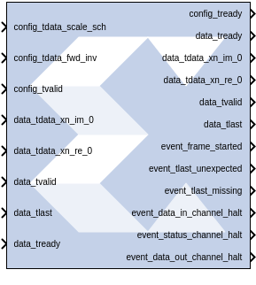
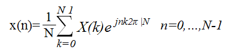
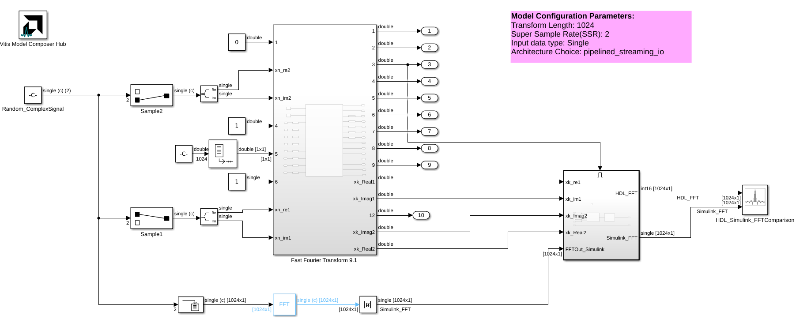

<!-- Library: hdlDSPIP -->

# Fast Fourier Transform 9.1

The Xilinx Fast Fourier Transform block implements the Cooley-Tukey FFT
algorithm, a computationally efficient method for calculating the
Discrete Fourier Transform (DFT). In addition, the block provides an
AXI4-Stream-compliant interface.

The FFT computes an N-point forward DFT or inverse DFT (IDFT) where, N =
2^(m), m = 3 - 16. For fixed-point inputs, the input data is a vector of
N complex values represented as dual b_(x)-bit two’s complement numbers,
that is, b^(x) bits for each of the real and imaginary components of the
data sample, where b_(x) is in the range 8 to 34 bit, inclusive.
Similarly, the phase factors b_(w) can be 8 to 34 bits wide.

For single-precision floating-point inputs, the input data is a vector
of N complex values represented as dual 32-bit floating-point numbers
with the phase factors represented as 24- or 25-bit fixed-point numbers.

## Theory of Operation

The FFT is a computationally efficient algorithm for computing a
Discrete Fourier Transform (DFT) of sample sizes that are a positive
integer power of 2. The DFT of a sequence is defined as:

  

  

where N is the transform length and j is the square root of -1. The
inverse DFT (IDFT) is defined as:

  

  

## AXI Ports that are Unique to this Block

This System Generator block exposes the AXI CONFIG channel as a group of
separate ports based on sub-field names. The sub-field ports are
described as follows:

Configuration Channel Input Signals:

|                        |                                                                                                                                                                                                                                                                                                                          |
|------------------------|--------------------------------------------------------------------------------------------------------------------------------------------------------------------------------------------------------------------------------------------------------------------------------------------------------------------------|
| config_tdata_scale_sch | A sub-field port that represents the Scaling Schedule field in the Configuration Channel vector. Refer to the document Fast Fourier Transform LogiCORE IP Product Guide ([PG109](https://docs.xilinx.com/access/sources/framemaker/map?isLatest=true&ft:locale=en-US&url=pg109-xfft)) for an explanation of the bits in this field.              |
| config_tdata_fwd_inv   | A sub-field port that represents the Forward Inverse field in the Configuration Channel vector. Refer to the document Fast Fourier Transform LogiCORE IP Product Guide ([PG109](https://docs.xilinx.com/access/sources/framemaker/map?isLatest=true&ft:locale=en-US&url=pg109-xfft)) for an explanation of the bits in this field.               |
| config_tdata_nfft      | A sub-field port that represents the Transform Size (NFFT) field in the Configuration Channel vector. Refer to the document Fast Fourier Transform LogiCORE IP Product Guide ([PG109](https://docs.xilinx.com/access/sources/framemaker/map?isLatest=true&ft:locale=en-US&url=pg109-xfft)) for an explanation of the bits in this field.         |
| config_tdata_cp_len    | A sub-field port that represents the Cyclic Prefix Length (CP_LEN) field in the Configuration Channel vector. Refer to the document Fast Fourier Transform LogiCORE IP Product Guide ([PG109](https://docs.xilinx.com/access/sources/framemaker/map?isLatest=true&ft:locale=en-US&url=pg109-xfft)) for an explanation of the bits in this field. |

This HDL block exposes the AXI DATA channel as separate ports based on
the real and imaginary sub-field names. The sub-field ports are
described as follows:

DATA Channel Input Signals:

|                        |                                                                                                                                                                                                                                                                                                                          |
|------------------------|--------------------------------------------------------------------------------------------------------------------------------------------------------------------------------------------------------------------------------------------------------------------------------------------------------------------------|
| data_tdata_xn_im | Represents the imaginary component of the Data Channel. The signal driving xn_im can be a signed data type of width S with binary point at S-1, where S is a value between 8 and 34, inclusive. eg: Fix_8_7, Fix_34_33. Both xn_re and xn_im signals must have the same data type. Refer to the document Fast Fourier Transform LogiCORE IP Product Guide ([PG109](https://docs.xilinx.com/access/sources/framemaker/map?isLatest=true&ft:locale=en-US&url=pg109-xfft)) for an explanation of the bits in this field.|
|  data_tdata_xn_re  |Represents the real component of the Data Channel. The signal driving xn_re can be a signed data type of width S with binary point at S-1, where S is a value between 8 and 34, inclusive. eg: Fix_8_7, Fix_34_33. Both xn_re and xn_im signals must have the same data type. Refer to the document Fast Fourier Transform LogiCORE IP Product Guide ([PG109](https://docs.xilinx.com/access/sources/framemaker/map?isLatest=true&ft:locale=en-US&url=pg109-xfft)) for an explanation of the bits in this field.  |

## Parameters

### Basic tab  
Parameters specific to the Basic tab are as follows.

#### Transform Length  
##### Transform_length  
One of N = 2^((3..16)) = 8 - 65536.

#### Architecture Configuration  
##### Target Clock Frequency(MHz)  
Enter the target clock frequency.

##### Target Data Throughput(MSPS)  
Enter the target throughput.

##### Architecture Choice  
Choose one of the following.

- automatically_select
- pipelined_streaming_io
- radix_4_burst_io
- radix_2_burst_io
- radix_2_lite_burst_io

#### Transform Length Options  
Run Time Configurable Transform Length  
The transform length can be set through the nfft port if this option is
selected. Valid settings and the corresponding transform sizes are
provided in the section titled Transform Size in the associated document
Fast Fourier Transform LogiCORE IP Product Guide
([PG109](https://www.xilinx.com/cgi-bin/docs/ipdoc?c=xfft;v=latest;d=pg109-xfft.pdf)).

### Advanced tab  
Parameters specific to the Advanced tab are as follows.

#### Super Sample Rate(SSR) 
This parameter specifies the number of parallel input and output ports. For an SSR value of 'n' (which must be of the form 2^N, where N is a positive integer).

#### Precision Options  
##### Phase Factor Width  
Choose a value between 8 and 34, inclusive to be used as bit widths for
phase factors.

#### Scaling Options  
Select between Unscaled, Scaled, and Block Floating Point output data
types.

##### Rounding Modes  
###### Truncation  
To be applied at the output of each rank.

##### Convergent Rounding  
To be applied at the output of each rank.

#### Control Signals  
##### ACLKEN  
Enables the clock enable (aclken) pin on the core. All registers in the
core are enabled by this control signal.

##### ARESETn  
Active-low synchronous clear input that always takes priority over
ACLKEN. A minimum ARESETn active pulse of two cycles is required, since
the signal is internally registered for performance. A pulse of one
cycle resets the core, but the response to the pulse is not in the cycle
immediately following.

#### Output Ordering  
##### Cyclic Prefix Insertion  
Cyclic prefix insertion takes a section of the output of the FFT and
prefixes it to the beginning of the transform. The resultant output data
consists of the cyclic prefix (a copy of the end of the output data)
followed by the complete output data, all in natural order. Cyclic
prefix insertion is only available when output ordering is Natural
Order.

When cyclic prefix insertion is used, the length of the cyclic prefix
can be set frame-by-frame without interrupting frame processing. The
cyclic prefix length can be any number of samples from zero to one less
than the point size. The cyclic prefix length is set by the CP_LEN field
in the Configuration channel. For example, when N = 1024, the cyclic
prefix length can be from 0 to 1023 samples, and a CP_LEN value of
0010010110 produces a cyclic prefix consisting of the last 150 samples
of the output data.

##### Output ordering  
Choose between Bit/Digit Reversed Order or Natural Order output.

#### Throttle Schemes  
Select the tradeoff between performance and data timing requirements.

##### Real Time  
This mode typically gives a smaller and faster design, but has strict
constraints on when data must be provided and consumed.

##### Non Real Time  
This mode has no such constraints, but the design might be larger and
slower.

#### Optional Output Fields  
##### XK_INDEX  
The XK_INDEX field (if present in the Data Output channel) gives the
sample number of the XK_RE/XK_IM data being presented at the same time.
In the case of natural order outputs, XK_INDEX increments from 0 to
(point size) -1. When bit reversed outputs are used, XK_INDEX covers the
same range of numbers, but in a bit (or digit) reversed manner.

##### OVFLO  
The Overflow (OVFLO) field in the Data Output and Status channels is
only available when the Scaled arithmetic is used. OVFLO is driven High
during unloading if any point in the data frame overflowed.

For a multichannel core, there is a separate OVFLO field for each
channel. When an overflow occurs in the core, the data is wrapped rather
than saturated, resulting in the transformed data becoming unusable for
most applications

#### Block Icon Display  
##### Display shortened port names  
On by default. When unchecked, data_tvalid, for example, becomes
m_axis_data_tvalid.

### Implementation tab  
Parameters specific to the Implementation tab are as follows.

#### Memory Options  
##### Data  
Option to choose between Block RAM and Distributed RAM. This option is
available only for sample points 8 through 1024. This option is not
available for Pipelined Streaming I/O implementation.

##### Phase Factors  
Choose between Block RAM and Distributed RAM. This option is available
only for sample points 8 till 1024. This option is not available for
Pipelined Streaming I/O implementation.

##### Number Of Stages Using Block RAM  
Store data and phase factor in Block RAM and partially in Distributed
RAM. This option is available only for the Pipelined Streaming I/O
implementation.

##### Reorder Buffer  
Choose between Block RAM and Distributed RAM up to 1024 points transform
size.

##### Hybrid Memories  
Click check box to Optimize Block RAM Count Using Hybrid Memories.

#### Optimize Options  
##### Complex Multipliers  
Choose one of the following.

- Use CLB logic
- Use 3-multiplier structure (resource optimization)
- Use 4-multiplier structure (performance optimization)

##### Butterfly Arithmetic  
Choose one of the following:

- Use CLB logic
- Use XTremeDSP Slices

Other parameters used by this block are explained in the topic [Common
Options in Block Parameter Dialog
Boxes](../../GEN/common-options/README.md).

## Block Timing

To better understand the FFT blocks control behavior and timing, please
consult the core data sheet.

## Examples

***Click on the images below to open each model.***

<!--
DESCRIPTION:
Model: FastFourierTransform_Ex1
Generated: 09-Jan-2026 13:52:53

Vitis Model Composer Configuration:
  Target Device: xcvc1502-nsvg1369-1LHP-i-L

Vitis Model Composer Blocks:
  - AIE: To Fixed Size
  - HDL: Constant
  - HDL: Gateway In
  - HDL: Gateway Out
  - HDL: Fast Fourier Transform 9.1 

Description:
This MATLAB script creates a Vitis Model Composer Simulink model that uses the Fast Fourier Transform 9.1  block.  and results are compared against a Simulink reference implementation.

-->

<!--
MATLAB CREATION SCRIPT:

% create_FastFourierTransform_Ex1_model.m
% Auto-generated script to recreate the FastFourierTransform_Ex1 Simulink model
% Generated on: 09-Jan-2026 13:52:53

%% Model Configuration
modelName = 'FastFourierTransform_Ex1_recreated';

%% Create New Model
if bdIsLoaded(modelName)
    close_system(modelName, 0);
end

new_system(modelName);
open_system(modelName);
fprintf('Created new model: %s\n', modelName);

%% Add Vitis Model Composer Hub Block
hubBlockPath = [modelName '/Vitis Model Composer Hub'];
add_block('vmcUtilities/Vitis Model Composer Hub', hubBlockPath, ...
    'Position', [-535 -656 -485 -606]);

hubBlk = xmcFindHubBlock(modelName);
vmchub_set_param(hubBlk, modelName, 'SelectHardware', 'xcvc1502-nsvg1369-1LHP-i-L');

%% Add Top-Level Blocks
add_block('built-in/Abs', [modelName '/Abs'], ...
    'Position', [95 -145 125 -115]);
set_param([modelName '/Abs'], ...
    'ZeroCross', 'on', ...
    'SampleTime', '-1', ...
    'OutMin', '[]', ...
    'OutMax', '[]', ...
    'OutDataTypeStr', 'Inherit: Same as input', ...
    'LockScale', 'off', ...
    'RndMeth', 'Floor', ...
    'SaturateOnIntegerOverflow', 'off');
add_block('built-in/Buffer', [modelName '/Buffer3'], ...
    'Position', [-250 -144 -205 -116]);
set_param([modelName '/Buffer3'], ...
    'N', '1024', ...
    'V', '0', ...
    'ic', '0', ...
    'OverlapPercent', '0');
add_block('built-in/ComplexToRealImag', [modelName '/Complex to Real-Imag'], ...
    'Position', [-210 -522 -180 -493]);
set_param([modelName '/Complex to Real-Imag'], ...
    'Output', 'Real and imag', ...
    'SampleTime', '-1');
add_block('built-in/ComplexToRealImag', [modelName '/Complex to Real-Imag1'], ...
    'Position', [-210 -302 -180 -273]);
set_param([modelName '/Complex to Real-Imag1'], ...
    'Output', 'Real and imag', ...
    'SampleTime', '-1');
add_block('built-in/Constant', [modelName '/Constant'], ...
    'Position', [-160 -615 -130 -585]);
set_param([modelName '/Constant'], ...
    'Value', '0', ...
    'VectorParams1D', 'on', ...
    'OutMin', '[]', ...
    'OutMax', '[]', ...
    'OutDataTypeStr', 'Inherit: Inherit from ''Constant value''', ...
    'LockScale', 'off', ...
    'SampleTime', '-1', ...
    'FramePeriod', 'inf');
add_block('built-in/Constant', [modelName '/Constant1'], ...
    'Position', [-160 -415 -130 -385]);
set_param([modelName '/Constant1'], ...
    'Value', '0', ...
    'VectorParams1D', 'on', ...
    'OutMin', '[]', ...
    'OutMax', '[]', ...
    'OutDataTypeStr', 'Inherit: Inherit from ''Constant value''', ...
    'LockScale', 'off', ...
    'SampleTime', '-1', ...
    'FramePeriod', 'inf');
add_block('built-in/Constant', [modelName '/Constant3'], ...
    'Position', [-160 -365 -130 -335]);
set_param([modelName '/Constant3'], ...
    'Value', '1', ...
    'VectorParams1D', 'on', ...
    'OutMin', '[]', ...
    'OutMax', '[]', ...
    'OutDataTypeStr', 'single', ...
    'LockScale', 'off', ...
    'SampleTime', '-1', ...
    'FramePeriod', 'inf');
add_block('built-in/Constant', [modelName '/Constant4'], ...
    'Position', [-160 -465 -130 -435]);
set_param([modelName '/Constant4'], ...
    'Value', '1', ...
    'VectorParams1D', 'on', ...
    'OutMin', '[]', ...
    'OutMax', '[]', ...
    'OutDataTypeStr', 'Inherit: Inherit from ''Constant value''', ...
    'LockScale', 'off', ...
    'SampleTime', '-1', ...
    'FramePeriod', 'inf');
add_block('dspxfrm3/FFT', [modelName '/FFT1'], ...
    'Position', [-80 -149 -40 -111]);
set_param([modelName '/FFT1'], ...
    'FFTImplementation', 'FFTW', ...
    'CompMethod', 'Table lookup', ...
    'TableOpt', 'NEW', ...
    'TableOptActive', 'Speed', ...
    'BitRevOrder', 'on', ...
    'Normalize', 'off', ...
    'InheritFFTLength', 'on', ...
    'FFTLength', '64', ...
    'WrapInput', 'on', ...
    'roundingMode', 'Floor', ...
    'overflowMode', 'off', ...
    'firstCoeffMode', 'Same word length as input', ...
    'firstCoeffWordLength', '16', ...
    'firstCoeffFracLength', '15', ...
    'firstCoeffDataTypeStr', 'Inherit: Same word length as input', ...
    'firstCoeffLastDataTypeStr', 'Inherit: Same word length as input', ...
    'prodOutputMode', 'Inherit via internal rule', ...
    'prodOutputWordLength', '32', ...
    'prodOutputFracLength', '30', ...
    'prodOutputDataTypeStr', 'Inherit: Inherit via internal rule', ...
    'prodOutputLastDataTypeStr', 'Inherit: Inherit via internal rule', ...
    'accumMode', 'Inherit via internal rule', ...
    'accumWordLength', '32', ...
    'accumFracLength', '30', ...
    'accumDataTypeStr', 'Inherit: Inherit via internal rule', ...
    'accumLastDataTypeStr', 'Inherit: Inherit via internal rule', ...
    'outputMode', 'Inherit via internal rule', ...
    'outputWordLength', '16', ...
    'outputFracLength', '15', ...
    'outputDataTypeStr', 'Inherit: Inherit via internal rule', ...
    'outputMin', '[]', ...
    'outputMax', '[]', ...
    'outputLastDataTypeStr', 'Inherit: Inherit via internal rule', ...
    'LockScale', 'off');
add_block('built-in/ArrayPlot', [modelName '/HDL_Simulink_FFTComparison'], ...
    'Position', [785 -304 830 -251]);
set_param([modelName '/HDL_Simulink_FFTComparison'], ...
    'NumInputPorts', '2', ...
    'OpenAtSimulationStart', 'on', ...
    'WindowPosition', '[1.000000,1.000000,1280.000000,744.000000,]', ...
    'XDataMode', 'Sample increment and X-offset', ...
    'SampleIncrement', '1', ...
    'XOffset', '0', ...
    'CustomXData', '[]', ...
    'XScale', 'Linear', ...
    'YScale', 'Linear', ...
    'PlotType', 'Stem', ...
    'PlotBaseValue', '0', ...
    'AxesScaling', 'OnceAtStop', ...
    'AxesScalingNumUpdates', '100', ...
    'MaximizeAxes', 'Auto', ...
    'LayoutDimensions', '[1,1]', ...
    'ActiveDisplay', '1', ...
    'PlotAsMagnitudePhase', 'off', ...
    'YLabel', 'Amplitude', ...
    'YLimits', '[474.75 477.25]', ...
    'ShowGrid', 'on', ...
    'ShowLegend', 'on', ...
    'ChannelNames', '[]');
add_block('built-in/Constant', [modelName '/Random_ComplexSignal'], ...
    'Position', [-515 -520 -485 -490]);
set_param([modelName '/Random_ComplexSignal'], ...
    'Value', '[10+(randn*i) 8-(randn*j)]', ...
    'VectorParams1D', 'on', ...
    'OutMin', '[]', ...
    'OutMax', '[]', ...
    'OutDataTypeStr', 'single', ...
    'LockScale', 'off', ...
    'SampleTime', '1', ...
    'FramePeriod', 'inf');
add_block('built-in/Selector', [modelName '/Sample1'], ...
    'Position', [-335 -304 -260 -266]);
set_param([modelName '/Sample1'], ...
    'NumberOfDimensions', '1', ...
    'IndexMode', 'One-based', ...
    'InputPortWidth', '2', ...
    'SampleTime', '-1', ...
    'IndexOptions', 'Index vector (dialog)', ...
    'Indices', '1:2:2', ...
    'OutputSizes', '1', ...
    'RuntimeRangeChecks', 'off');
add_block('built-in/Selector', [modelName '/Sample2'], ...
    'Position', [-335 -524 -260 -486]);
set_param([modelName '/Sample2'], ...
    'NumberOfDimensions', '1', ...
    'IndexMode', 'One-based', ...
    'InputPortWidth', '2', ...
    'SampleTime', '-1', ...
    'IndexOptions', 'Index vector (dialog)', ...
    'Indices', '2:2:2', ...
    'OutputSizes', '1', ...
    'RuntimeRangeChecks', 'off');
add_block('vmcUtilities/Vitis Model Composer Hub', [modelName '/Vitis Model Composer Hub'], ...
    'Position', [-535 -656 -485 -606]);
set_param([modelName '/Vitis Model Composer Hub'], ...
    'CodeGeneration', 'off', ...
    'SubsystemName', 'Fast Fourier Transform 9.1 ', ...
    'StartColumn', '1', ...
    'NumberOfColumns', '1', ...
    'TargetDirectory', './code', ...
    'exportDesign', 'off', ...
    'analyzeDesign', 'off', ...
    'validateDesignOnHw', 'off', ...
    'ExportType', 'System Generator', ...
    'IpVendor', 'xilinx.com', ...
    'IpLibrary', 'hls', ...
    'IpVersion', '1.0', ...
    'IpHWLanguage', 'Verilog', ...
    'AieCompilerOptions', '{}', ...
    'CreateTestbench', 'off', ...
    'TestbenchStackSize', '10', ...
    'RunRtlSim', 'off', ...
    'RunCSim', 'off', ...
    'RunAieSim', 'off', ...
    'AieSimTimeout', '50000', ...
    'RunAieSimProfiling', 'off', ...
    'LaunchVitisAnalyzer', 'off', ...
    'PlotOutput', 'off', ...
    'GenHwImage', 'off', ...
    'GenLibadfXo', 'on', ...
    'GenHwValidationCode', 'off', ...
    'PlatformType', 'Not Specified', ...
    'HwSystemType', 'Baremetal', ...
    'HwValidationTarget', 'hw', ...
    'ProjDevice', 'xcvc1502-nsvg1369-1LHP-i-L', ...
    'SamplePeriod', '-1', ...
    'ClockFrequency', '200', ...
    'DataPathParallelism', '1', ...
    'xilinxfamily', 'versalaicore', ...
    'part', 'xcvc1502', ...
    'speed', '-1LHP-i-L', ...
    'package', 'nsvg1369', ...
    'directory', './netlist/ip/Fast_Fourier_Transform_9.1_/src', ...
    'testbench', 'off', ...
    'incr_netlist', 'off', ...
    'synthesis_tool', 'Vivado', ...
    'clock_wrapper', 'Clock Enables', ...
    'dbl_ovrd', 'According to Block Masks', ...
    'dcm_input_clock_period', '10', ...
    'sysclk_period', '4', ...
    'simulink_period', '1', ...
    'eval_field', '0', ...
    'LogFileName', '''''', ...
    'NThreads', '4');
add_block('built-in/Outport', [modelName '/Out1'], ...
    'Position', [185 -627 215 -613]);
set_param([modelName '/Out1'], ...
    'Port', '1', ...
    'StorageClass', 'Auto', ...
    'IconDisplay', 'Port number', ...
    'OutputFunctionCall', 'off', ...
    'OutMin', '[]', ...
    'OutMax', '[]', ...
    'OutDataTypeStr', 'Inherit: auto', ...
    'LockScale', 'off', ...
    'BusOutputAsStruct', 'off', ...
    'BusVirtuality', 'inherit', ...
    'DataMode', 'inherit', ...
    'Unit', 'inherit', ...
    'PortDimensions', '-1', ...
    'VarSizeSig', 'Inherit', ...
    'SampleTime', '-1', ...
    'SignalType', 'auto', ...
    'EnsureOutportIsVirtual', 'off', ...
    'OutputWhenDisabled', 'held', ...
    'InitialOutput', '[]', ...
    'MustResolveToSignalObject', 'off', ...
    'OutputWhenUnConnected', 'off', ...
    'OutputWhenUnconnectedValue', '0', ...
    'VectorParamsAs1DForOutWhenUnconnected', 'on');
add_block('built-in/Outport', [modelName '/Out2'], ...
    'Position', [185 -597 215 -583]);
set_param([modelName '/Out2'], ...
    'Port', '2', ...
    'StorageClass', 'Auto', ...
    'IconDisplay', 'Port number', ...
    'OutputFunctionCall', 'off', ...
    'OutMin', '[]', ...
    'OutMax', '[]', ...
    'OutDataTypeStr', 'Inherit: auto', ...
    'LockScale', 'off', ...
    'BusOutputAsStruct', 'off', ...
    'BusVirtuality', 'inherit', ...
    'DataMode', 'inherit', ...
    'Unit', 'inherit', ...
    'PortDimensions', '-1', ...
    'VarSizeSig', 'Inherit', ...
    'SampleTime', '-1', ...
    'SignalType', 'auto', ...
    'EnsureOutportIsVirtual', 'off', ...
    'OutputWhenDisabled', 'held', ...
    'InitialOutput', '[]', ...
    'MustResolveToSignalObject', 'off', ...
    'OutputWhenUnConnected', 'off', ...
    'OutputWhenUnconnectedValue', '0', ...
    'VectorParamsAs1DForOutWhenUnconnected', 'on');
add_block('built-in/Outport', [modelName '/Out3'], ...
    'Position', [185 -567 215 -553]);
set_param([modelName '/Out3'], ...
    'Port', '3', ...
    'StorageClass', 'Auto', ...
    'IconDisplay', 'Port number', ...
    'OutputFunctionCall', 'off', ...
    'OutMin', '[]', ...
    'OutMax', '[]', ...
    'OutDataTypeStr', 'Inherit: auto', ...
    'LockScale', 'off', ...
    'BusOutputAsStruct', 'off', ...
    'BusVirtuality', 'inherit', ...
    'DataMode', 'inherit', ...
    'Unit', 'inherit', ...
    'PortDimensions', '-1', ...
    'VarSizeSig', 'Inherit', ...
    'SampleTime', '-1', ...
    'SignalType', 'auto', ...
    'EnsureOutportIsVirtual', 'off', ...
    'OutputWhenDisabled', 'held', ...
    'InitialOutput', '[]', ...
    'MustResolveToSignalObject', 'off', ...
    'OutputWhenUnConnected', 'off', ...
    'OutputWhenUnconnectedValue', '0', ...
    'VectorParamsAs1DForOutWhenUnconnected', 'on');
add_block('built-in/Outport', [modelName '/Out4'], ...
    'Position', [185 -537 215 -523]);
set_param([modelName '/Out4'], ...
    'Port', '4', ...
    'StorageClass', 'Auto', ...
    'IconDisplay', 'Port number', ...
    'OutputFunctionCall', 'off', ...
    'OutMin', '[]', ...
    'OutMax', '[]', ...
    'OutDataTypeStr', 'Inherit: auto', ...
    'LockScale', 'off', ...
    'BusOutputAsStruct', 'off', ...
    'BusVirtuality', 'inherit', ...
    'DataMode', 'inherit', ...
    'Unit', 'inherit', ...
    'PortDimensions', '-1', ...
    'VarSizeSig', 'Inherit', ...
    'SampleTime', '-1', ...
    'SignalType', 'auto', ...
    'EnsureOutportIsVirtual', 'off', ...
    'OutputWhenDisabled', 'held', ...
    'InitialOutput', '[]', ...
    'MustResolveToSignalObject', 'off', ...
    'OutputWhenUnConnected', 'off', ...
    'OutputWhenUnconnectedValue', '0', ...
    'VectorParamsAs1DForOutWhenUnconnected', 'on');
add_block('built-in/Outport', [modelName '/Out5'], ...
    'Position', [185 -507 215 -493]);
set_param([modelName '/Out5'], ...
    'Port', '5', ...
    'StorageClass', 'Auto', ...
    'IconDisplay', 'Port number', ...
    'OutputFunctionCall', 'off', ...
    'OutMin', '[]', ...
    'OutMax', '[]', ...
    'OutDataTypeStr', 'Inherit: auto', ...
    'LockScale', 'off', ...
    'BusOutputAsStruct', 'off', ...
    'BusVirtuality', 'inherit', ...
    'DataMode', 'inherit', ...
    'Unit', 'inherit', ...
    'PortDimensions', '-1', ...
    'VarSizeSig', 'Inherit', ...
    'SampleTime', '-1', ...
    'SignalType', 'auto', ...
    'EnsureOutportIsVirtual', 'off', ...
    'OutputWhenDisabled', 'held', ...
    'InitialOutput', '[]', ...
    'MustResolveToSignalObject', 'off', ...
    'OutputWhenUnConnected', 'off', ...
    'OutputWhenUnconnectedValue', '0', ...
    'VectorParamsAs1DForOutWhenUnconnected', 'on');
add_block('built-in/Outport', [modelName '/Out6'], ...
    'Position', [185 -477 215 -463]);
set_param([modelName '/Out6'], ...
    'Port', '6', ...
    'StorageClass', 'Auto', ...
    'IconDisplay', 'Port number', ...
    'OutputFunctionCall', 'off', ...
    'OutMin', '[]', ...
    'OutMax', '[]', ...
    'OutDataTypeStr', 'Inherit: auto', ...
    'LockScale', 'off', ...
    'BusOutputAsStruct', 'off', ...
    'BusVirtuality', 'inherit', ...
    'DataMode', 'inherit', ...
    'Unit', 'inherit', ...
    'PortDimensions', '-1', ...
    'VarSizeSig', 'Inherit', ...
    'SampleTime', '-1', ...
    'SignalType', 'auto', ...
    'EnsureOutportIsVirtual', 'off', ...
    'OutputWhenDisabled', 'held', ...
    'InitialOutput', '[]', ...
    'MustResolveToSignalObject', 'off', ...
    'OutputWhenUnConnected', 'off', ...
    'OutputWhenUnconnectedValue', '0', ...
    'VectorParamsAs1DForOutWhenUnconnected', 'on');
add_block('built-in/Outport', [modelName '/Out7'], ...
    'Position', [185 -447 215 -433]);
set_param([modelName '/Out7'], ...
    'Port', '7', ...
    'StorageClass', 'Auto', ...
    'IconDisplay', 'Port number', ...
    'OutputFunctionCall', 'off', ...
    'OutMin', '[]', ...
    'OutMax', '[]', ...
    'OutDataTypeStr', 'Inherit: auto', ...
    'LockScale', 'off', ...
    'BusOutputAsStruct', 'off', ...
    'BusVirtuality', 'inherit', ...
    'DataMode', 'inherit', ...
    'Unit', 'inherit', ...
    'PortDimensions', '-1', ...
    'VarSizeSig', 'Inherit', ...
    'SampleTime', '-1', ...
    'SignalType', 'auto', ...
    'EnsureOutportIsVirtual', 'off', ...
    'OutputWhenDisabled', 'held', ...
    'InitialOutput', '[]', ...
    'MustResolveToSignalObject', 'off', ...
    'OutputWhenUnConnected', 'off', ...
    'OutputWhenUnconnectedValue', '0', ...
    'VectorParamsAs1DForOutWhenUnconnected', 'on');
add_block('built-in/Outport', [modelName '/Out8'], ...
    'Position', [185 -417 215 -403]);
set_param([modelName '/Out8'], ...
    'Port', '8', ...
    'StorageClass', 'Auto', ...
    'IconDisplay', 'Port number', ...
    'OutputFunctionCall', 'off', ...
    'OutMin', '[]', ...
    'OutMax', '[]', ...
    'OutDataTypeStr', 'Inherit: auto', ...
    'LockScale', 'off', ...
    'BusOutputAsStruct', 'off', ...
    'BusVirtuality', 'inherit', ...
    'DataMode', 'inherit', ...
    'Unit', 'inherit', ...
    'PortDimensions', '-1', ...
    'VarSizeSig', 'Inherit', ...
    'SampleTime', '-1', ...
    'SignalType', 'auto', ...
    'EnsureOutportIsVirtual', 'off', ...
    'OutputWhenDisabled', 'held', ...
    'InitialOutput', '[]', ...
    'MustResolveToSignalObject', 'off', ...
    'OutputWhenUnConnected', 'off', ...
    'OutputWhenUnconnectedValue', '0', ...
    'VectorParamsAs1DForOutWhenUnconnected', 'on');
add_block('built-in/Outport', [modelName '/Out9'], ...
    'Position', [185 -387 215 -373]);
set_param([modelName '/Out9'], ...
    'Port', '9', ...
    'StorageClass', 'Auto', ...
    'IconDisplay', 'Port number', ...
    'OutputFunctionCall', 'off', ...
    'OutMin', '[]', ...
    'OutMax', '[]', ...
    'OutDataTypeStr', 'Inherit: auto', ...
    'LockScale', 'off', ...
    'BusOutputAsStruct', 'off', ...
    'BusVirtuality', 'inherit', ...
    'DataMode', 'inherit', ...
    'Unit', 'inherit', ...
    'PortDimensions', '-1', ...
    'VarSizeSig', 'Inherit', ...
    'SampleTime', '-1', ...
    'SignalType', 'auto', ...
    'EnsureOutportIsVirtual', 'off', ...
    'OutputWhenDisabled', 'held', ...
    'InitialOutput', '[]', ...
    'MustResolveToSignalObject', 'off', ...
    'OutputWhenUnConnected', 'off', ...
    'OutputWhenUnconnectedValue', '0', ...
    'VectorParamsAs1DForOutWhenUnconnected', 'on');
add_block('built-in/Outport', [modelName '/Out10'], ...
    'Position', [170 -297 200 -283]);
set_param([modelName '/Out10'], ...
    'Port', '10', ...
    'StorageClass', 'Auto', ...
    'IconDisplay', 'Port number', ...
    'OutputFunctionCall', 'off', ...
    'OutMin', '[]', ...
    'OutMax', '[]', ...
    'OutDataTypeStr', 'Inherit: auto', ...
    'LockScale', 'off', ...
    'BusOutputAsStruct', 'off', ...
    'BusVirtuality', 'inherit', ...
    'DataMode', 'inherit', ...
    'Unit', 'inherit', ...
    'PortDimensions', '-1', ...
    'VarSizeSig', 'Inherit', ...
    'SampleTime', '-1', ...
    'SignalType', 'auto', ...
    'EnsureOutportIsVirtual', 'off', ...
    'OutputWhenDisabled', 'held', ...
    'InitialOutput', '[]', ...
    'MustResolveToSignalObject', 'off', ...
    'OutputWhenUnConnected', 'off', ...
    'OutputWhenUnconnectedValue', '0', ...
    'VectorParamsAs1DForOutWhenUnconnected', 'on');

%% Create Fast Fourier Transform 9.1  Subsystem
add_block('built-in/SubSystem', [modelName '/Fast Fourier Transform 9.1 '], ...
    'Position', [-80 -631 105 -219]);

% Remove default blocks
defaultBlocks = find_system([modelName '/Fast Fourier Transform 9.1 '], 'SearchDepth', 1, 'Type', 'block');
for i = 1:length(defaultBlocks)
    if ~strcmp(defaultBlocks{i}, [modelName '/Fast Fourier Transform 9.1 '])
        delete_block(defaultBlocks{i});
    end
end

add_block('built-in/Inport', [[modelName '/Fast Fourier Transform 9.1 '] '/In1'], ...
    'Position', [300 163 330 177]);
set_param([[modelName '/Fast Fourier Transform 9.1 '] '/In1'], ...
    'Port', '1', ...
    'IconDisplay', 'Port number', ...
    'OutputFunctionCall', 'off', ...
    'OutMin', '[]', ...
    'OutMax', '[]', ...
    'OutDataTypeStr', 'Inherit: auto', ...
    'LockScale', 'off', ...
    'BusOutputAsStruct', 'off', ...
    'BusVirtuality', 'inherit', ...
    'Unit', 'inherit', ...
    'PortDimensions', '-1', ...
    'VarSizeSig', 'Inherit', ...
    'SampleTime', '-1', ...
    'SignalType', 'auto', ...
    'LatchByDelayingOutsideSignal', 'off', ...
    'LatchInputForFeedbackSignals', 'off', ...
    'Interpolate', 'on', ...
    'DataMode', 'inherit', ...
    'MessageQueueUseDefaultAttributes', 'on', ...
    'MessageQueueCapacity', '1', ...
    'MessageQueueType', 'LIFO', ...
    'MessageQueueOverwriting', 'on');
add_block('built-in/Inport', [[modelName '/Fast Fourier Transform 9.1 '] '/xn_re2'], ...
    'Position', [35 233 65 247]);
set_param([[modelName '/Fast Fourier Transform 9.1 '] '/xn_re2'], ...
    'Port', '2', ...
    'IconDisplay', 'Port number', ...
    'OutputFunctionCall', 'off', ...
    'OutMin', '[]', ...
    'OutMax', '[]', ...
    'OutDataTypeStr', 'Inherit: auto', ...
    'LockScale', 'off', ...
    'BusOutputAsStruct', 'off', ...
    'BusVirtuality', 'inherit', ...
    'Unit', 'inherit', ...
    'PortDimensions', '-1', ...
    'VarSizeSig', 'Inherit', ...
    'SampleTime', '-1', ...
    'SignalType', 'auto', ...
    'LatchByDelayingOutsideSignal', 'off', ...
    'LatchInputForFeedbackSignals', 'off', ...
    'Interpolate', 'on', ...
    'DataMode', 'inherit', ...
    'MessageQueueUseDefaultAttributes', 'on', ...
    'MessageQueueCapacity', '1', ...
    'MessageQueueType', 'LIFO', ...
    'MessageQueueOverwriting', 'on');
add_block('built-in/Inport', [[modelName '/Fast Fourier Transform 9.1 '] '/xn_im2'], ...
    'Position', [100 198 130 212]);
set_param([[modelName '/Fast Fourier Transform 9.1 '] '/xn_im2'], ...
    'Port', '3', ...
    'IconDisplay', 'Port number', ...
    'OutputFunctionCall', 'off', ...
    'OutMin', '[]', ...
    'OutMax', '[]', ...
    'OutDataTypeStr', 'Inherit: auto', ...
    'LockScale', 'off', ...
    'BusOutputAsStruct', 'off', ...
    'BusVirtuality', 'inherit', ...
    'Unit', 'inherit', ...
    'PortDimensions', '-1', ...
    'VarSizeSig', 'Inherit', ...
    'SampleTime', '-1', ...
    'SignalType', 'auto', ...
    'LatchByDelayingOutsideSignal', 'off', ...
    'LatchInputForFeedbackSignals', 'off', ...
    'Interpolate', 'on', ...
    'DataMode', 'inherit', ...
    'MessageQueueUseDefaultAttributes', 'on', ...
    'MessageQueueCapacity', '1', ...
    'MessageQueueType', 'LIFO', ...
    'MessageQueueOverwriting', 'on');
add_block('built-in/Inport', [[modelName '/Fast Fourier Transform 9.1 '] '/In4'], ...
    'Position', [265 338 295 352]);
set_param([[modelName '/Fast Fourier Transform 9.1 '] '/In4'], ...
    'Port', '4', ...
    'IconDisplay', 'Port number', ...
    'OutputFunctionCall', 'off', ...
    'OutMin', '[]', ...
    'OutMax', '[]', ...
    'OutDataTypeStr', 'Inherit: auto', ...
    'LockScale', 'off', ...
    'BusOutputAsStruct', 'off', ...
    'BusVirtuality', 'inherit', ...
    'Unit', 'inherit', ...
    'PortDimensions', '-1', ...
    'VarSizeSig', 'Inherit', ...
    'SampleTime', '-1', ...
    'SignalType', 'auto', ...
    'LatchByDelayingOutsideSignal', 'off', ...
    'LatchInputForFeedbackSignals', 'off', ...
    'Interpolate', 'on', ...
    'DataMode', 'inherit', ...
    'MessageQueueUseDefaultAttributes', 'on', ...
    'MessageQueueCapacity', '1', ...
    'MessageQueueType', 'LIFO', ...
    'MessageQueueOverwriting', 'on');
add_block('built-in/Inport', [[modelName '/Fast Fourier Transform 9.1 '] '/In5'], ...
    'Position', [265 373 295 387]);
set_param([[modelName '/Fast Fourier Transform 9.1 '] '/In5'], ...
    'Port', '5', ...
    'IconDisplay', 'Port number', ...
    'OutputFunctionCall', 'off', ...
    'OutMin', '[]', ...
    'OutMax', '[]', ...
    'OutDataTypeStr', 'Inherit: auto', ...
    'LockScale', 'off', ...
    'BusOutputAsStruct', 'off', ...
    'BusVirtuality', 'inherit', ...
    'Unit', 'inherit', ...
    'PortDimensions', '-1', ...
    'VarSizeSig', 'Inherit', ...
    'SampleTime', '-1', ...
    'SignalType', 'auto', ...
    'LatchByDelayingOutsideSignal', 'off', ...
    'LatchInputForFeedbackSignals', 'off', ...
    'Interpolate', 'on', ...
    'DataMode', 'inherit', ...
    'MessageQueueUseDefaultAttributes', 'on', ...
    'MessageQueueCapacity', '1', ...
    'MessageQueueType', 'LIFO', ...
    'MessageQueueOverwriting', 'on');
add_block('built-in/Inport', [[modelName '/Fast Fourier Transform 9.1 '] '/In6'], ...
    'Position', [265 408 295 422]);
set_param([[modelName '/Fast Fourier Transform 9.1 '] '/In6'], ...
    'Port', '6', ...
    'IconDisplay', 'Port number', ...
    'OutputFunctionCall', 'off', ...
    'OutMin', '[]', ...
    'OutMax', '[]', ...
    'OutDataTypeStr', 'Inherit: auto', ...
    'LockScale', 'off', ...
    'BusOutputAsStruct', 'off', ...
    'BusVirtuality', 'inherit', ...
    'Unit', 'inherit', ...
    'PortDimensions', '-1', ...
    'VarSizeSig', 'Inherit', ...
    'SampleTime', '-1', ...
    'SignalType', 'auto', ...
    'LatchByDelayingOutsideSignal', 'off', ...
    'LatchInputForFeedbackSignals', 'off', ...
    'Interpolate', 'on', ...
    'DataMode', 'inherit', ...
    'MessageQueueUseDefaultAttributes', 'on', ...
    'MessageQueueCapacity', '1', ...
    'MessageQueueType', 'LIFO', ...
    'MessageQueueOverwriting', 'on');
add_block('built-in/Inport', [[modelName '/Fast Fourier Transform 9.1 '] '/xn_re1'], ...
    'Position', [330 303 360 317]);
set_param([[modelName '/Fast Fourier Transform 9.1 '] '/xn_re1'], ...
    'Port', '7', ...
    'IconDisplay', 'Port number', ...
    'OutputFunctionCall', 'off', ...
    'OutMin', '[]', ...
    'OutMax', '[]', ...
    'OutDataTypeStr', 'Inherit: auto', ...
    'LockScale', 'off', ...
    'BusOutputAsStruct', 'off', ...
    'BusVirtuality', 'inherit', ...
    'Unit', 'inherit', ...
    'PortDimensions', '-1', ...
    'VarSizeSig', 'Inherit', ...
    'SampleTime', '-1', ...
    'SignalType', 'auto', ...
    'LatchByDelayingOutsideSignal', 'off', ...
    'LatchInputForFeedbackSignals', 'off', ...
    'Interpolate', 'on', ...
    'DataMode', 'inherit', ...
    'MessageQueueUseDefaultAttributes', 'on', ...
    'MessageQueueCapacity', '1', ...
    'MessageQueueType', 'LIFO', ...
    'MessageQueueOverwriting', 'on');
add_block('built-in/Inport', [[modelName '/Fast Fourier Transform 9.1 '] '/xn_im1'], ...
    'Position', [165 268 195 282]);
set_param([[modelName '/Fast Fourier Transform 9.1 '] '/xn_im1'], ...
    'Port', '8', ...
    'IconDisplay', 'Port number', ...
    'OutputFunctionCall', 'off', ...
    'OutMin', '[]', ...
    'OutMax', '[]', ...
    'OutDataTypeStr', 'Inherit: auto', ...
    'LockScale', 'off', ...
    'BusOutputAsStruct', 'off', ...
    'BusVirtuality', 'inherit', ...
    'Unit', 'inherit', ...
    'PortDimensions', '-1', ...
    'VarSizeSig', 'Inherit', ...
    'SampleTime', '-1', ...
    'SignalType', 'auto', ...
    'LatchByDelayingOutsideSignal', 'off', ...
    'LatchInputForFeedbackSignals', 'off', ...
    'Interpolate', 'on', ...
    'DataMode', 'inherit', ...
    'MessageQueueUseDefaultAttributes', 'on', ...
    'MessageQueueCapacity', '1', ...
    'MessageQueueType', 'LIFO', ...
    'MessageQueueOverwriting', 'on');
add_block('hdlBasic/Constant', [[modelName '/Fast Fourier Transform 9.1 '] '/Constant1'], ...
    'Position', [415 88 450 112]);
set_param([[modelName '/Fast Fourier Transform 9.1 '] '/Constant1'], ...
    'const', '683', ...
    'gui_display_data_type', 'Fixed-point', ...
    'arith_type', 'Unsigned', ...
    'n_bits', '10', ...
    'bin_pt', '0', ...
    'preci_type', 'Single', ...
    'exp_width', '8', ...
    'frac_width', '24', ...
    'explicit_period', 'on', ...
    'period', '1');
add_block('hdlBasic/Constant', [[modelName '/Fast Fourier Transform 9.1 '] '/Constant2'], ...
    'Position', [495 123 530 147]);
set_param([[modelName '/Fast Fourier Transform 9.1 '] '/Constant2'], ...
    'const', '1', ...
    'gui_display_data_type', 'Fixed-point', ...
    'arith_type', 'Unsigned', ...
    'n_bits', '1', ...
    'bin_pt', '0', ...
    'preci_type', 'Single', ...
    'exp_width', '8', ...
    'frac_width', '24', ...
    'explicit_period', 'on', ...
    'period', '1');
add_block('hdlDSPIP/Fast Fourier Transform 9.1 ', [[modelName '/Fast Fourier Transform 9.1 '] '/Fast Fourier Transform 9.1 '], ...
    'Position', [575 69 880 446]);
set_param([[modelName '/Fast Fourier Transform 9.1 '] '/Fast Fourier Transform 9.1 '], ...
    'transform_length', '1024', ...
    'target_clock_frequency', '250', ...
    'target_data_throughput', '50', ...
    'implementation_options', 'pipelined_streaming_io', ...
    'run_time_configurable_transform_length', 'off', ...
    'enable_ssr', 'on', ...
    'super_sample_rates', '2', ...
    'phase_factor_width', '24', ...
    'scaling_options', 'scaled', ...
    'rounding_modes', 'truncation', ...
    'aclken', 'off', ...
    'aresetn', 'off', ...
    'output_ordering', 'natural_order', ...
    'cyclic_prefix_insertion', 'off', ...
    'throttle_scheme', 'nonrealtime', ...
    'xk_index', 'off', ...
    'ovflo', 'off', ...
    'trim_axipin_name', 'on', ...
    'memory_options_data', 'block_ram', ...
    'memory_options_phase_factors', 'block_ram', ...
    'number_of_stages_using_block_ram_for_data_and_phase_factors', '1', ...
    'memory_options_reorder', 'block_ram', ...
    'memory_options_hybrid', 'off', ...
    'complex_mult_type', 'use_mults_resources', ...
    'butterfly_type', 'use_luts');
add_block('hdlBasic/Gateway In', [[modelName '/Fast Fourier Transform 9.1 '] '/config_tvalid'], ...
    'Position', [405 164 455 176]);
set_param([[modelName '/Fast Fourier Transform 9.1 '] '/config_tvalid'], ...
    'gui_display_data_type', 'Boolean', ...
    'arith_type', 'Boolean', ...
    'n_bits', '16', ...
    'bin_pt', '15', ...
    'preci_type', 'Single', ...
    'exp_width', '8', ...
    'frac_width', '24', ...
    'rows', '1', ...
    'columns', '1', ...
    'quantization', 'Round  (unbiased: +/- Inf)', ...
    'overflow', 'Saturate', ...
    'period', '1', ...
    'UseAsADC', 'off', ...
    'ADCChannel', '''1''', ...
    'interface', 'None', ...
    'automatic_assignment', 'on', ...
    'address_offset', 'hex2dec(''00'')', ...
    'intf_name', '''''', ...
    'intf_description', '''''', ...
    'default_value', '0', ...
    'timing_constraint', 'None', ...
    'locs_specified', 'off', ...
    'LOCs', '{}', ...
    'io_standard', '{}', ...
    'inherit_from_input', 'off');
add_block('hdlBasic/Gateway In', [[modelName '/Fast Fourier Transform 9.1 '] '/data_tready'], ...
    'Position', [435 409 485 421]);
set_param([[modelName '/Fast Fourier Transform 9.1 '] '/data_tready'], ...
    'gui_display_data_type', 'Boolean', ...
    'arith_type', 'Boolean', ...
    'n_bits', '16', ...
    'bin_pt', '15', ...
    'preci_type', 'Single', ...
    'exp_width', '8', ...
    'frac_width', '24', ...
    'rows', '1', ...
    'columns', '1', ...
    'quantization', 'Round  (unbiased: +/- Inf)', ...
    'overflow', 'Saturate', ...
    'period', '1', ...
    'UseAsADC', 'off', ...
    'ADCChannel', '''1''', ...
    'interface', 'None', ...
    'automatic_assignment', 'on', ...
    'address_offset', 'hex2dec(''00'')', ...
    'intf_name', '''''', ...
    'intf_description', '''''', ...
    'default_value', '0', ...
    'timing_constraint', 'None', ...
    'locs_specified', 'off', ...
    'LOCs', '{}', ...
    'io_standard', '{}', ...
    'inherit_from_input', 'off');
add_block('hdlBasic/Gateway In', [[modelName '/Fast Fourier Transform 9.1 '] '/s_axis_data_tdata_xn_im1'], ...
    'Position', [455 269 505 281]);
set_param([[modelName '/Fast Fourier Transform 9.1 '] '/s_axis_data_tdata_xn_im1'], ...
    'gui_display_data_type', 'Floating-point', ...
    'arith_type', 'Floating-point', ...
    'n_bits', '16', ...
    'bin_pt', '15', ...
    'preci_type', 'Single', ...
    'exp_width', '8', ...
    'frac_width', '24', ...
    'rows', '1', ...
    'columns', '1', ...
    'quantization', 'Round  (unbiased: +/- Inf)', ...
    'overflow', 'Saturate', ...
    'period', '1', ...
    'UseAsADC', 'off', ...
    'ADCChannel', '''1''', ...
    'interface', 'None', ...
    'automatic_assignment', 'on', ...
    'address_offset', 'hex2dec(''00'')', ...
    'intf_name', '''''', ...
    'intf_description', '''''', ...
    'default_value', '0', ...
    'timing_constraint', 'None', ...
    'locs_specified', 'off', ...
    'LOCs', '{}', ...
    'io_standard', '{}', ...
    'inherit_from_input', 'off');
add_block('hdlBasic/Gateway In', [[modelName '/Fast Fourier Transform 9.1 '] '/s_axis_data_tdata_xn_im2'], ...
    'Position', [250 199 300 211]);
set_param([[modelName '/Fast Fourier Transform 9.1 '] '/s_axis_data_tdata_xn_im2'], ...
    'gui_display_data_type', 'Floating-point', ...
    'arith_type', 'Floating-point', ...
    'n_bits', '16', ...
    'bin_pt', '15', ...
    'preci_type', 'Single', ...
    'exp_width', '8', ...
    'frac_width', '24', ...
    'rows', '1', ...
    'columns', '1', ...
    'quantization', 'Round  (unbiased: +/- Inf)', ...
    'overflow', 'Saturate', ...
    'period', '1', ...
    'UseAsADC', 'off', ...
    'ADCChannel', '''1''', ...
    'interface', 'None', ...
    'automatic_assignment', 'on', ...
    'address_offset', 'hex2dec(''00'')', ...
    'intf_name', '''''', ...
    'intf_description', '''''', ...
    'default_value', '0', ...
    'timing_constraint', 'None', ...
    'locs_specified', 'off', ...
    'LOCs', '{}', ...
    'io_standard', '{}', ...
    'inherit_from_input', 'off');
add_block('hdlBasic/Gateway In', [[modelName '/Fast Fourier Transform 9.1 '] '/s_axis_data_tdata_xn_re1'], ...
    'Position', [480 304 530 316]);
set_param([[modelName '/Fast Fourier Transform 9.1 '] '/s_axis_data_tdata_xn_re1'], ...
    'gui_display_data_type', 'Floating-point', ...
    'arith_type', 'Floating-point', ...
    'n_bits', '16', ...
    'bin_pt', '15', ...
    'preci_type', 'Single', ...
    'exp_width', '8', ...
    'frac_width', '24', ...
    'rows', '1', ...
    'columns', '1', ...
    'quantization', 'Round  (unbiased: +/- Inf)', ...
    'overflow', 'Saturate', ...
    'period', '1', ...
    'UseAsADC', 'off', ...
    'ADCChannel', '''1''', ...
    'interface', 'None', ...
    'automatic_assignment', 'on', ...
    'address_offset', 'hex2dec(''00'')', ...
    'intf_name', '''''', ...
    'intf_description', '''''', ...
    'default_value', '0', ...
    'timing_constraint', 'None', ...
    'locs_specified', 'off', ...
    'LOCs', '{}', ...
    'io_standard', '{}', ...
    'inherit_from_input', 'off');
add_block('hdlBasic/Gateway In', [[modelName '/Fast Fourier Transform 9.1 '] '/s_axis_data_tdata_xn_re2'], ...
    'Position', [355 234 405 246]);
set_param([[modelName '/Fast Fourier Transform 9.1 '] '/s_axis_data_tdata_xn_re2'], ...
    'gui_display_data_type', 'Floating-point', ...
    'arith_type', 'Floating-point', ...
    'n_bits', '16', ...
    'bin_pt', '15', ...
    'preci_type', 'Single', ...
    'exp_width', '8', ...
    'frac_width', '24', ...
    'rows', '1', ...
    'columns', '1', ...
    'quantization', 'Round  (unbiased: +/- Inf)', ...
    'overflow', 'Saturate', ...
    'period', '1', ...
    'UseAsADC', 'off', ...
    'ADCChannel', '''1''', ...
    'interface', 'None', ...
    'automatic_assignment', 'on', ...
    'address_offset', 'hex2dec(''00'')', ...
    'intf_name', '''''', ...
    'intf_description', '''''', ...
    'default_value', '0', ...
    'timing_constraint', 'None', ...
    'locs_specified', 'off', ...
    'LOCs', '{}', ...
    'io_standard', '{}', ...
    'inherit_from_input', 'off');
add_block('hdlBasic/Gateway In', [[modelName '/Fast Fourier Transform 9.1 '] '/s_axis_data_tlast'], ...
    'Position', [390 374 440 386]);
set_param([[modelName '/Fast Fourier Transform 9.1 '] '/s_axis_data_tlast'], ...
    'gui_display_data_type', 'Boolean', ...
    'arith_type', 'Boolean', ...
    'n_bits', '9', ...
    'bin_pt', '8', ...
    'preci_type', 'Single', ...
    'exp_width', '8', ...
    'frac_width', '24', ...
    'rows', '1', ...
    'columns', '1', ...
    'quantization', 'Round  (unbiased: +/- Inf)', ...
    'overflow', 'Saturate', ...
    'period', '1', ...
    'UseAsADC', 'off', ...
    'ADCChannel', '''1''', ...
    'interface', 'None', ...
    'automatic_assignment', 'on', ...
    'address_offset', 'hex2dec(''00'')', ...
    'intf_name', '''''', ...
    'intf_description', '''''', ...
    'default_value', '0', ...
    'timing_constraint', 'None', ...
    'locs_specified', 'off', ...
    'LOCs', '{}', ...
    'io_standard', '{}', ...
    'inherit_from_input', 'off');
add_block('hdlBasic/Gateway In', [[modelName '/Fast Fourier Transform 9.1 '] '/s_axis_data_tvalid'], ...
    'Position', [455 339 505 351]);
set_param([[modelName '/Fast Fourier Transform 9.1 '] '/s_axis_data_tvalid'], ...
    'gui_display_data_type', 'Boolean', ...
    'arith_type', 'Boolean', ...
    'n_bits', '9', ...
    'bin_pt', '8', ...
    'preci_type', 'Single', ...
    'exp_width', '8', ...
    'frac_width', '24', ...
    'rows', '1', ...
    'columns', '1', ...
    'quantization', 'Round  (unbiased: +/- Inf)', ...
    'overflow', 'Saturate', ...
    'period', '1', ...
    'UseAsADC', 'off', ...
    'ADCChannel', '''1''', ...
    'interface', 'None', ...
    'automatic_assignment', 'on', ...
    'address_offset', 'hex2dec(''00'')', ...
    'intf_name', '''''', ...
    'intf_description', '''''', ...
    'default_value', '0', ...
    'timing_constraint', 'None', ...
    'locs_specified', 'off', ...
    'LOCs', '{}', ...
    'io_standard', '{}', ...
    'inherit_from_input', 'off');
add_block('hdlBasic/Gateway Out', [[modelName '/Fast Fourier Transform 9.1 '] '/tvalid_out'], ...
    'Position', [970 239 1025 251]);
set_param([[modelName '/Fast Fourier Transform 9.1 '] '/tvalid_out'], ...
    'inherit_from_input', 'off', ...
    'bool_to_boolean', 'off', ...
    'hdl_port', 'on', ...
    'rows', '1', ...
    'columns', '1', ...
    'UseAsDAC', 'off', ...
    'DACChannel', '''1''', ...
    'interface', 'None', ...
    'automatic_assignment', 'on', ...
    'address_offset', 'hex2dec(''00'')', ...
    'intf_name', '''''', ...
    'intf_description', '''''', ...
    'timing_constraint', 'None', ...
    'locs_specified', 'off', ...
    'LOCs', '{}', ...
    'io_standard', '{}');
add_block('hdlBasic/Gateway Out', [[modelName '/Fast Fourier Transform 9.1 '] '/xk_im'], ...
    'Position', [1000 139 1055 151]);
set_param([[modelName '/Fast Fourier Transform 9.1 '] '/xk_im'], ...
    'inherit_from_input', 'off', ...
    'bool_to_boolean', 'off', ...
    'hdl_port', 'on', ...
    'rows', '1', ...
    'columns', '1', ...
    'UseAsDAC', 'off', ...
    'DACChannel', '''1''', ...
    'interface', 'None', ...
    'automatic_assignment', 'on', ...
    'address_offset', 'hex2dec(''00'')', ...
    'intf_name', '''''', ...
    'intf_description', '''''', ...
    'timing_constraint', 'None', ...
    'locs_specified', 'off', ...
    'LOCs', '{}', ...
    'io_standard', '{}');
add_block('hdlBasic/Gateway Out', [[modelName '/Fast Fourier Transform 9.1 '] '/xk_im2'], ...
    'Position', [955 189 1010 201]);
set_param([[modelName '/Fast Fourier Transform 9.1 '] '/xk_im2'], ...
    'inherit_from_input', 'off', ...
    'bool_to_boolean', 'off', ...
    'hdl_port', 'on', ...
    'rows', '1', ...
    'columns', '1', ...
    'UseAsDAC', 'off', ...
    'DACChannel', '''1''', ...
    'interface', 'None', ...
    'automatic_assignment', 'on', ...
    'address_offset', 'hex2dec(''00'')', ...
    'intf_name', '''''', ...
    'intf_description', '''''', ...
    'timing_constraint', 'None', ...
    'locs_specified', 'off', ...
    'LOCs', '{}', ...
    'io_standard', '{}');
add_block('hdlBasic/Gateway Out', [[modelName '/Fast Fourier Transform 9.1 '] '/xk_re'], ...
    'Position', [1085 164 1140 176]);
set_param([[modelName '/Fast Fourier Transform 9.1 '] '/xk_re'], ...
    'inherit_from_input', 'off', ...
    'bool_to_boolean', 'off', ...
    'hdl_port', 'on', ...
    'rows', '1', ...
    'columns', '1', ...
    'UseAsDAC', 'off', ...
    'DACChannel', '''1''', ...
    'interface', 'None', ...
    'automatic_assignment', 'on', ...
    'address_offset', 'hex2dec(''00'')', ...
    'intf_name', '''''', ...
    'intf_description', '''''', ...
    'timing_constraint', 'None', ...
    'locs_specified', 'off', ...
    'LOCs', '{}', ...
    'io_standard', '{}');
add_block('hdlBasic/Gateway Out', [[modelName '/Fast Fourier Transform 9.1 '] '/xk_re2'], ...
    'Position', [1055 214 1110 226]);
set_param([[modelName '/Fast Fourier Transform 9.1 '] '/xk_re2'], ...
    'inherit_from_input', 'off', ...
    'bool_to_boolean', 'off', ...
    'hdl_port', 'on', ...
    'rows', '1', ...
    'columns', '1', ...
    'UseAsDAC', 'off', ...
    'DACChannel', '''1''', ...
    'interface', 'None', ...
    'automatic_assignment', 'on', ...
    'address_offset', 'hex2dec(''00'')', ...
    'intf_name', '''''', ...
    'intf_description', '''''', ...
    'timing_constraint', 'None', ...
    'locs_specified', 'off', ...
    'LOCs', '{}', ...
    'io_standard', '{}');
add_block('built-in/Outport', [[modelName '/Fast Fourier Transform 9.1 '] '/Out1'], ...
    'Position', [1075 88 1105 102]);
set_param([[modelName '/Fast Fourier Transform 9.1 '] '/Out1'], ...
    'Port', '1', ...
    'StorageClass', 'Auto', ...
    'IconDisplay', 'Port number', ...
    'OutputFunctionCall', 'off', ...
    'OutMin', '[]', ...
    'OutMax', '[]', ...
    'OutDataTypeStr', 'Inherit: auto', ...
    'LockScale', 'off', ...
    'BusOutputAsStruct', 'off', ...
    'BusVirtuality', 'inherit', ...
    'DataMode', 'inherit', ...
    'Unit', 'inherit', ...
    'PortDimensions', '-1', ...
    'VarSizeSig', 'Inherit', ...
    'SampleTime', '-1', ...
    'SignalType', 'auto', ...
    'EnsureOutportIsVirtual', 'off', ...
    'OutputWhenDisabled', 'held', ...
    'InitialOutput', '[]', ...
    'MustResolveToSignalObject', 'off', ...
    'OutputWhenUnConnected', 'off', ...
    'OutputWhenUnconnectedValue', '0', ...
    'VectorParamsAs1DForOutWhenUnconnected', 'on');
add_block('built-in/Outport', [[modelName '/Fast Fourier Transform 9.1 '] '/Out2'], ...
    'Position', [955 113 985 127]);
set_param([[modelName '/Fast Fourier Transform 9.1 '] '/Out2'], ...
    'Port', '2', ...
    'StorageClass', 'Auto', ...
    'IconDisplay', 'Port number', ...
    'OutputFunctionCall', 'off', ...
    'OutMin', '[]', ...
    'OutMax', '[]', ...
    'OutDataTypeStr', 'Inherit: auto', ...
    'LockScale', 'off', ...
    'BusOutputAsStruct', 'off', ...
    'BusVirtuality', 'inherit', ...
    'DataMode', 'inherit', ...
    'Unit', 'inherit', ...
    'PortDimensions', '-1', ...
    'VarSizeSig', 'Inherit', ...
    'SampleTime', '-1', ...
    'SignalType', 'auto', ...
    'EnsureOutportIsVirtual', 'off', ...
    'OutputWhenDisabled', 'held', ...
    'InitialOutput', '[]', ...
    'MustResolveToSignalObject', 'off', ...
    'OutputWhenUnConnected', 'off', ...
    'OutputWhenUnconnectedValue', '0', ...
    'VectorParamsAs1DForOutWhenUnconnected', 'on');
add_block('built-in/Outport', [[modelName '/Fast Fourier Transform 9.1 '] '/Out4'], ...
    'Position', [1200 238 1230 252]);
set_param([[modelName '/Fast Fourier Transform 9.1 '] '/Out4'], ...
    'Port', '3', ...
    'StorageClass', 'Auto', ...
    'IconDisplay', 'Port number', ...
    'OutputFunctionCall', 'off', ...
    'OutMin', '[]', ...
    'OutMax', '[]', ...
    'OutDataTypeStr', 'Inherit: auto', ...
    'LockScale', 'off', ...
    'BusOutputAsStruct', 'off', ...
    'BusVirtuality', 'inherit', ...
    'DataMode', 'inherit', ...
    'Unit', 'inherit', ...
    'PortDimensions', '-1', ...
    'VarSizeSig', 'Inherit', ...
    'SampleTime', '-1', ...
    'SignalType', 'auto', ...
    'EnsureOutportIsVirtual', 'off', ...
    'OutputWhenDisabled', 'held', ...
    'InitialOutput', '[]', ...
    'MustResolveToSignalObject', 'off', ...
    'OutputWhenUnConnected', 'off', ...
    'OutputWhenUnconnectedValue', '0', ...
    'VectorParamsAs1DForOutWhenUnconnected', 'on');
add_block('built-in/Outport', [[modelName '/Fast Fourier Transform 9.1 '] '/Out6'], ...
    'Position', [1140 263 1170 277]);
set_param([[modelName '/Fast Fourier Transform 9.1 '] '/Out6'], ...
    'Port', '4', ...
    'StorageClass', 'Auto', ...
    'IconDisplay', 'Port number', ...
    'OutputFunctionCall', 'off', ...
    'OutMin', '[]', ...
    'OutMax', '[]', ...
    'OutDataTypeStr', 'Inherit: auto', ...
    'LockScale', 'off', ...
    'BusOutputAsStruct', 'off', ...
    'BusVirtuality', 'inherit', ...
    'DataMode', 'inherit', ...
    'Unit', 'inherit', ...
    'PortDimensions', '-1', ...
    'VarSizeSig', 'Inherit', ...
    'SampleTime', '-1', ...
    'SignalType', 'auto', ...
    'EnsureOutportIsVirtual', 'off', ...
    'OutputWhenDisabled', 'held', ...
    'InitialOutput', '[]', ...
    'MustResolveToSignalObject', 'off', ...
    'OutputWhenUnConnected', 'off', ...
    'OutputWhenUnconnectedValue', '0', ...
    'VectorParamsAs1DForOutWhenUnconnected', 'on');
add_block('built-in/Outport', [[modelName '/Fast Fourier Transform 9.1 '] '/Out7'], ...
    'Position', [1040 288 1070 302]);
set_param([[modelName '/Fast Fourier Transform 9.1 '] '/Out7'], ...
    'Port', '5', ...
    'StorageClass', 'Auto', ...
    'IconDisplay', 'Port number', ...
    'OutputFunctionCall', 'off', ...
    'OutMin', '[]', ...
    'OutMax', '[]', ...
    'OutDataTypeStr', 'Inherit: auto', ...
    'LockScale', 'off', ...
    'BusOutputAsStruct', 'off', ...
    'BusVirtuality', 'inherit', ...
    'DataMode', 'inherit', ...
    'Unit', 'inherit', ...
    'PortDimensions', '-1', ...
    'VarSizeSig', 'Inherit', ...
    'SampleTime', '-1', ...
    'SignalType', 'auto', ...
    'EnsureOutportIsVirtual', 'off', ...
    'OutputWhenDisabled', 'held', ...
    'InitialOutput', '[]', ...
    'MustResolveToSignalObject', 'off', ...
    'OutputWhenUnConnected', 'off', ...
    'OutputWhenUnconnectedValue', '0', ...
    'VectorParamsAs1DForOutWhenUnconnected', 'on');
add_block('built-in/Outport', [[modelName '/Fast Fourier Transform 9.1 '] '/Out8'], ...
    'Position', [1140 313 1170 327]);
set_param([[modelName '/Fast Fourier Transform 9.1 '] '/Out8'], ...
    'Port', '6', ...
    'StorageClass', 'Auto', ...
    'IconDisplay', 'Port number', ...
    'OutputFunctionCall', 'off', ...
    'OutMin', '[]', ...
    'OutMax', '[]', ...
    'OutDataTypeStr', 'Inherit: auto', ...
    'LockScale', 'off', ...
    'BusOutputAsStruct', 'off', ...
    'BusVirtuality', 'inherit', ...
    'DataMode', 'inherit', ...
    'Unit', 'inherit', ...
    'PortDimensions', '-1', ...
    'VarSizeSig', 'Inherit', ...
    'SampleTime', '-1', ...
    'SignalType', 'auto', ...
    'EnsureOutportIsVirtual', 'off', ...
    'OutputWhenDisabled', 'held', ...
    'InitialOutput', '[]', ...
    'MustResolveToSignalObject', 'off', ...
    'OutputWhenUnConnected', 'off', ...
    'OutputWhenUnconnectedValue', '0', ...
    'VectorParamsAs1DForOutWhenUnconnected', 'on');
add_block('built-in/Outport', [[modelName '/Fast Fourier Transform 9.1 '] '/Out10'], ...
    'Position', [1025 338 1055 352]);
set_param([[modelName '/Fast Fourier Transform 9.1 '] '/Out10'], ...
    'Port', '7', ...
    'StorageClass', 'Auto', ...
    'IconDisplay', 'Port number', ...
    'OutputFunctionCall', 'off', ...
    'OutMin', '[]', ...
    'OutMax', '[]', ...
    'OutDataTypeStr', 'Inherit: auto', ...
    'LockScale', 'off', ...
    'BusOutputAsStruct', 'off', ...
    'BusVirtuality', 'inherit', ...
    'DataMode', 'inherit', ...
    'Unit', 'inherit', ...
    'PortDimensions', '-1', ...
    'VarSizeSig', 'Inherit', ...
    'SampleTime', '-1', ...
    'SignalType', 'auto', ...
    'EnsureOutportIsVirtual', 'off', ...
    'OutputWhenDisabled', 'held', ...
    'InitialOutput', '[]', ...
    'MustResolveToSignalObject', 'off', ...
    'OutputWhenUnConnected', 'off', ...
    'OutputWhenUnconnectedValue', '0', ...
    'VectorParamsAs1DForOutWhenUnconnected', 'on');
add_block('built-in/Outport', [[modelName '/Fast Fourier Transform 9.1 '] '/Out11'], ...
    'Position', [955 363 985 377]);
set_param([[modelName '/Fast Fourier Transform 9.1 '] '/Out11'], ...
    'Port', '8', ...
    'StorageClass', 'Auto', ...
    'IconDisplay', 'Port number', ...
    'OutputFunctionCall', 'off', ...
    'OutMin', '[]', ...
    'OutMax', '[]', ...
    'OutDataTypeStr', 'Inherit: auto', ...
    'LockScale', 'off', ...
    'BusOutputAsStruct', 'off', ...
    'BusVirtuality', 'inherit', ...
    'DataMode', 'inherit', ...
    'Unit', 'inherit', ...
    'PortDimensions', '-1', ...
    'VarSizeSig', 'Inherit', ...
    'SampleTime', '-1', ...
    'SignalType', 'auto', ...
    'EnsureOutportIsVirtual', 'off', ...
    'OutputWhenDisabled', 'held', ...
    'InitialOutput', '[]', ...
    'MustResolveToSignalObject', 'off', ...
    'OutputWhenUnConnected', 'off', ...
    'OutputWhenUnconnectedValue', '0', ...
    'VectorParamsAs1DForOutWhenUnconnected', 'on');
add_block('built-in/Outport', [[modelName '/Fast Fourier Transform 9.1 '] '/Out12'], ...
    'Position', [1140 388 1170 402]);
set_param([[modelName '/Fast Fourier Transform 9.1 '] '/Out12'], ...
    'Port', '9', ...
    'StorageClass', 'Auto', ...
    'IconDisplay', 'Port number', ...
    'OutputFunctionCall', 'off', ...
    'OutMin', '[]', ...
    'OutMax', '[]', ...
    'OutDataTypeStr', 'Inherit: auto', ...
    'LockScale', 'off', ...
    'BusOutputAsStruct', 'off', ...
    'BusVirtuality', 'inherit', ...
    'DataMode', 'inherit', ...
    'Unit', 'inherit', ...
    'PortDimensions', '-1', ...
    'VarSizeSig', 'Inherit', ...
    'SampleTime', '-1', ...
    'SignalType', 'auto', ...
    'EnsureOutportIsVirtual', 'off', ...
    'OutputWhenDisabled', 'held', ...
    'InitialOutput', '[]', ...
    'MustResolveToSignalObject', 'off', ...
    'OutputWhenUnConnected', 'off', ...
    'OutputWhenUnconnectedValue', '0', ...
    'VectorParamsAs1DForOutWhenUnconnected', 'on');
add_block('built-in/Outport', [[modelName '/Fast Fourier Transform 9.1 '] '/xk_Real1'], ...
    'Position', [1250 213 1280 227]);
set_param([[modelName '/Fast Fourier Transform 9.1 '] '/xk_Real1'], ...
    'Port', '10', ...
    'StorageClass', 'Auto', ...
    'IconDisplay', 'Port number', ...
    'OutputFunctionCall', 'off', ...
    'OutMin', '[]', ...
    'OutMax', '[]', ...
    'OutDataTypeStr', 'Inherit: auto', ...
    'LockScale', 'off', ...
    'BusOutputAsStruct', 'off', ...
    'BusVirtuality', 'inherit', ...
    'DataMode', 'inherit', ...
    'Unit', 'inherit', ...
    'PortDimensions', '-1', ...
    'VarSizeSig', 'Inherit', ...
    'SampleTime', '-1', ...
    'SignalType', 'auto', ...
    'EnsureOutportIsVirtual', 'off', ...
    'OutputWhenDisabled', 'held', ...
    'InitialOutput', '[]', ...
    'MustResolveToSignalObject', 'off', ...
    'OutputWhenUnConnected', 'off', ...
    'OutputWhenUnconnectedValue', '0', ...
    'VectorParamsAs1DForOutWhenUnconnected', 'on');
add_block('built-in/Outport', [[modelName '/Fast Fourier Transform 9.1 '] '/xk_Imag1'], ...
    'Position', [1305 188 1335 202]);
set_param([[modelName '/Fast Fourier Transform 9.1 '] '/xk_Imag1'], ...
    'Port', '11', ...
    'StorageClass', 'Auto', ...
    'IconDisplay', 'Port number', ...
    'OutputFunctionCall', 'off', ...
    'OutMin', '[]', ...
    'OutMax', '[]', ...
    'OutDataTypeStr', 'Inherit: auto', ...
    'LockScale', 'off', ...
    'BusOutputAsStruct', 'off', ...
    'BusVirtuality', 'inherit', ...
    'DataMode', 'inherit', ...
    'Unit', 'inherit', ...
    'PortDimensions', '-1', ...
    'VarSizeSig', 'Inherit', ...
    'SampleTime', '-1', ...
    'SignalType', 'auto', ...
    'EnsureOutportIsVirtual', 'off', ...
    'OutputWhenDisabled', 'held', ...
    'InitialOutput', '[]', ...
    'MustResolveToSignalObject', 'off', ...
    'OutputWhenUnConnected', 'off', ...
    'OutputWhenUnconnectedValue', '0', ...
    'VectorParamsAs1DForOutWhenUnconnected', 'on');
add_block('built-in/Outport', [[modelName '/Fast Fourier Transform 9.1 '] '/Out14'], ...
    'Position', [1045 413 1075 427]);
set_param([[modelName '/Fast Fourier Transform 9.1 '] '/Out14'], ...
    'Port', '12', ...
    'StorageClass', 'Auto', ...
    'IconDisplay', 'Port number', ...
    'OutputFunctionCall', 'off', ...
    'OutMin', '[]', ...
    'OutMax', '[]', ...
    'OutDataTypeStr', 'Inherit: auto', ...
    'LockScale', 'off', ...
    'BusOutputAsStruct', 'off', ...
    'BusVirtuality', 'inherit', ...
    'DataMode', 'inherit', ...
    'Unit', 'inherit', ...
    'PortDimensions', '-1', ...
    'VarSizeSig', 'Inherit', ...
    'SampleTime', '-1', ...
    'SignalType', 'auto', ...
    'EnsureOutportIsVirtual', 'off', ...
    'OutputWhenDisabled', 'held', ...
    'InitialOutput', '[]', ...
    'MustResolveToSignalObject', 'off', ...
    'OutputWhenUnConnected', 'off', ...
    'OutputWhenUnconnectedValue', '0', ...
    'VectorParamsAs1DForOutWhenUnconnected', 'on');
add_block('built-in/Outport', [[modelName '/Fast Fourier Transform 9.1 '] '/xk_Imag2'], ...
    'Position', [1185 138 1215 152]);
set_param([[modelName '/Fast Fourier Transform 9.1 '] '/xk_Imag2'], ...
    'Port', '13', ...
    'StorageClass', 'Auto', ...
    'IconDisplay', 'Port number', ...
    'OutputFunctionCall', 'off', ...
    'OutMin', '[]', ...
    'OutMax', '[]', ...
    'OutDataTypeStr', 'Inherit: auto', ...
    'LockScale', 'off', ...
    'BusOutputAsStruct', 'off', ...
    'BusVirtuality', 'inherit', ...
    'DataMode', 'inherit', ...
    'Unit', 'inherit', ...
    'PortDimensions', '-1', ...
    'VarSizeSig', 'Inherit', ...
    'SampleTime', '-1', ...
    'SignalType', 'auto', ...
    'EnsureOutportIsVirtual', 'off', ...
    'OutputWhenDisabled', 'held', ...
    'InitialOutput', '[]', ...
    'MustResolveToSignalObject', 'off', ...
    'OutputWhenUnConnected', 'off', ...
    'OutputWhenUnconnectedValue', '0', ...
    'VectorParamsAs1DForOutWhenUnconnected', 'on');
add_block('built-in/Outport', [[modelName '/Fast Fourier Transform 9.1 '] '/xk_Real2'], ...
    'Position', [1260 163 1290 177]);
set_param([[modelName '/Fast Fourier Transform 9.1 '] '/xk_Real2'], ...
    'Port', '14', ...
    'StorageClass', 'Auto', ...
    'IconDisplay', 'Port number', ...
    'OutputFunctionCall', 'off', ...
    'OutMin', '[]', ...
    'OutMax', '[]', ...
    'OutDataTypeStr', 'Inherit: auto', ...
    'LockScale', 'off', ...
    'BusOutputAsStruct', 'off', ...
    'BusVirtuality', 'inherit', ...
    'DataMode', 'inherit', ...
    'Unit', 'inherit', ...
    'PortDimensions', '-1', ...
    'VarSizeSig', 'Inherit', ...
    'SampleTime', '-1', ...
    'SignalType', 'auto', ...
    'EnsureOutportIsVirtual', 'off', ...
    'OutputWhenDisabled', 'held', ...
    'InitialOutput', '[]', ...
    'MustResolveToSignalObject', 'off', ...
    'OutputWhenUnConnected', 'off', ...
    'OutputWhenUnconnectedValue', '0', ...
    'VectorParamsAs1DForOutWhenUnconnected', 'on');

% Connect blocks in Fast Fourier Transform 9.1 
add_line([modelName '/Fast Fourier Transform 9.1 '], 'tvalid_out/2', 'Out4/2', 'autorouting', 'on');
add_line([modelName '/Fast Fourier Transform 9.1 '], 'Fast Fourier Transform 9.1 /8', 'tvalid_out/2', 'autorouting', 'on');
add_line([modelName '/Fast Fourier Transform 9.1 '], 'Fast Fourier Transform 9.1 /15', 'Out14/2', 'autorouting', 'on');
add_line([modelName '/Fast Fourier Transform 9.1 '], 'data_tready/2', 'Fast Fourier Transform 9.1 /11', 'autorouting', 'on');
add_line([modelName '/Fast Fourier Transform 9.1 '], 's_axis_data_tlast/2', 'Fast Fourier Transform 9.1 /10', 'autorouting', 'on');
add_line([modelName '/Fast Fourier Transform 9.1 '], 'Fast Fourier Transform 9.1 /5', 'xk_re/2', 'autorouting', 'on');
add_line([modelName '/Fast Fourier Transform 9.1 '], 'Fast Fourier Transform 9.1 /4', 'xk_im/2', 'autorouting', 'on');
add_line([modelName '/Fast Fourier Transform 9.1 '], 's_axis_data_tdata_xn_re1/2', 'Fast Fourier Transform 9.1 /8', 'autorouting', 'on');
add_line([modelName '/Fast Fourier Transform 9.1 '], 's_axis_data_tdata_xn_im1/2', 'Fast Fourier Transform 9.1 /7', 'autorouting', 'on');
add_line([modelName '/Fast Fourier Transform 9.1 '], 'Constant1/2', 'Fast Fourier Transform 9.1 /2', 'autorouting', 'on');
add_line([modelName '/Fast Fourier Transform 9.1 '], 'Fast Fourier Transform 9.1 /13', 'Out11/2', 'autorouting', 'on');
add_line([modelName '/Fast Fourier Transform 9.1 '], 'Fast Fourier Transform 9.1 /12', 'Out10/2', 'autorouting', 'on');
add_line([modelName '/Fast Fourier Transform 9.1 '], 'Fast Fourier Transform 9.1 /11', 'Out8/2', 'autorouting', 'on');
add_line([modelName '/Fast Fourier Transform 9.1 '], 'Fast Fourier Transform 9.1 /10', 'Out7/2', 'autorouting', 'on');
add_line([modelName '/Fast Fourier Transform 9.1 '], 'Fast Fourier Transform 9.1 /9', 'Out6/2', 'autorouting', 'on');
add_line([modelName '/Fast Fourier Transform 9.1 '], 'Fast Fourier Transform 9.1 /7', 'xk_re2/2', 'autorouting', 'on');
add_line([modelName '/Fast Fourier Transform 9.1 '], 'Fast Fourier Transform 9.1 /6', 'xk_im2/2', 'autorouting', 'on');
add_line([modelName '/Fast Fourier Transform 9.1 '], 's_axis_data_tvalid/2', 'Fast Fourier Transform 9.1 /9', 'autorouting', 'on');
add_line([modelName '/Fast Fourier Transform 9.1 '], 'xn_im1/2', 's_axis_data_tdata_xn_im1/2', 'autorouting', 'on');
add_line([modelName '/Fast Fourier Transform 9.1 '], 'xn_re1/2', 's_axis_data_tdata_xn_re1/2', 'autorouting', 'on');
add_line([modelName '/Fast Fourier Transform 9.1 '], 'xk_re2/2', 'xk_Real1/2', 'autorouting', 'on');
add_line([modelName '/Fast Fourier Transform 9.1 '], 'xk_im2/2', 'xk_Imag1/2', 'autorouting', 'on');
add_line([modelName '/Fast Fourier Transform 9.1 '], 'In5/2', 's_axis_data_tlast/2', 'autorouting', 'on');
add_line([modelName '/Fast Fourier Transform 9.1 '], 'Fast Fourier Transform 9.1 /14', 'Out12/2', 'autorouting', 'on');
add_line([modelName '/Fast Fourier Transform 9.1 '], 'xn_im2/2', 's_axis_data_tdata_xn_im2/2', 'autorouting', 'on');
add_line([modelName '/Fast Fourier Transform 9.1 '], 'xn_re2/2', 's_axis_data_tdata_xn_re2/2', 'autorouting', 'on');
add_line([modelName '/Fast Fourier Transform 9.1 '], 'Fast Fourier Transform 9.1 /2', 'Out1/2', 'autorouting', 'on');
add_line([modelName '/Fast Fourier Transform 9.1 '], 'Constant2/2', 'Fast Fourier Transform 9.1 /3', 'autorouting', 'on');
add_line([modelName '/Fast Fourier Transform 9.1 '], 'Fast Fourier Transform 9.1 /3', 'Out2/2', 'autorouting', 'on');
add_line([modelName '/Fast Fourier Transform 9.1 '], 'In1/2', 'config_tvalid/2', 'autorouting', 'on');
add_line([modelName '/Fast Fourier Transform 9.1 '], 's_axis_data_tdata_xn_im2/2', 'Fast Fourier Transform 9.1 /5', 'autorouting', 'on');
add_line([modelName '/Fast Fourier Transform 9.1 '], 'In4/2', 's_axis_data_tvalid/2', 'autorouting', 'on');
add_line([modelName '/Fast Fourier Transform 9.1 '], 'xk_im/2', 'xk_Imag2/2', 'autorouting', 'on');
add_line([modelName '/Fast Fourier Transform 9.1 '], 'In6/2', 'data_tready/2', 'autorouting', 'on');
add_line([modelName '/Fast Fourier Transform 9.1 '], 's_axis_data_tdata_xn_re2/2', 'Fast Fourier Transform 9.1 /6', 'autorouting', 'on');
add_line([modelName '/Fast Fourier Transform 9.1 '], 'xk_re/2', 'xk_Real2/2', 'autorouting', 'on');
add_line([modelName '/Fast Fourier Transform 9.1 '], 'config_tvalid/2', 'Fast Fourier Transform 9.1 /4', 'autorouting', 'on');

%% Create Magnitude Computation Subsystem
add_block('built-in/SubSystem', [modelName '/Magnitude Computation'], ...
    'Position', [485 -341 620 -239]);

% Remove default blocks
defaultBlocks = find_system([modelName '/Magnitude Computation'], 'SearchDepth', 1, 'Type', 'block');
for i = 1:length(defaultBlocks)
    if ~strcmp(defaultBlocks{i}, [modelName '/Magnitude Computation'])
        delete_block(defaultBlocks{i});
    end
end

add_block('built-in/Inport', [[modelName '/Magnitude Computation'] '/ HDL_FFT'], ...
    'Position', [20 33 50 47]);
set_param([[modelName '/Magnitude Computation'] '/ HDL_FFT'], ...
    'Port', '1', ...
    'IconDisplay', 'Port number', ...
    'OutputFunctionCall', 'off', ...
    'OutMin', '[]', ...
    'OutMax', '[]', ...
    'OutDataTypeStr', 'Inherit: auto', ...
    'LockScale', 'off', ...
    'BusOutputAsStruct', 'off', ...
    'BusVirtuality', 'inherit', ...
    'Unit', 'inherit', ...
    'PortDimensions', '-1', ...
    'VarSizeSig', 'Inherit', ...
    'SampleTime', '-1', ...
    'SignalType', 'auto', ...
    'LatchByDelayingOutsideSignal', 'off', ...
    'LatchInputForFeedbackSignals', 'off', ...
    'Interpolate', 'on', ...
    'DataMode', 'inherit', ...
    'MessageQueueUseDefaultAttributes', 'on', ...
    'MessageQueueCapacity', '1', ...
    'MessageQueueType', 'LIFO', ...
    'MessageQueueOverwriting', 'on');
add_block('built-in/Abs', [[modelName '/Magnitude Computation'] '/Abs'], ...
    'Position', [270 25 300 55]);
set_param([[modelName '/Magnitude Computation'] '/Abs'], ...
    'ZeroCross', 'on', ...
    'SampleTime', '-1', ...
    'OutMin', '[]', ...
    'OutMax', '[]', ...
    'OutDataTypeStr', 'Inherit: Same as input', ...
    'LockScale', 'off', ...
    'RndMeth', 'Floor', ...
    'SaturateOnIntegerOverflow', 'off');
add_block('built-in/Buffer', [[modelName '/Magnitude Computation'] '/Buffer'], ...
    'Position', [705 14 755 66]);
set_param([[modelName '/Magnitude Computation'] '/Buffer'], ...
    'N', '1024', ...
    'V', '0', ...
    'ic', '0', ...
    'OverlapPercent', '0');
add_block('built-in/DataTypeConversion', [[modelName '/Magnitude Computation'] '/Data Type Conversion'], ...
    'Position', [125 23 200 57]);
set_param([[modelName '/Magnitude Computation'] '/Data Type Conversion'], ...
    'OutMin', '[]', ...
    'OutMax', '[]', ...
    'OutDataTypeStr', 'single', ...
    'LockScale', 'off', ...
    'ConvertRealWorld', 'Real World Value (RWV)', ...
    'RndMeth', 'Floor', ...
    'SaturateOnIntegerOverflow', 'off', ...
    'SampleTime', '-1');
add_block('built-in/DataTypeConversion', [[modelName '/Magnitude Computation'] '/Data Type Conversion1'], ...
    'Position', [390 23 465 57]);
set_param([[modelName '/Magnitude Computation'] '/Data Type Conversion1'], ...
    'OutMin', '[]', ...
    'OutMax', '[]', ...
    'OutDataTypeStr', 'int16', ...
    'LockScale', 'off', ...
    'ConvertRealWorld', 'Real World Value (RWV)', ...
    'RndMeth', 'Floor', ...
    'SaturateOnIntegerOverflow', 'off', ...
    'SampleTime', '-1');
add_block('built-in/Delay', [[modelName '/Magnitude Computation'] '/Delay'], ...
    'Position', [555 23 590 57]);
set_param([[modelName '/Magnitude Computation'] '/Delay'], ...
    'DelayLengthSource', 'Dialog', ...
    'DelayLength', '702', ...
    'DelayLengthUpperLimit', '100', ...
    'InitialConditionSource', 'Dialog', ...
    'InitialCondition', '0', ...
    'ExternalReset', 'None', ...
    'ShowEnablePort', 'off', ...
    'PreventDirectFeedthrough', 'off', ...
    'DiagnosticForDelayLength', 'None', ...
    'RemoveDelayLengthCheckInGeneratedCode', 'off', ...
    'InputProcessing', 'Elements as channels (sample based)', ...
    'UseCircularBuffer', 'off', ...
    'SampleTime', '-1', ...
    'StateMustResolveToSignalObject', 'off', ...
    'StateStorageClass', 'Auto');
add_block('built-in/Outport', [[modelName '/Magnitude Computation'] '/HDL_FFTOut'], ...
    'Position', [855 33 885 47]);
set_param([[modelName '/Magnitude Computation'] '/HDL_FFTOut'], ...
    'Port', '1', ...
    'StorageClass', 'Auto', ...
    'IconDisplay', 'Port number', ...
    'OutputFunctionCall', 'off', ...
    'OutMin', '[]', ...
    'OutMax', '[]', ...
    'OutDataTypeStr', 'Inherit: auto', ...
    'LockScale', 'off', ...
    'BusOutputAsStruct', 'off', ...
    'BusVirtuality', 'inherit', ...
    'DataMode', 'inherit', ...
    'Unit', 'inherit', ...
    'PortDimensions', '-1', ...
    'VarSizeSig', 'Inherit', ...
    'SampleTime', '-1', ...
    'SignalType', 'auto', ...
    'EnsureOutportIsVirtual', 'off', ...
    'OutputWhenDisabled', 'held', ...
    'InitialOutput', '[]', ...
    'MustResolveToSignalObject', 'off', ...
    'OutputWhenUnConnected', 'off', ...
    'OutputWhenUnconnectedValue', '0', ...
    'VectorParamsAs1DForOutWhenUnconnected', 'on');

% Connect blocks in Magnitude Computation
add_line([modelName '/Magnitude Computation'], 'Delay/2', 'Buffer/2', 'autorouting', 'on');
add_line([modelName '/Magnitude Computation'], 'Buffer/2', 'HDL_FFTOut/2', 'autorouting', 'on');
add_line([modelName '/Magnitude Computation'], 'Data Type Conversion1/2', 'Delay/2', 'autorouting', 'on');
add_line([modelName '/Magnitude Computation'], ' HDL_FFT/2', 'Data Type Conversion/2', 'autorouting', 'on');
add_line([modelName '/Magnitude Computation'], 'Abs/2', 'Data Type Conversion1/2', 'autorouting', 'on');
add_line([modelName '/Magnitude Computation'], 'Data Type Conversion/2', 'Abs/2', 'autorouting', 'on');

%% Create Merging Subsystem
add_block('built-in/SubSystem', [modelName '/Merging'], ...
    'Position', [250 -348 415 -232]);

% Remove default blocks
defaultBlocks = find_system([modelName '/Merging'], 'SearchDepth', 1, 'Type', 'block');
for i = 1:length(defaultBlocks)
    if ~strcmp(defaultBlocks{i}, [modelName '/Merging'])
        delete_block(defaultBlocks{i});
    end
end

add_block('built-in/Inport', [[modelName '/Merging'] '/xk_re1'], ...
    'Position', [-55 18 -25 32]);
set_param([[modelName '/Merging'] '/xk_re1'], ...
    'Port', '1', ...
    'IconDisplay', 'Port number', ...
    'OutputFunctionCall', 'off', ...
    'OutMin', '[]', ...
    'OutMax', '[]', ...
    'OutDataTypeStr', 'Inherit: auto', ...
    'LockScale', 'off', ...
    'BusOutputAsStruct', 'off', ...
    'BusVirtuality', 'inherit', ...
    'Unit', 'inherit', ...
    'PortDimensions', '-1', ...
    'VarSizeSig', 'Inherit', ...
    'SampleTime', '-1', ...
    'SignalType', 'auto', ...
    'LatchByDelayingOutsideSignal', 'off', ...
    'LatchInputForFeedbackSignals', 'off', ...
    'Interpolate', 'on', ...
    'DataMode', 'inherit', ...
    'MessageQueueUseDefaultAttributes', 'on', ...
    'MessageQueueCapacity', '1', ...
    'MessageQueueType', 'LIFO', ...
    'MessageQueueOverwriting', 'on');
add_block('built-in/Inport', [[modelName '/Merging'] '/xk_im1'], ...
    'Position', [10 33 40 47]);
set_param([[modelName '/Merging'] '/xk_im1'], ...
    'Port', '2', ...
    'IconDisplay', 'Port number', ...
    'OutputFunctionCall', 'off', ...
    'OutMin', '[]', ...
    'OutMax', '[]', ...
    'OutDataTypeStr', 'Inherit: auto', ...
    'LockScale', 'off', ...
    'BusOutputAsStruct', 'off', ...
    'BusVirtuality', 'inherit', ...
    'Unit', 'inherit', ...
    'PortDimensions', '-1', ...
    'VarSizeSig', 'Inherit', ...
    'SampleTime', '-1', ...
    'SignalType', 'auto', ...
    'LatchByDelayingOutsideSignal', 'off', ...
    'LatchInputForFeedbackSignals', 'off', ...
    'Interpolate', 'on', ...
    'DataMode', 'inherit', ...
    'MessageQueueUseDefaultAttributes', 'on', ...
    'MessageQueueCapacity', '1', ...
    'MessageQueueType', 'LIFO', ...
    'MessageQueueOverwriting', 'on');
add_block('built-in/Inport', [[modelName '/Merging'] '/xk_Imag2'], ...
    'Position', [-15 243 15 257]);
set_param([[modelName '/Merging'] '/xk_Imag2'], ...
    'Port', '3', ...
    'IconDisplay', 'Port number', ...
    'OutputFunctionCall', 'off', ...
    'OutMin', '[]', ...
    'OutMax', '[]', ...
    'OutDataTypeStr', 'Inherit: auto', ...
    'LockScale', 'off', ...
    'BusOutputAsStruct', 'off', ...
    'BusVirtuality', 'inherit', ...
    'Unit', 'inherit', ...
    'PortDimensions', '-1', ...
    'VarSizeSig', 'Inherit', ...
    'SampleTime', '-1', ...
    'SignalType', 'auto', ...
    'LatchByDelayingOutsideSignal', 'off', ...
    'LatchInputForFeedbackSignals', 'off', ...
    'Interpolate', 'on', ...
    'DataMode', 'inherit', ...
    'MessageQueueUseDefaultAttributes', 'on', ...
    'MessageQueueCapacity', '1', ...
    'MessageQueueType', 'LIFO', ...
    'MessageQueueOverwriting', 'on');
add_block('built-in/Inport', [[modelName '/Merging'] '/xk_Real2'], ...
    'Position', [-15 173 15 187]);
set_param([[modelName '/Merging'] '/xk_Real2'], ...
    'Port', '4', ...
    'IconDisplay', 'Port number', ...
    'OutputFunctionCall', 'off', ...
    'OutMin', '[]', ...
    'OutMax', '[]', ...
    'OutDataTypeStr', 'Inherit: auto', ...
    'LockScale', 'off', ...
    'BusOutputAsStruct', 'off', ...
    'BusVirtuality', 'inherit', ...
    'Unit', 'inherit', ...
    'PortDimensions', '-1', ...
    'VarSizeSig', 'Inherit', ...
    'SampleTime', '-1', ...
    'SignalType', 'auto', ...
    'LatchByDelayingOutsideSignal', 'off', ...
    'LatchInputForFeedbackSignals', 'off', ...
    'Interpolate', 'on', ...
    'DataMode', 'inherit', ...
    'MessageQueueUseDefaultAttributes', 'on', ...
    'MessageQueueCapacity', '1', ...
    'MessageQueueType', 'LIFO', ...
    'MessageQueueOverwriting', 'on');
add_block('built-in/Mux', [[modelName '/Merging'] '/Mux'], ...
    'Position', [435 31 440 69]);
set_param([[modelName '/Merging'] '/Mux'], ...
    'Inputs', '2', ...
    'DisplayOption', 'bar');
add_block('built-in/RealImagToComplex', [[modelName '/Merging'] '/Real-Imag to Complex1'], ...
    'Position', [90 18 120 47]);
set_param([[modelName '/Merging'] '/Real-Imag to Complex1'], ...
    'Input', 'Real and imag', ...
    'ConstantPart', '0', ...
    'SampleTime', '-1');
add_block('built-in/RealImagToComplex', [[modelName '/Merging'] '/Real-Imag to Complex2'], ...
    'Position', [90 193 120 222]);
set_param([[modelName '/Merging'] '/Real-Imag to Complex2'], ...
    'Input', 'Real and imag', ...
    'ConstantPart', '0', ...
    'SampleTime', '-1');
add_block('built-in/Reshape', [[modelName '/Merging'] '/Reshape'], ...
    'Position', [530 38 560 62]);
set_param([[modelName '/Merging'] '/Reshape'], ...
    'OutputDimensionality', 'Customize', ...
    'OutputDimensions', '[1, 2]');
add_block('built-in/Reshape', [[modelName '/Merging'] '/Reshape1'], ...
    'Position', [805 38 835 62]);
set_param([[modelName '/Merging'] '/Reshape1'], ...
    'OutputDimensionality', '1-D array', ...
    'OutputDimensions', '[1, 10]');
add_block('built-in/Terminator', [[modelName '/Merging'] '/Terminator1'], ...
    'Position', [325 40 345 60]);
add_block('built-in/Terminator', [[modelName '/Merging'] '/Terminator2'], ...
    'Position', [355 215 375 235]);
add_block('aieUtilities/To Fixed Size', [[modelName '/Merging'] '/To Fixed Size1'], ...
    'Position', [170 7 285 63]);
set_param([[modelName '/Merging'] '/To Fixed Size1'], ...
    'Mode', 'Produce a valid output signal', ...
    'OutputSize', 'Inherit: Same as input', ...
    'CopyMethod', 'Buffer samples to form output', ...
    'HasStatusOutput', 'on');
add_block('aieUtilities/To Fixed Size', [[modelName '/Merging'] '/To Fixed Size2'], ...
    'Position', [170 182 285 238]);
set_param([[modelName '/Merging'] '/To Fixed Size2'], ...
    'Mode', 'Produce a valid output signal', ...
    'OutputSize', 'Inherit: Same as input', ...
    'CopyMethod', 'Buffer samples to form output', ...
    'HasStatusOutput', 'on');
add_block('built-in/Math', [[modelName '/Merging'] '/Transpose'], ...
    'Position', [685 34 715 66]);
set_param([[modelName '/Merging'] '/Transpose'], ...
    'Operator', 'transpose', ...
    'AlgorithmMethod', 'Exact', ...
    'SignedPower', 'off', ...
    'OutputSignalType', 'auto', ...
    'SampleTime', '-1', ...
    'OutMin', '[]', ...
    'OutMax', '[]', ...
    'OutDataTypeStr', 'Inherit: Same as first input', ...
    'LockScale', 'off', ...
    'RndMeth', 'Floor', ...
    'SaturateOnIntegerOverflow', 'on', ...
    'IntermediateResultsDataTypeStr', 'Inherit: Inherit via internal rule', ...
    'AlgorithmType', 'Newton-Raphson', ...
    'Iterations', '3');
add_block('built-in/Outport', [[modelName '/Merging'] '/HDL_DFT'], ...
    'Position', [1040 43 1070 57]);
set_param([[modelName '/Merging'] '/HDL_DFT'], ...
    'Port', '1', ...
    'StorageClass', 'Auto', ...
    'IconDisplay', 'Port number', ...
    'OutputFunctionCall', 'off', ...
    'OutMin', '[]', ...
    'OutMax', '[]', ...
    'OutDataTypeStr', 'Inherit: auto', ...
    'LockScale', 'off', ...
    'BusOutputAsStruct', 'off', ...
    'BusVirtuality', 'inherit', ...
    'DataMode', 'inherit', ...
    'Unit', 'inherit', ...
    'PortDimensions', '-1', ...
    'VarSizeSig', 'Inherit', ...
    'SampleTime', '-1', ...
    'SignalType', 'auto', ...
    'EnsureOutportIsVirtual', 'off', ...
    'OutputWhenDisabled', 'held', ...
    'InitialOutput', '[]', ...
    'MustResolveToSignalObject', 'off', ...
    'OutputWhenUnConnected', 'off', ...
    'OutputWhenUnconnectedValue', '0', ...
    'VectorParamsAs1DForOutWhenUnconnected', 'on');

% Connect blocks in Merging
add_line([modelName '/Merging'], 'Reshape1/2', 'HDL_DFT/2', 'autorouting', 'on');
add_line([modelName '/Merging'], 'Transpose/2', 'Reshape1/2', 'autorouting', 'on');
add_line([modelName '/Merging'], 'Mux/2', 'Reshape/2', 'autorouting', 'on');
add_line([modelName '/Merging'], 'Reshape/2', 'Transpose/2', 'autorouting', 'on');
add_line([modelName '/Merging'], 'To Fixed Size2/2', 'Mux/3', 'autorouting', 'on');
add_line([modelName '/Merging'], 'To Fixed Size1/2', 'Mux/2', 'autorouting', 'on');
add_line([modelName '/Merging'], 'To Fixed Size2/3', 'Terminator2/2', 'autorouting', 'on');
add_line([modelName '/Merging'], 'Real-Imag to Complex2/2', 'To Fixed Size2/2', 'autorouting', 'on');
add_line([modelName '/Merging'], 'xk_Imag2/2', 'Real-Imag to Complex2/3', 'autorouting', 'on');
add_line([modelName '/Merging'], 'xk_Real2/2', 'Real-Imag to Complex2/2', 'autorouting', 'on');
add_line([modelName '/Merging'], 'Real-Imag to Complex1/2', 'To Fixed Size1/2', 'autorouting', 'on');
add_line([modelName '/Merging'], 'To Fixed Size1/3', 'Terminator1/2', 'autorouting', 'on');
add_line([modelName '/Merging'], 'xk_im1/2', 'Real-Imag to Complex1/3', 'autorouting', 'on');
add_line([modelName '/Merging'], 'xk_re1/2', 'Real-Imag to Complex1/2', 'autorouting', 'on');

%% Connect Top-Level Blocks
add_line(modelName, 'Fast Fourier Transform 9.1 /13', 'Out10/2', 'autorouting', 'on');
add_line(modelName, 'Fast Fourier Transform 9.1 /10', 'Out9/2', 'autorouting', 'on');
add_line(modelName, 'Fast Fourier Transform 9.1 /9', 'Out8/2', 'autorouting', 'on');
add_line(modelName, 'Fast Fourier Transform 9.1 /8', 'Out7/2', 'autorouting', 'on');
add_line(modelName, 'Fast Fourier Transform 9.1 /7', 'Out6/2', 'autorouting', 'on');
add_line(modelName, 'Fast Fourier Transform 9.1 /6', 'Out5/2', 'autorouting', 'on');
add_line(modelName, 'Fast Fourier Transform 9.1 /5', 'Out4/2', 'autorouting', 'on');
add_line(modelName, 'Fast Fourier Transform 9.1 /4', 'Out3/2', 'autorouting', 'on');
add_line(modelName, 'Fast Fourier Transform 9.1 /3', 'Out2/2', 'autorouting', 'on');
add_line(modelName, 'Fast Fourier Transform 9.1 /2', 'Out1/2', 'autorouting', 'on');
add_line(modelName, 'Random_ComplexSignal/2', 'Sample2/2', 'autorouting', 'on');
add_line(modelName, 'Random_ComplexSignal/2', 'Sample1/2', 'autorouting', 'on');
add_line(modelName, 'Random_ComplexSignal/2', 'Buffer3/2', 'autorouting', 'on');
add_line(modelName, 'Random_ComplexSignal/2', 'Buffer3/2', 'autorouting', 'on');
add_line(modelName, 'Random_ComplexSignal/2', 'Buffer3/2', 'autorouting', 'on');
add_line(modelName, 'Complex to Real-Imag1/3', 'Fast Fourier Transform 9.1 /9', 'autorouting', 'on');
add_line(modelName, 'Complex to Real-Imag1/2', 'Fast Fourier Transform 9.1 /8', 'autorouting', 'on');
add_line(modelName, 'Sample1/2', 'Complex to Real-Imag1/2', 'autorouting', 'on');
add_line(modelName, 'Complex to Real-Imag/3', 'Fast Fourier Transform 9.1 /4', 'autorouting', 'on');
add_line(modelName, 'Complex to Real-Imag/2', 'Fast Fourier Transform 9.1 /3', 'autorouting', 'on');
add_line(modelName, 'Sample2/2', 'Complex to Real-Imag/2', 'autorouting', 'on');
add_line(modelName, 'Fast Fourier Transform 9.1 /15', 'Merging/5', 'autorouting', 'on');
add_line(modelName, 'Fast Fourier Transform 9.1 /14', 'Merging/4', 'autorouting', 'on');
add_line(modelName, 'Buffer3/2', 'FFT1/2', 'autorouting', 'on');
add_line(modelName, 'Abs/2', 'HDL_Simulink_FFTComparison/3', 'autorouting', 'on');
add_line(modelName, 'FFT1/2', 'Abs/2', 'autorouting', 'on');
add_line(modelName, 'Fast Fourier Transform 9.1 /12', 'Merging/3', 'autorouting', 'on');
add_line(modelName, 'Fast Fourier Transform 9.1 /11', 'Merging/2', 'autorouting', 'on');
add_line(modelName, 'Magnitude Computation/2', 'HDL_Simulink_FFTComparison/2', 'autorouting', 'on');
add_line(modelName, 'Merging/2', 'Magnitude Computation/2', 'autorouting', 'on');
add_line(modelName, 'Constant1/2', 'Fast Fourier Transform 9.1 /6', 'autorouting', 'on');
add_line(modelName, 'Constant3/2', 'Fast Fourier Transform 9.1 /7', 'autorouting', 'on');
add_line(modelName, 'Constant4/2', 'Fast Fourier Transform 9.1 /5', 'autorouting', 'on');
add_line(modelName, 'Constant/2', 'Fast Fourier Transform 9.1 /2', 'autorouting', 'on');

%% Save Model
save_system(modelName);
fprintf('\nModel saved: %s.slx\n', modelName);
-->

## LogiCORE Documentation

Fast Fourier Transform LogiCORE IP Product Guide
([PG109](https://docs.xilinx.com/access/sources/framemaker/map?isLatest=true&ft:locale=en-US&url=pg109-xfft))

Floating-Point Operator LogiCORE IP Product Guide
([PG060](https://docs.xilinx.com/access/sources/ud/document?isLatest=true&url=pg060-floating-point&ft:locale=en-US))

--------------
Copyright (C) 2025 Advanced Micro Devices, Inc.
All rights reserved.

SPDX-License-Identifier: MIT
