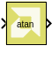

# atan

Compute element-wise arctangent function of an argument.

## Library

Math Functions / Math Operations

## Description

The atan block returns the output of the atan (`x`) function for each
element in array `x`.

## Data Type Support

Data types accepted at the inputs of the block are:

- Dimension: Input can be scalar, vector, or matrix.
- Data Types: Input supports signals of integer type, floating point
  type (double, single and half) and fixed point type.
- Complex Number Support: No

Output has the same dimension and type as the input. However, If the
data type of the input is a fixed point type, the data type of the
output is fixed point type with integer width fixed as 2. The reason for
this is that the output of the atan function is between -π/2 and π/2.
Use the atan2 function if you need the output of the function to be
between -π and π.

## Parameters

The Atan block has no parameters to set.
