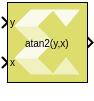

# atan2

Compute element-wise four-quadrant inverse tangent of input signal.

## Library

Math Functions / Math Operations

## Description

The atan2 block returns the output of the function atan2(`y`,`x`).

### Data Type Support

Data types accepted at the inputs of the block are:

- Dimension: Inputs can be scalar, vector, or matrix. If one of the
  inputs is scalar and the other is a vector or matrix then the scalar
  input is expanded to match the other input dimension, and operation
  will be performed element wise. If both inputs are non-scalar, then
  they must match in dimension.
- Data Types: Input supports signals of integer type, floating point
  type (double, single, and half) and signed and unsigned fixed point
  type. Both inputs must be of the same data type.
- Complex Number Support: No

Except for fixed-point input data type, output has the same data type as
the input. For fixed point input, the output data type will be signed
fixed-point with a 3-bit integer width, to be able to represent numbers
between –π and π.

## Parameters

The atan2 block has no parameters to set.

--------------
Copyright (C) 2024 Advanced Micro Devices, Inc.
All rights reserved.
