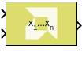
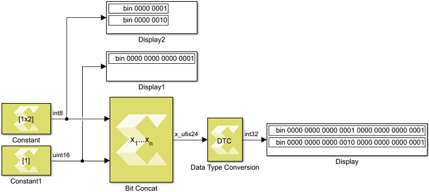

# Bit Concat

Perform bitwise concatenation of input values into a single output value

## Library

Logic and Bit Operations

## Description

Starting from the input with the highest order (the first input at the
top in normal block orientation) the bit values of all input ports are
concatenated into a single output bit vector. For multidimensional
inputs the dimensions of all inputs must match and concatenation
proceeds element-wise as it would in the scalar case. A scalar value on
one input is automatically expanded to match the dimensions of the other
input.

## Data Type Support

Data type support for the Bit Concat block is:

- All integer types (including Boolean) and fixed-point types are
  supported. Floating point types are not supported.
- All inputs must be of real numeric type. Complex types are not
  supported.
- Scalars, Vectors and 2-D Matrices are supported. Unless an input is a
  scalar, the dimensions of all inputs must agree.
- The output type is always an unsigned fixed-point type without
  fractional bits.

## Parameters

Number of inputs

Sets the number of inputs to be concatenated. The minimum number of
inputs is 2, the maximum is 128. The sum of all input bit widths shall
not exceed 1024 bits.
