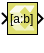

# Bit Slice

Extract a range of bits from a value

## Library

Logic and Bit Operations

## Description

The Bit Slice block allows the element-wise extraction of a contiguous
set of bits from the input values. The extracted bits are returned as
unsigned fixed point values of an all-integer range, and you specify the
width of the specified extraction range. The block dialog box allows you
to specify the range of bits using one of these methods:

- Bottom bit + width - You specify the bottom bit and the number of bits
  to be extracted (Slice width).
- Top bit + width - You specify the top bit and the number of bits to be
  extracted (Slice width).
- Top and bottom bit - You specify the top and bottom bits and the
  number of bits to be extracted is implied.

The top and bottom bit specifications have multiple ways of specifying
the position in relation to either the Least Significant Bit (LSB), the
Binary Point of a fixed-point value, or the Most Significant Bit (MSB).
In case of integer inputs the Binary Point and Least Significant Bit
options are equivalent. Offsets to specify the position relative to
these anchors can be positive or negative. However, an error will occur
during simulation and/or code generation if the extraction range lies
outside of the input type bit range.

## Data Type Support

The Bit Slice block accepts any real-valued integer or fixed-point type
of any dimension N ≤ 2. Floating point values and complex numeric types
are not supported.

The output data type is always a real-valued unsigned fixed-point type
with integer-only range. The output data has the same width as the
extraction range you specify.

The output dimensions are the same as the input dimensions.

## Parameters

Specify range as

The Specify range as parameter specifies the extraction range.

- If you select Bottom bit + width, parameters in the Bottom of bit
  range section are enabled and parameters in the Top of bit range
  section are disabled.
- If you select Top bit + width, parameters in the Top of bit range
  section are enabled and parameters in the Bottom of bit range section
  are disabled.
- If you select Top and Bottom bit, parameters in both the Top of bit
  range section and the Bottom of bit range section are enabled, and the
  Slice width parameter is disabled.

Following are the settings for the Specify range as parameter.

| Setting            | Description                                                                                                                                                                                                                                 |
|--------------------|---------------------------------------------------------------------------------------------------------------------------------------------------------------------------------------------------------------------------------------------|
| Bottom bit + width | The width specifies the number of bits to extract. The Bottom bit of the range specifies the offset at which the range begins (offset of the least significant bit to be extracted).                                                        |
| Top bit + width    | The width specifies the number of bits to extract. The Top bit of the range specifies the offset at which the range begins (offset of the most significant bit to be extracted).                                                            |
| Top and bottom bit | The Top bit of the range specifies the offset of the most significant bit to be extracted. The bottom bit of the range gives the offset of the least significant bit to be extracted. The width of the extracted range is given implicitly. |

Table 1. Specify Range As Parameter

Slice width

Specifies the width of the bit range to be extracted. Slice width is
only enabled if the Specify range as parameter is set to Top bit + width
or Bottom bit + width.

Enter a scalar positive integer value for Slice width.

Bit position relative to

Defines the basis for offset specifications in both Top of bit range and
Bottom of bit range sections of the block dialog box.

Following are the settings for the Bit position relative to parameter.

| Setting               | Description                                                                                                                                                                                                                                                                                                                                                  |
|-----------------------|--------------------------------------------------------------------------------------------------------------------------------------------------------------------------------------------------------------------------------------------------------------------------------------------------------------------------------------------------------------|
| Least Significant Bit | Defines the offset parameter as counting from the LSB of the input value, with offset 0 denoting the LSB, offset 1 denoting the bit to the left of the LSB, etc. If the Least Significant Bit setting is selected, the With offset parameter cannot specify a negative offset.                                                                               |
| Binary point          | Defines the offset parameter as counting from the binary point of a fixed point value, with offset 0 denoting the least significant integer bit. A negative offset denotes a range starting in the fractional bits with offset -1 being the most significant fractional bit. A positive offset denotes a range starting in the integer portion of the value. |
| Most Significant Bit  | Defines the offset parameter as counting from the MSB of the input value, with offset 0 denoting the MSB, offset -1 denoting the bit to the right of the MSB, etc. If the Most Significant Bit stetting is selected, the With offset parameter cannot specify a positive offset.                                                                             |

Table 2. Bit Position Relative To Parameter

With offset

Specifies the offset to be applied to the basis specified by the
corresponding Bit position relative to parameter. The With offset
parameter is available in both Top of bit range and Bottom of bit range
sections of the block dialog box.

Negative offsets specify bit positions to the right of the anchor (zero
offset basis). Positive offsets specify bit positions to the left of the
anchor.
