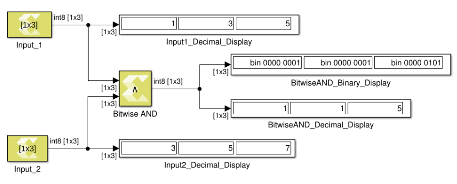

# Bitwise AND

Perform element and bitwise Boolean AND operation on the inputs

## Library

Logic and Bit Operations

## Description

The Bitwise AND block has two input signals and one output signal. The
block performs element and bit-wise Boolean AND operation on the inputs.
The first input corresponds to the top input port and the second input
to the bottom input port. Both input ports must have the same data type.
The dimension of the output signal matches the dimensions of the input
signals. Unless an input is a scalar, the dimensions of all inputs must
agree. A scalar value on one input is automatically expanded to match
the dimension of the other input.

Figure: Bitwise AND

## Data Type Support

The block accepts integer, fixed-point, and Boolean types of real
numeric type. It does not support floating point input types. Complex
signals are not supported for this operation.

## Parameters

The Bitwise AND block has no parameters to set.
