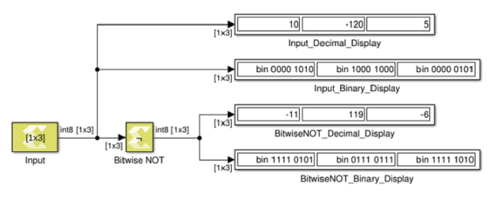

# Bitwise NOT

Perform element and bit-wise Boolean NOT operation on the input

## Library

Logic and Bit Operations

## Description

The Bitwise NOT block has one input signal and one output signal. It
performs element and bit-wise Boolean NOT operation on the input. The
dimension of the output signals matches the dimension of the input
signals.

## Data Type Support

The Bitwise NOT block accepts integer, fixed-point, and Boolean types of
real numeric type. The block does not support floating point input
types. Complex signals are not supported.

## Parameters

The Bitwise NOT block has no parameters to set.

--------------
Copyright (C) 2024 Advanced Micro Devices, Inc.
All rights reserved.
