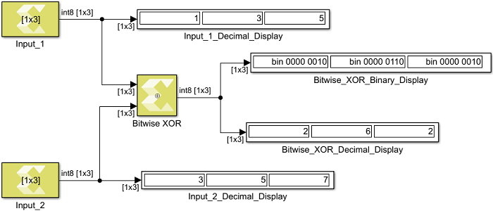

# Bitwise XOR

Perform element and bit-wise Boolean XOR operation on the inputs

## Library

Logic and Bit Operations

## Description

The Bitwise XOR block has two input signals and one output signal. The
block performs element and bit-wise Boolean XOR operation on the inputs.
The first input corresponds to the upper input port and the second input
to the lower input port. The dimension of the output signal matches the
dimensions of the input signals.

## Data Type Support

If one of the inputs is scalar, the output dimension is non-scalar. If
both inputs are non-scalar, they must have the same dimension. The
dimension can be scalar, vector, or matrix.

## Parameters

The Bitwise XOR block has no parameters to set.

--------------
Copyright (C) 2024 Advanced Micro Devices, Inc.
All rights reserved.
