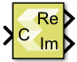

# Complex to Real-Imag

Computes the real and imaginary components of the input

## Library

Math Functions / Math Operations

## Description

The Complex to Real-Imag block accepts a complex or real signal of any
valid data type and outputs the real and/or imaginary components of the
input signal. The outputs are real-valued signals of the same data type
as the block input. The input can be a scalar, vector, or matrix. The
outputs have the same dimensions as that of the input.

## Data Type Support

Data type support for the input port is:

- Supports real or complex input of any valid data type. The outputs are
  real-valued signals of the same data type as the block input.
- The input can be a scalar, vector, or matrix. The outputs have the
  same dimensions as that of the input.

## Parameters

Output  
This parameter specifies the kind of output the block produces.

Settings for the Output parameter are:

| Setting       | Description                                                                                                               |
|---------------|---------------------------------------------------------------------------------------------------------------------------|
| Real and imag | Outputs real and imaginary parts of the input signal as Re and Im outputs of the block, respectively.                     |
| Real          | Outputs the real part of the input signal as Re output of the block.                                                      |
| Imag          | Outputs imaginary part of the input signal as Im output of the block. If the input is real, the Im output is zero valued. |

Table 1. Output Parameters
