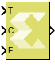

# Conditional

Pass through input T when control input C satisfies a selected criteria;
otherwise, pass through input F. The first and third input ports are
data ports, and the second input port is the control port.

## Library

Signal Routing

## Description

The Conditional block passes through input T when control input C
satisfies the selected criteria; otherwise, it passes through input F.
The first and third input ports are data ports, and the second (or
middle) input port is the control port.

## Data Type Support

Data type support for the Conditional block is:

- Inputs T and F should either be both complex or real, and can be
  scalar, vector, or matrix. For non fixed-point data types, inputs T
  and F do not necessarily have the same data type. But, for fixed point
  data types, both these inputs should be of fixed-point type. In that
  case the output data type will be fixed-point, and the number of
  integer and fractional bits will be set to accommodate both inputs
  without loss of precision. For example, if one of the inputs is
  x_sfix16_En10 (1 signed bit, 5 integer bits and 10 fractional bits),
  and the other is x_sfix16_En5 (1 signed bit, 10 integer bits, and 5
  fractional bits), the output will be x_sfix21_En10 (1 signed bit, 10
  integer bits, and 10 fractional bits).
- Input C can be a scalar, vector, or matrix if inputs T and F are
  scalars and Threshold parameter is scalar. In this case, the output
  dimension matches with the input C dimension. Input C must match the
  dimension of input T and F if they are non scalars. Input C should be
  real and can be of any data type.

## Parameters

#### Criteria for passing first input  
This parameter is used to select the condition under which the block
passes the first input (T). If the control input C meets the condition
set in the Criteria for passing first input parameter, the block passes
the first input (T). Otherwise, the block passes the third input (F).

Settings for the Criteria for passing first input parameter are:

| Setting         | Description                                                                                             |
|-----------------|---------------------------------------------------------------------------------------------------------|
| C \>= Threshold | Select input T if control input C is greater than or equal to the Threshold parameter.                  |
| C \> Threshold  | Select input T if control input C is greater than the Threshold parameter.                              |
| C ~= 0          | Select input T if control input C is not equal to 0. Selecting C ~= 0 disables the Threshold parameter. |

#### Threshold  
This parameter assigns the switch threshold that determines which input
the block passes to the output. Threshold parameter is rounded to the
same data type as that of the C input.

##### Settings  
| Settings                             | Description                       |
|--------------------------------------|-----------------------------------|
| 0                                    | default value                     |
| `real number`, `vector`, or `matrix` | any real scalar, vector or matrix |

**TIP**:
To specify a non-scalar threshold, use brackets. For example, the
following entries are valid: \[1 3 5\].

For a non-scalar threshold, the inputs must be scalars. In that case,
the output dimension is the same as the threshold dimension, and input 2
is compared to each element of the threshold, and depending on the
criteria, either T or F is selected to populate the output signal.

Dependencies  
Setting Criteria for passing first input to C ~= 0 disables this
parameter.

--------------
Copyright (C) 2024 Advanced Micro Devices, Inc.
All rights reserved.
