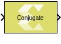

# Conjugate

Apply element-wise complex conjugate operation to the input signal

## Library

Math Functions / Math Operations

## Description

The Conjugate block applies element-wise complex conjugate operation to
the input signal.

The conjugate of a complex number is the number with equal real part,
where the imaginary part is equal in magnitude but opposite in sign. The
complex conjugate of a+bi is a-bi.

## Data Type Support

Data type support for the input is:

- The input signals can be signed integer, fixed-point, or
  floating-point data type.
- Boolean and unsigned data types are not supported.
- The input signals can be a scalars, vectors, or matrices.
- The input signal supports complex type.

The data type and dimension of the output signal are the same as those
of input signal. For complex type input, only the magnitude of the
imaginary part changes.

## Parameters

The Conjugate block has no parameters to set.

--------------
Copyright (C) 2024 Advanced Micro Devices, Inc.
All rights reserved.

SPDX-License-Identifier: MIT
