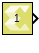

# Constant

Provides constant value as a source.

## Library

Source

## Description

The Constant block generates a constant output of the value specified by
the Constant value parameter. If you select Interpret vector parameters
as 1-D parameter and specify the constant value as a scalar, row matrix,
or column matrix, then the output is a 1-D array. Otherwise, the output
is always two-dimensional. The Constant block supports real or complex
constant values.

## Data Type Support

By default, the Constant block outputs a signal with double data type
and the same complexity as the Constant value parameter. However, you
can specify the output to be any data type that Model Composer supports,
including fixed-point and half data types by selecting the Output data
type parameter.

## Parameters

#### Constant value  
The Constant value parameter specifies the constant value output of the
block.

You can enter any expression that MATLAB® evaluates as a scalar or
matrix.

##### 1.0
Constant Value

#### Interpret vector parameters as 1-D  
Specifies whether the constant value should be interpreted as a 1-D
array.
##### On
If the specified constant value is a scalar, row matrix, or column matrix, then the output is a 1-D array. Otherwise, the output is a 2-D matrix.

##### Off
The output is a 2-D scalar or matrix.
                                                                                                          
#### Sample time  
Specifies block sample time as a numerical value. The sample time of a
block indicates when, during simulation, the block generates outputs or
updates its internal state.

The block allows you to specify a block sample time directly as a
numerical value. For example, to generate output at every two seconds,
you can directly set the discrete sample time by specifying the
numerical value of 2 as the Sample time parameter.

##### Sample Time Type
###### Discrete
Generates output at discrete samples Ts.
Discrete sample time is supported with the initial time offset value fixed to 0. The initial offset value is not configurable.

Sample Time Supported: Ts , Supported: Yes

###### Continuous
Generate output continuously by dividing the sample hits into major time steps and minor time steps. The Simulink ODE solver you choose integrates all continuous states from the simulation start time to a given major or minor time step.

Sample Time Supported: 0 , Supported: No

##### Inherited
The sample time value is inherited from other sources. It is determined by applying a set of heuristics and based on the context of the block within the model by Simulink.
Allowing a design to inherit sample time maximizes its reuse potential. For example, a design might fix the data types and dimensions of all its input and output signals. But you could reuse the design with different sample times (for example, discrete at 0.1 or discrete at 0.2, triggered, and so on).

Sample Time Supported: -1, Supported: Yes

###### Constant
Constant sample time. Same as inherited sample time for HLS blocks.

Sample Time Supported: inf, Supported: Yes

###### Variable
Variable Sample time.

Sample Time Supported: -2, Supported: No

###### Triggered
Execute the block upon some implicit condition when it is inside a subsystem like triggered, function call, or iterator subsystem.

Sample Time Supported: -1 (implicit), Supported: Yes

For additional details for simulating sample time, see [Types of Sample
time](https://in.mathworks.com/help/simulink/ug/types-of-sample-time.html)
in the Simulink documentation.

#### Output data type  
This parameter specifies the data type of the output signal.

If the output data type is one of the integer types, then the Constant
value is rounded off as explained below.

A value with the fractional part less than 0.5 is rounded towards zero,
the fractional part more than 0.5 is rounded away from zero.

In case of a tie (fractional part is 0.5), the Constant value is rounded
up, i.e. the negative Constant value, is rounded towards zero and the
positive Constant value is rounded away from zero.

#### Settings  
The following data types are supported:
##### double, single, and half
Floating point data types.

##### int8, uint8, int16, uint16, int32, uint32
Signed and unsigned integer data types.

##### Logical
Boolean data type.

##### Fixed point data type
* Fixed-point arithmetic data type with configurable output data type attributes like signedness, word length, fractional length.
* Constant value conversion attributes rounding and overflow for reading constant value parameter.

##### Data type Expression
A string that specifies the output data type. See "Working with Data Type Expression" in the Vitis Model Composer User Guide ([UG1483](https://docs.xilinx.com/access/sources/dita/map?isLatest=true&ft:locale=en-US&url=ug1483-model-composer-sys-gen-user-guide))

--------------
Copyright (C) 2023 Advanced Micro Devices, Inc. All rights reserved.
SPDX-License-Identifier: MIT
