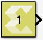

# Constant

Provides constant value as a source.

## Library

Source

## Description

The Constant block generates a constant output of the value specified by
the Constant value parameter. If you select Interpret vector parameters
as 1-D parameter and specify the constant value as a scalar, row matrix,
or column matrix, then the output is a 1-D array. Otherwise, the output
is always two-dimensional. The Constant block supports real or complex
constant values.

## Data Type Support

By default, the Constant block outputs a signal with double data type
and the same complexity as the Constant value parameter. However, you
can specify the output to be any data type that Model Composer supports,
including fixed-point and half data types by selecting the Output data
type parameter.

## Parameters

Constant value  
The Constant value parameter specifies the constant value output of the
block.

You can enter any expression that MATLAB® evaluates as a scalar or
matrix.

| Choices | Description    |
|---------|----------------|
| 1.0     | Constant Value |

Table 1. Settings

&nbsp;

Interpret vector parameters as 1-D  
Specifies whether the constant value should be interpreted as a 1-D
array.
| Choices | Description                                                                                                                                       |
|---------|---------------------------------------------------------------------------------------------------------------------------------------------------|
| On      | If the specified constant value is a scalar, row matrix, or column matrix, then the output is a 1-D array. Otherwise, the output is a 2-D matrix. |
| Off     | The output is a 2-D scalar or matrix.                                                                                                             |

Table 2. Settings

&nbsp;

Sample time  
Specifies block sample time as a numerical value. The sample time of a
block indicates when, during simulation, the block generates outputs or
updates its internal state.

The block allows you to specify a block sample time directly as a
numerical value. For example, to generate output at every two seconds,
you can directly set the discrete sample time by specifying the
numerical value of 2 as the Sample time parameter.

Settings for Sample time are:

[TABLE]

Table 3. Sample Time Parameter

For additional details for simulating sample time, see [Types of Sample
time](https://in.mathworks.com/help/simulink/ug/types-of-sample-time.html)
in the Simulink documentation.

&nbsp;

Output data type  
This parameter specifies the data type of the output signal.

If the output data type is one of the integer types, then the Constant
value is rounded off as explained below.

A value with the fractional part less than 0.5 is rounded towards zero,
the fractional part more than 0.5 is rounded away from zero.

In case of a tie (fractional part is 0.5), the Constant value is rounded
up, i.e. the negative Constant value, is rounded towards zero and the
positive Constant value is rounded away from zero.

&nbsp;

Settings  
The following data types are supported:

[TABLE]

Table 4. Output Data Type Parameter
