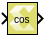

# Cosine

Computes cosine value for the input.

## Library

Math Functions / Math Operations

## Description

The Cosine block returns the output of the function cos(x) for each
element in array x.

## Data Type Support

Data type support is:

- Dimension: Input can be scalar, vector, or matrix.
- Data Types: Input supports signal of floating-point data types
  (double, single, and half), and signed fixed point type. It does not
  support integer, Boolean, and unsigned fixed point data types.
- Complex Numbers: Complex numbers are not supported.

Output has the same dimension and data type as the input. However, if
the data type of the input is a fixed point type, the data type of the
output is fixed point type with integer width fixed as 2.

## Parameters

The Cosine block has no parameters to set.

--------------
Copyright (C) 2024 Advanced Micro Devices, Inc.
All rights reserved.

SPDX-License-Identifier: MIT
