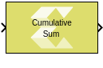

# Cumulative Sum

Compute the cumulative sum along the specified dimension of the input

## Library

Math Functions / Math Operations

## Description

The Cumulative Sum block computes the cumulative sum of the input signal
along the specified dimension or across time (running sum). The output
signal has the same dimensions, data type and complexity as the input
signal.

Summing is performed in this way:

- Summing along Rows: If the block is configured for cumulative sum
  along rows, each element in the output signal is the sum of the
  corresponding element in the input and all of the elements in the same
  row and to the left of that element. If the input is 1-dimensional,
  each element in the output signal is the sum of the corresponding
  element in the input and all of the preceding elements.
- Summing along Columns: If the block is configured for cumulative sum
  along columns, each element in the output signal is the sum of the
  corresponding element in the input and all of the elements in the same
  column and above of that element. If the input is 1-dimensional, each
  element in the output signal is the sum of the corresponding element
  in the input and all of the preceding elements.
- Running sum: If the block is configured for running sum, each element
  in the output signal is the sum of the corresponding element in the
  input signal over time. In this case you can specify an optional reset
  port and restart the running sum when the reset signal is asserted.

## Data Type Support

Data type support is:

- Data input: The data In input is the data signal to be summed. It
  supports integer, fixed point and floating-point data types but not
  boolean. The signal can be complex or real. The signal can be a
  scalar, vector or matrix.
- Reset: The Reset input is applicable only for running sum with
  non-default reset type. The reset signal must be scalar and real, and
  its data type must be integer or floating-point. Fixed point data type
  is not supported.
- Output: The data type, dimension and complexity of the output signal
  are the same as those of input signal.

## Parameters

Sum input along

This parameter specifies the dimension along which sum elements are
computed.

Settings for the Sum input along parameter are:

| Setting                | Description                                                                                                                                                                          |
|------------------------|--------------------------------------------------------------------------------------------------------------------------------------------------------------------------------------|
| Columns                | The block computes the cumulative sum of each column of the input.                                                                                                                   |
| Rows                   | The block computes the cumulative sum of each row of the input.                                                                                                                      |
| Channels (running sum) | The block computes a running sum for each element of the input across time. When you select the Channels (running sum) option, you will also have to specify a Reset port parameter. |

Table 1. Sum Input Along Parameter

Reset port

This parameter applies only to running sum. The Reset port parameter
appears if you select Channels (running sum) for the Sum input along
parameter.

Settings for the Reset port parameter are:

| Setting         | Description                                                                      |
|-----------------|----------------------------------------------------------------------------------|
| None            | Omits the Reset port.                                                            |
| Non-zero sample | Triggers a reset operation at each sample time that the Reset input is not zero. |

Table 2. Reset Port Paremeter
