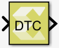

# Data Type Conversion

Convert the input to the data type of the output.

The block warns or errors out when an integer or fixed-point output
overflows during simulation. To configure, select Configuration
Parameters → Diagnostics → Data Validity. In the Data Validity pane, set
Wrap or Saturate to Overflow.

## Library

Signal Attributes

## Description

The Data Type Conversion block has one input and one output. It converts
the value of the input signal to the data type of the output. This
conversion tries to preserve the mathematical value of the input signal.
The data type of the output is specified via the mask dialog. The
conversion is governed by the following rules:

- Conversions where the output data type is fixed-point, first select
  the nearest number that can be represented, taking into account the
  overflow mode. In case of a tie, the rounding mode breaks the tie.
- Conversions where the output data type is integer are performed as in
  the C language. Overflow is handled via truncation.
  - As per IEEE Standard for Floating-point Arithmetic (IEEE Standard
    754, Section-7.2), conversion from floating-point to integral is an
    invalid operation, when the floating-point value is outside the
    range of the destination integer data type. In this case, the output
    integer value depends upon the implementation of a C compiler.
    Hence, the results from the HLS Data Type Conversion block may
    differ from the results from Simulink® Data Type Conversion block.
  - When the floating-point input value is outside the range of the
    integer data type, the simulation results between Model Composer and
    RTL co-simulation in Vitis HLS may also differ.
  - During simulation, to check whether the input floating-point value
    goes outside the range of the destination integer type, in Simulink
    select Model Configuration Parameters → Diagnostics → Data Validity
    . Then set Saturate on overflow to either warning or error.
- Conversions where the output data type is floating point follow the
  rules implemented in the C language.

## Data Type Support

The input signal can be double, single, an integer, boolean, Xilinx
supported half or Xilinx supported fixed-point data type.

The data type of the output is specified the mask parameters.

The input can be real or complex, and scalar, vector, or matrix. The
output signal has the same complexity and dimensions as the input
signal.

## Parameters

Output data type  
This parameter specifies the data type of the output signal. If `fixed`
is specified, more parameters are available.

Settings for the Output data type parameter are as follows.

| Setting              | Description                                                                                                                                                                                                                                                         |
|----------------------|---------------------------------------------------------------------------------------------------------------------------------------------------------------------------------------------------------------------------------------------------------------------|
| double               | double precision floating point                                                                                                                                                                                                                                     |
| single               | single precision floating point                                                                                                                                                                                                                                     |
| int8                 | 8-bit signed integer                                                                                                                                                                                                                                                |
| uint8                | 8-bit unsigned integer                                                                                                                                                                                                                                              |
| int16                | 16-bit signed integer                                                                                                                                                                                                                                               |
| uint16               | 16-bit unsigned integer                                                                                                                                                                                                                                             |
| int32                | 32-bit signed integer                                                                                                                                                                                                                                               |
| uint32               | 32-bit unsigned integer                                                                                                                                                                                                                                             |
| logical              | boolean                                                                                                                                                                                                                                                             |
| fixed                | Xilinx supported fixed-point                                                                                                                                                                                                                                        |
| half                 | Xilinx supported half precision floating point                                                                                                                                                                                                                      |
| data type expression | A string that specifies the output data type. See "Working with Data Type Expression" in the Vitis Model Composer User Guide ([UG1483](https://docs.xilinx.com/access/sources/dita/map?Doc_Version=2022.2%20English&url=ug1483-model-composer-sys-gen-user-guide)). |

Table 1. Output Data Type Parameter

Signedness  
If the Output data type is set to fixed, the Signedness parameter
specifies whether the output is a signed fixed-point or unsigned
fixed-point data type.

Settings for the Signedness parameter are as follows.

| Setting  | Description                                                  |
|----------|--------------------------------------------------------------|
| Signed   | The output type contains both positive and negative numbers. |
| Unsigned | The output type contains only non-negative numbers.          |

Table 2. Signedness Parameter

This parameter is available only if fixed is selected as the setting for
parameter Output data type.

&nbsp;

Word length  
If the Output data type is set to fixed, the Word length parameter
specifies the number of bits used to represent it.

| Choices | Description        |
|---------|--------------------|
| 16      |                    |
| N       | A positive integer |

Table 3. Word Length Parameter

This parameter is available only if fixed is selected as the setting for
parameter Output data type.

Fractional length  
If the Output data type is set to `fixed`, the Fractional length
parameter specifies the number of bits to the right of the binary point.

| Choices | Description |
|---------|-------------|
| 10      |             |
| N       | An integer  |

Table 4. Fractional Length Parameter

This parameter is available only if fixed is selected as the setting for
parameter Output data type.

Round  
If the Output data type is set to fixed, the Round parameter allows you
to select among five rounding and two truncation options.

If one of the five rounding options is selected, the block always rounds
to the nearest supported precision. The five rounding choices are
relevant only in case of a tie. For example, assume the output type is
signed fixed-point, with a word length of 6 and a fractional length of
2, and the input to the block is 2.74. In this case, the output is
rounded to the nearest supported precision, 2.75, regardless of which
one of the five rounding modes is selected. However, if the input value
is 2.625 (halfway between 2.5 and 2.75), then the output value depends
on the chosen rounding mode. If Round to plus infinity is selected, the
value will be 2.75, and if Round to zero is selected, the value will be
2.5. For more information on this, refer to the Vitis High-Level
Synthesis User Guide
([UG1399](https://docs.xilinx.com/access/sources/dita/map?Doc_Version=2022.2%20English&url=ug1399-vitis-hls)).

If one of the two truncation options is selected, the output will be
truncated to the supported precision specified by the truncation
selection.

Truncation to minus infinity is the default setting for Round and
requires the smallest hardware resources among all the options.

The Round parameter is available only if fixed is selected as the
setting for the Output data type parameter.

Settings for the Round parameter are:

| Setting                      | Description                  |
|------------------------------|------------------------------|
| Round to plus infinity       | Rounding to plus infinity    |
| Round to zero                | Rounding to zero             |
| Round to minus infinity      | Rounding to minus infinity   |
| Round to infinity            | Rounding to infinity         |
| Convergent rounding          | Convergent rounding          |
| Truncation to minus infinity | Truncation to minus infinity |
| Truncation to zero           | Truncation to zero           |

Table 5. Round Parameter

&nbsp;

Overflow  
If the Output data type is set to `fixed`, the Overflow parameter
specifies the overflow mode applied during conversion.

This parameter is available only if fixed is selected as the setting for
parameter Output data type.

Settings for the Overflow parameter are:

| Setting                    | Description                |
|----------------------------|----------------------------|
| Saturation                 | Saturation                 |
| Saturation to Zero         | Saturation to zero         |
| Symmetrical Saturation     | Symmetrical saturation     |
| Wrap around                | Wrap around                |
| Sign-Magnitude Wrap Around | Sign magnitude wrap around |

Table 6. Overflow Parameter

&nbsp;

Type Expression  
If the Output data type is set to data type expression, the Type
Expression parameter specifies the output data type as a string.

This parameter is available only if data type expression is selected as
the setting for parameter Output data type.

&nbsp;

Saturate on integer overflow  
This parameter specifies whether integer overflow is handled by wrapping
(default) or by saturating. This parameter is relevant only if the
output is integral (int8, int16, int32, uint8, uint16, uint32).

When overflow is detected, the Diagnostic Viewer displays messages
depending on the diagnostic action selected in the Configuration
Parameters dialog box. To configure, in the Configuration
Parameters → Diagnostics → Data Validity pane, set the Wrap or Saturate
on overflow.

Settings for the Saturate on integer overflow parameter are:

| Setting      | Description                                |
|--------------|--------------------------------------------|
| Not selected | Integer overflow is handled by wrapping.   |
| Selected     | Integer overflow is handled by saturation. |

Table 7. Saturate On Integer Overflow Parameter

If the Output data type is set to fixed and overflow is detected, the
Diagnostic Viewer displays messages that depend on the diagnostic action
you specify in the Simulink Editor. To configure, select
Simulation → Model Configuration Parameters → Diagnostics → Data
Validity for your model in the Simulink Editor, then set the Wrap on
overflow or Saturate on overflow parameter.
