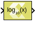

# Log10

Compute element-wise base 10 logarithm of input

## Library

Math Functions / Math Operations

## Description

The Log10 block returns the base 10 logarithm value for the input. The
block supports input of all data types except Boolean. The input can be
scalar, vector, or matrix.

## Data Type Support

Data types accepted at the inputs of the block are:

- Data Types:  Input supports signals of integer, fixed-point, and
  floating-point data type. The block does not support Boolean inputs.
- Complex Number Support: No

The output has the same dimension and type as the input.

## Parameters

The Log10 block has no parameters to set.

--------------
Copyright (C) 2023 Advanced Micro Devices, Inc. All rights reserved.
SPDX-License-Identifier: MIT
