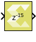

# Delay

Delay input signal by specified number of samples

## Library

Signal Operations

## Description

The delay block produces an output signal by delaying the input signal
by the number of samples specified in the block dialog box. If the
latency of the block is N, then the N-1 first output samples are always
0, and the N-th output sample is the first input sample.

## Data Type Support

All data types are supported.

Input can be a vector or a matrix. If input is a vector or a matrix and
the latency value is a scalar, the scalar value will apply to all the
elements of the input.

Output is complex if the input is complex.

## Parameters

#### Latency

The Latency parameter specifies the number of samples by which the input
signal is delayed.

Latency should be a real, non-negative, scalar integer with minimum
value as 1 and maximum value as 2^25.

--------------
Copyright (C) 2023 Advanced Micro Devices, Inc. All rights reserved.
SPDX-License-Identifier: MIT
