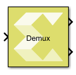
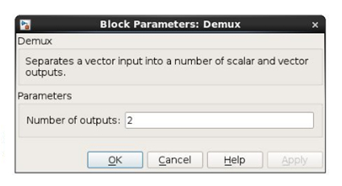
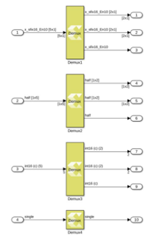

# Demux

Separates a vector input into a number of scalar and vector outputs.

## Library

Signal Routing

## Description

The Demux block input signal can be a scalar, a vector, a row matrix
(1xN), or a column matrix (Nx1). The block splits elements in the input
signal into scalar and vector type output signals according to the width
of each output port starting from the first port at the top right.

The number of output ports and the port widths are configurable using
the Number of outputs block parameter,

You can specify the width of each port or it can be dynamically computed
by the block based on how the parameter value is provided. Refer to the
Parameters section below for more details.

When the value of the Number of outputs parameter is changed, the output
ports are either added or removed starting from the last port at the
bottom right.

Figure: Demux Parameter Dialog

Figure: Demux Diagaram

The output ports are added/removed starting from the last port at the
bottom right.

## Data Type Support

Inputs  
- The block has one input port.
- The input signal can be a scalar, a vector (N), a row matrix (1xN), or
  column matrix (Nx1), where N is the width of input signal.
- The Demux block supports all native data types (double, single, uint8,
  int8, uint16, int16, uint32, int32, and boolean), and Model Composer
  supported half and fixed-point data types.
- The block supports input data in real or complex numeric type.

&nbsp;

Outputs  
- The number of outputs for the block is specified using the Number of
  outputs block parameter.
- The value of the block parameter can be a finite positive integer, P,
  or an array of integers. The numbers in the array are used to decide
  the number of outputs as well as the width of each output signal.
- An output signal can be configured as a scalar, a vector (M), a row
  matrix (1xM), or a column matrix (Mx1) where M is less than or equal
  to the width of the input signal.
- The sum of widths of all output signals is ensured to be the same as
  the input signal width.
- The data type and the numeric type (real or complex) of output signals
  are the same as those of the input signal.

## Parameters

Number of outputs  
This parameter takes number of outputs in several ways. Depending upon
the parameter value, the output ports are added/removed starting from
the last port at the bottom right.

[TABLE]

Table 1. Number of Outputs
