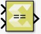
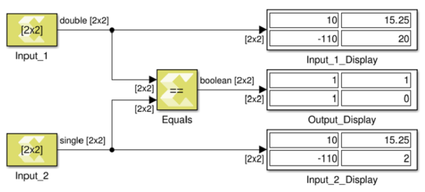

# Equals

Perform element-wise equal to relational operation on the inputs. The
top input corresponds to the first operand.

## Library

Relational Operations

## Description

The Equals block performs element-wise comparison of inputs for
equality. The block has two input ports and one output port. The output
is true if the first input is equal to the second input.

Figure: Equals Block

## Data Type Support

Data types accepted at the inputs of the block are:

- The block supports all data types supported by Vitis Model Composer.
- The block supports inputs having different data types. The output data
  type is always Boolean.
- The block supports mixed dimensions for inputs, where one input is a
  scalar, and the other input is a vector/matrix. The scalar value is
  compared with each element of the multi-dimensional input value for
  equality. The output has the same dimension as the multi-dimension
  input.
- If both inputs are non-scalar then their dimensions must match.

The output data type is always Boolean.

## Parameters

The Equals block has no parameters to set.
