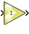

# Gain

Element-wise multiplication of the input by a constant gain factor

## Library

Math Functions / Math Operations

## Description

The Gain block multiplies the input signal by a constant gain factor.

You can specify the data type of the gain constant and built-in type
promotion rules apply to determine the output data type. Alternatively,
the output data type can be made the same as the input type. In case of
integer overflow the block supports the option to saturate output values
at the output type limits.

The block warns or errors out when an integer output overflows during
simulation. To configure, select Simulation → Model Configuration
Parameters → Diagnostics → Data Validity for your model in the Simulink
Editor, then set the Wrap on overflow or Saturate on overflow parameter.

### Data Type Support

The block supports all data types except Boolean.

Data type support for the block is:

- The input can be a scalar, vector or matrix.
- If the input is a vector or matrix and the Gain is a scalar, the
  scalar value will apply to all the elements of the input.
- If neither the input nor the gain constant are scalar the dimensions
  of the input and the gain constant must match.

The output is complex if either the Gain constant or the input is
complex.

## Parameters

#### Gain

Specifies the constant gain factor. The Gain can be any valid MATLAB
expression that evaluates to a real or complex scalar, vector, or
matrix.

#### Gain data type

This parameter specifies the type of conversion to be applied to the
Gain factor constant before multiplication. If fixed is specified more
parameters are available.

Settings for the Gain data type parameter are:

##### double
double precision floating-point

##### single
single precision floating-point

##### int8
8-bit signed integer

##### uint8
8-bit unsigned integer

##### int16
16-bit signed integer

##### uint16
16-bit unsigned integer

##### int32
32-bit signed integer

##### uint32
32-bit unsigned integer

##### fixed
fixed-point

##### half
half precision floating-point

##### data type expression
A string that specifies the output data type. See "Working with Data Type Expression" in the Vitis Model Composer User Guide ([UG1483](https://docs.xilinx.com/access/sources/dita/map?Doc_Version=2022.2%20English&url=ug1483-model-composer-sys-gen-user-guide)). |

Unless the **Output data type same as input** parameter is enabled, the
output data type will be a function of the input type and the specified
Gain data type.

- If either input or gain types are floating-point (double, single, or
  half), the output type will be floating-point. If both are
  floating-point, the output type will be the larger of both. The
  smaller type will be promoted to the larger before the operation.
- Otherwise, if either of input or Gain data type are fixed-point, the
  output type will be fixed-point with a bit width sufficient to hold
  the full output result. The other type (input or Gain data type) will
  be promoted to its equivalent fixed-point type.
- Otherwise, the input and Gain data type are integers. The output type
  will be the larger of either input or Gain data type, and will be a
  signed integer if either one is signed.

#### Output data type same as input

This parameter specifies the way the output data type is determined.

If disabled (unchecked) the output type is computed via built-in type
promotion rules. If enabled (checked), the output data type is the same
as the input type.

#### Saturate on integer overflow

This parameter specifies the behavior in case of integer overflow. By
default the option is disabled and overflow would result in value wrap.
With the option enabled, integer overflow gets mitigated by saturation
at the limits of the output data type.

Settings for the Saturate on integer overflow parameter are:

##### Unchecked
Wrap around

##### Checked
Saturation

When overflow is detected, the Diagnostic Viewer displays messages that
depend on the diagnostic action you specify in the Simulink Editor. To
configure, select Simulation → Model Configuration
Parameters → Diagnostics → Data Validity for your model in the Simulink
Editor, then set the Wrap on overflow or Saturate on overflow parameter.

--------------
Copyright (C) 2023 Advanced Micro Devices, Inc. All rights reserved.
SPDX-License-Identifier: MIT
