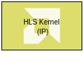

# HLS Kernel

This block lets you import an HLS kernel code with a streaming
interface.



## Library

HLS/User-Defined Functions

## Description

The HLS Kernel block allows you to import an HLS kernel, which is a
proper HLS IP (an IP with interface specification using HLS pragmas).
The primary use of this block is to co-simulate AI Engine domain with
HLS.

**Note**: This block does not participate in HLS code generation and should
not be part of the HLS subsystem in a design.

**Note**: Use this block to connect with AI Engine blocks using the AIE to
HLS Kernel or HLS to AIE blocks and co-simulate a design with both AI
Engines and PL components.

The block also accepts templatized HLS functions.

Function arguments can be either of hls::stream type or of scalar or
vector types. For example the following is a valid HLS function
signature:

``` pre
void func(hls::stream<unsigned int> &in, const ap_uint<8> (&param_in)[32], hls::stream<unsigned int> &out, ap_uint<8> param_out);
```

For stream inputs and outputs, this block accepts variable size signals
and produces variable size outputs. For stream inputs and outputs, the
data width can only be 32, 64, or 128 bit wide.

## Parameters
#### Kernel header file
String, Mandatory

The name of the HLS kernel header file that contains the function declaration. The string could be just the file name, a relative path to the file or an absolute path of the file. Use the browse button to select the file.

#### Kernel function
String, Mandatory

The name of the kernel function in C/C++ for which HLS Kernel block is to be created.


#### Kernel source file
String, optional

The name of the source file that contains the kernel function implementation (definition). The string could be just the file name, a relative path to the file or the absolute path of the file.

You can specify both the declaration and the definition of the function in the header file and leave this field empty.

#### Kernel search paths
Vector of Strings, Optional

If the kernel header file or the kernel source file is not found using the value provided through the 'Kernel header file' or 'Kernel source file' fields respectively, then the paths provided through 'Kernel search paths' are used to locate the files.

This parameter allows use of environment variables while specifying paths for the kernel header file and the kernel source file. The environment variable can be used in either ${ENV} or $ENV format.

#### Preprocessor Options
Optional

Optional preprocessor arguments for downstream compilation with specific preprocessor options.

The following two preprocessor option formats will be accepted and multiple can be selected. -Dname and -Dname=definition. That is, the optional argument must begin with the -D string and if the option definition value is not provided, it is assumed to be 1.


