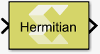
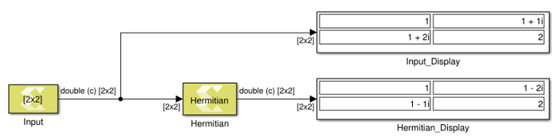

# Hermitian

Perform element-wise conjugate transpose operation on the input signal.

## Library

Math Functions / Matrices and Linear Algebra

## Description

The Hermitian block performs a conjugate transpose operation on the
input signal.

Figure: Hermitian Block

## Data Type Support

This block supports all data types supported by Xilinx® Model Composer.
The input signal can be real or a complex number of scalar, vector, or
matrix type.

## Parameters

The Hermitian block has no parameters to set.
