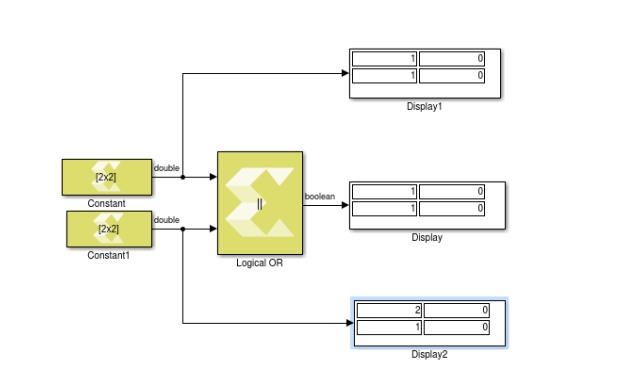

# Logical OR

Performs element-wise logical OR operation on inputs

## Library

Logic and Bit Operation

## Description

The Logical OR block has two input ports and one output port. The block
performs an element-wise logical OR operation on the inputs and produces
a Boolean result on the output.

## Data Type Support

- The Logical OR block supports all data types supported by Model
  Composer.
- The block supports inputs of different data types. The output data
  type is always Boolean.
- The block only supports real inputs.
- The block supports scalar and non-scalar type inputs. If one input is
  non-scalar type then the other input can be scalar type. When both
  inputs are non-scalar type then their dimensions must match. In that
  case, the output has the same dimension as the inputs.

## Parameters

The Logical OR block has no parameters to set.

--------------
Copyright (C) 2024 Advanced Micro Devices, Inc.
All rights reserved.

SPDX-License-Identifier: MIT
