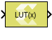
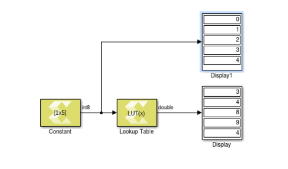

# Lookup Table

Perform one-dimensional lookup operation with an input index.

## Library

Lookup Tables

## Description

The Lookup Table block implements a simple read-only memory block with
an input index. The block maps input to an output value by looking up a
table of values you define with a Table data parameter.

The input value is used as a zero-based index into the table data. The
Input bias parameter is an offset to the index value (to support
negative indexing). A When input is out of range parameter lets you
specify the behavior of the block if the index value exceeds the valid
table size range.

**Note**: If the table size is not an exact power of 2, the block incurs
additional hardware cost when it is implemented in a Xilinx device, due
to a remainder calculation on the index.

In the example above, the Table data setting for the Lookup Table block
is \[7 3 4 8 9 4 1 5\] with an input bias of 1.

## Data Type Support

The Lookup Table block accepts the following data types to represent
scalar index value: int8, uint8, int16, uint16, int32, uint32, and
fixed-point type. Fixed-point inputs is shifted appropriately to
generate an integer index.

The output data type is same as the Table data parameter type. Inputs
for indexing must be real, but table data can be complex.

## Parameters

#### Table Data

This parameter accepts a 1-D vector of table values. The size of the
vector determines the valid index range for the input index. The data
will be explicitly converted into the type specified in the Output data
type parameter. If the input index exceeds table size and Saturate at
table ends is specified for the When input is out of range parameter,
then index value is saturated to either top or bottom of table size
range. If Wrap around is specified for the When input is out of range
parameter, the index is wrapped into the valid table size range.

**Note**: Large tables should be defined via a Simulink workspace variable
due to space limitations in the block dialog box.

#### Input bias

This parameter is an offset into the table data that will be added to
the index input. This makes it possible to use negative indices and
perform look up operation.

#### When input is out of range

This parameter will guard the index value if it exceeds the valid table
size range.
##### Saturate at table ends
If index value exceeds the valid table size range, then index value is saturated to either top or bottom of table size range, depending on the overflow direction.

##### Wrap around
If index value exceeds the valid table size range, then index value is wrapped into the valid table size range.

#### Output data type

Specifies the output data type.

##### double
double precision floating-point

##### single
single precision floating-point

##### int8
8-bit signed integer

##### uint8
8-bit unsigned integer

##### int16
16-bit signed integer

##### uint16
16-bit unsigned integer

##### int32
32-bit signed integer

##### uint32
32-bit unsigned integer

##### boolean
boolean

##### fixed
fixed-point

##### half
half precision floating-point

##### data type expression
A string that specifies the output data type. See "Working with Data Type Expression" in the Vitis Model Composer User Guide ([UG1483](https://docs.xilinx.com/access/sources/dita/map?Doc_Version=2022.2%20English&url=ug1483-model-composer-sys-gen-user-guide)).

--------------
Copyright (C) 2023 Advanced Micro Devices, Inc. All rights reserved.
SPDX-License-Identifier: MIT
