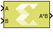

# Matrix Multiply

Compute matrix product of two input signals. The first operand is the
top input on the block.

## Library

Math Functions / Matrices and Linear Algebra

## Description

The Matrix Multiply block has two input ports and one output port. The
output signal is the matrix product of the input signals where the first
operand corresponds to the top input.

## Data Type Support

The data type of the input signals can be any floating-point,
fixed-point, integer, or Boolean. The input signals can be real or
complex. The input signals can be scalar, vector, or matrix, but they do
need to be such that mathematically, the matrix product is defined. The
table below shows valid combinations. Combinations that do not match any
row in the table result in an error.

| Dimensions of First Operand | Dimensions of Second Operand | Dimensions of Matrix Product | Conditions                |
|-----------------------------|------------------------------|------------------------------|---------------------------|
| K x L                       | L x M                        | K x M                        | K \>= 1, L \>= 1, M \>= 1 |
| K x L                       | L                            | K                            | K \>= 1, L \> 1           |
| K x 1                       | 1                            | K x 1                        | K \>= 1                   |
| K                           | 1                            | K                            | K \>= 1                   |
| K                           | 1 x M                        | K x M                        | K \>= 1, M \>= 1          |

The output data type is determined according to the following rules, in
the order listed. T1 is a variable representing the type of the first
operand; T2 is a variable representing the type of the second operand.
These rules were chosen for maximum alignment with Vitis HLS, which may
not correspond to the output data type computed via the internal rule of
the Simulink® Matrix Product block.

| Data Type of First Operand | Data Type of Second Operand | Data Type of Matrix Product                                                                                                                                             |
|----------------------------|-----------------------------|-------------------------------------------------------------------------------------------------------------------------------------------------------------------------|
| T1: floating-point         | T2                          | The widest floating-point type between T1 and T2 if T2 is a floating-point type; otherwise T1                                                                           |
| T1                         | T2: floating-point          | The widest floating-point type between T1 and T2 if T1 is a floating-point type; otherwise T2                                                                           |
| fixed-point                | fixed-point                 | The smallest fixed-point type capable of representing the product without loss of precision                                                                             |
| fixed-point                | integer                     | The smallest fixed-point type capable of representing the product without loss of precision                                                                             |
| integer                    | fixed-point                 | The smallest fixed-point type capable of representing the product without loss of precision                                                                             |
| T1: integer                | T2: integer                 | Let W1 be the bit width of T1 and W2 be the bit width of T2. The product is the integer type with bit width max (W1,W2) and it is signed if either T1 or T2 are signed. |
| boolean                    | T2                          | T2                                                                                                                                                                      |
| T1                         | boolean                     | T1                                                                                                                                                                      |

## Parameters

The Matrix Multiply block has no parameters to set.

--------------
Copyright (C) 2023 Advanced Micro Devices, Inc. All rights reserved.
SPDX-License-Identifier: MIT
