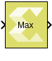

# Max

Outputs the maximum value of an input or element-wise maximum value of
multiple inputs.

## Library

Math Functions/Math Operations

## Description

The Max block with a single scalar or vector input, outputs the maximum
value of the input.

If the block has more than one input, the non-scalar inputs must have
the same dimensions. Any scalar input is expanded to the dimensions of
the non-scalar inputs, and the block outputs element-wise maximum value
of the inputs.

## Data Type Support

- The block supports floating-point, integer, and fixed-point data
  types.
- The block supports real valued inputs.
- For Number of Inputs = 1.
  - The block supports a scalar or vector (1-D or 2-D) input when it has
    only one input port. The output is a scalar.
- For Number of Inputs \> 1.
  - The block supports scalar, vector, or matrix inputs when it has more
    than one input port.
  - The output has the same dimensions as those of the inputs when all
    the inputs have the same dimensions.
  - The block supports mixed dimensions for inputs when it has more than
    one input port, provided all the non-scalar inputs have the same
    dimensions. Any scalar input is expanded to the dimensions of
    non-scalar inputs, and the block outputs element-wise maximum value
    of the inputs. The output has the same dimensions as those of the
    non-scalar inputs.
- The block supports inputs having different data types. The output data
  type in this case is defined by the following set of rules.
  - If the data type of one of the inputs is a floating-point type, the
    data type of the output is the floating-point type among the data
    types of the inputs with the most precision.
  - If the data type of one of the inputs is a fixed-point type, the
    data type of the output is the smallest fixed-point type capable of
    representing the result without any loss of precision.
  - If the inputs are integral, the output is integral. If any input is
    signed, the output is signed. The bit width of the output is the
    largest among the bit widths of the inputs.

## Parameters

Number of inputs  
This parameter determines the number of inputs.

[TABLE]

Table 1. Number of Inputs
