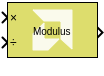

# Modulus

Performs element-wise modulus operation on the input signals

## Library

Math Functions / Math Operations



## Description

The Modulus block takes two inputs. The first input is taken as dividend
and the second input is considered as divisor. The output is the
remainder after division. For each element of the dividend A, compute
the modulus operation (remainder after division) with regard to the
corresponding element of the divisor B, as follows:

``` pre
M = mod(A, B) = A - B .* floor(A ./ B)
```

The block can handle division by 0 by returning the NaN output for
floating-point data types and 0 for the rest of the data types.

Note: For signed data types the remainder will have the same sign as the
divisor B. If instead it should have the same sign as the dividend, use
the Remainder block instead of the Modulus block.

## Data Type Support

Data types accepted at the inputs of the block are:

- The block supports all native Simulink® data types, as well as half
  precision floating-point, and fixed-point data types.
- For inputs of bool data type, the output value is always false.
- The block supports scalars, vectors, and 2D matrices.
- The input dimensions must match unless one input is a scalar, in which
  case, it gets broadcast to be used with each of the other input's
  elements. The output dimension is the larger of the two input
  dimensions.
- The block supports mismatched input data types. The output data type
  is decided by Vitis Model Composer data type propagation rules.
- The block operates on inputs of real numeric type only. For input of
  complex numeric type it issues an error.

## Parameters

The Modulus block has no parameters to set.
