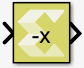
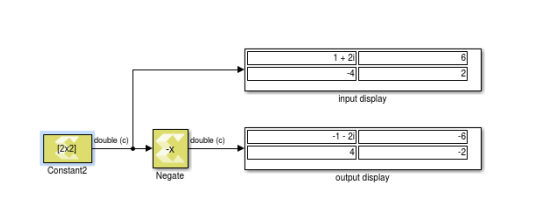

# Negate

Perform element-wise unary minus operation on the input data

## Library

Math Functions / Math Operations

## Description

The Negate block computes element-wise minus operation on the input
data. The block handles signedness of real and imaginary parts
separately in case of complex data input.

Figure: Negate Block

## Data Type Support

Data type support is:

- Input Data Type: All data types are supported except unsigned integer
  and Boolean values.
- Output: The data type, dimension, and complexity of the output are
  the same as those of the input signal.

The block supports scalar, vector, and two-dimensional matrix data.

## Parameters

The Negate block has no parameters to set.
