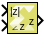

# Polar to Complex

Element-wise conversion of real magnitude and angle representation
signals into a complex signal

## Library

Math Functions / Math Operations

## Description

The Polar to Complex block accepts a real signal of floating point data
type such as double, single, or half. The first and second
inputs represent magnitude and angle respectively. The angle is in
radians. The outputs are complex values of the same data type as the
block input for a given real magnitude and angle. The input can
be scalar, vector or matrix of real signals, in which case the output
signals are also scalar, vector, or matrix. The elements of a certain
magnitude input map to the magnitudes of the corresponding complex
output elements. Similarly, the elements of a certain angle input map to
the angles of the corresponding complex output elements.

## Data Type Support

Data types accepted at the inputs of the block are:

- Dimension : The inputs can be scalar, array, or combination of scalar
  and an array. If both the inputs are arrays, they must have the same
  dimensions.
- Data Types:  Supports signal of floating point data type such
  as double, single, and half. Both inputs must have the same data type.
- Complex Number Support: No

Outputs for the different input types are:

| Inputs                                          | Output                                    |
|-------------------------------------------------|-------------------------------------------|
| Both are scalar                                 | Scalar                                    |
| Both are vector                                 | Vector of same dimension                  |
| Both are matrix                                 | Matrix of same dimension                  |
| One is scalar and the other is vector or matrix | Dimension is that of the vector or matrix |

## Parameters

The Polar to Complex block has no parameters to set.

--------------
Copyright (C) 2024 Advanced Micro Devices, Inc.
All rights reserved.

SPDX-License-Identifier: MIT
