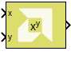

# Pow

Compute the element-wise power function

## Library

Math Functions / Math Operations

## Description

The Pow block computes the value of a base raised to the power exponent.
Z = X^(y) raises each element of X to the corresponding power in y. If
one of inputs is a matrix and the other is a scalar, the scalar input is
expanded to match the dimension of the non-scalar input to perform the
operation. If both inputs are non-scalar, they must agree in dimension.

## Data Type Support

Data type support for the block is:

- Dimension: Inputs can be scalar, vector, or matrix. If one of the
  inputs is scalar and the other is a vector or matrix then the scalar
  input is expanded to match the other input dimension and the operation
  will be performed element-wise. If both inputs are non-scalar, then
  they must match in dimension.
- Data Types: Input supports signals of integer type, floating point
  data type (double, single, and half), and signed and unsigned
  fixed-point type. Both inputs must be of the same data type.
- Complex Numbers: Complex numbers are not supported.

A negative base value raised to a fractional power will result in a Not
A Number (NAN) value.

## Parameters

The Pow block has no parameters to set.

--------------
Copyright (C) 2024 Advanced Micro Devices, Inc.
All rights reserved.

SPDX-License-Identifier: MIT
