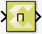

# Product of Elements

Multiply the elements of the input signal

## Library

Math Functions / Math Operations

## Description

The Product of Elements block computes the product of the elements of
the input signal. The block can be configured in the following ways.

- By default, the output is scalar and equal to the product of all
  (matrix) elements of the input signal.
- If the dimension to multiply over is specified to be 1, the output is
  a row matrix (1xN), where N is the number of columns of the input, and
  element (1,k) is the product of the elements of column k of the input.
- If the dimension to multiply over is specified to be 2, the output is
  a column matrix (Mx1), where M is the number of rows of the input, and
  element (k,1) is the product of the elements of row k of the input.

## Data Type Support

The input signal can be real or complex. The input data type can be any
Boolean, integer, floating-point, or fixed-point data type. The block
can perform element-wise multiplication on real or complex number data.

## Parameter

Multiply over

The Multiply over parameter value is used to decide whether elements
will be multiplied in all dimensions or in one of the dimensions.

Following are the settings for the Multiply over parameter.

| Setting             | Description                                                                                  |
|---------------------|----------------------------------------------------------------------------------------------|
| All dimensions      | Multiply all elements of the input signal (output is scalar)                                 |
| Specified dimension | This option shows an edit box, Dimension, where the specific dimension value can be entered. |

Table 1. Multiply Over Parameter

Dimension

The Dimension parameter is displayed only if the Multiply over parameter
value is set to Specified dimension.

Following are the settings for the Dimension parameter.

| Setting | Description                                                      |
|---------|------------------------------------------------------------------|
| 1       | Multiply input over row dimension. Output is a row matrix.       |
| 2       | Multiply input over column dimension. Output is a column matrix. |

Table 2. Dimension Parameter
