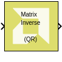
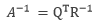

# QR Inverse

Compute the inverse of a matrix using QR factorization

## Library

Math Functions / Matrices and Linear Algebra

## Description

The QR Inverse block provides the inverse of the input matrix A by
performing QR factorization.

Q is an orthogonal matrix and R is an upper triangular square matrix.
For singular matrix input the output would contain NaN or +inf/-inf.

## Data Type Support

Data type support is:

- Dimension: Input has to be a square matrix. Scalar and vector inputs
  are not supported.
- Data Types: Input supports signals of floating point data types
  (double, single, and half ). It does not support integer, boolean, and
  fixed-point data types.
- Complex Numbers: Complex numbers are not supported.

The output has the same dimension and data type as the input.

## Parameters

The QR Inverse block has no parameters to set.
