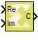

# Real-Imag to Complex

Computes the complex output from real and imaginary input.

## Library

Math Functions / Math Operations

## Description

The Real-Imag to Complex block converts the real and imaginary inputs to
a complex-valued output signal. The input signal can be of any data type
except boolean. The complex output has the same data type as that of the
block input. The input can be a scalar, 1-D vector, or matrix of real
signals. It is possible to specify the constant real or imaginary part
from the block dialog.

## Data Type Support

Data type support for the input port is as follows.

- The block supports all data types except boolean. If the 'Input' is
  'Real and Imag', both the inputs must have the same data type.
  Otherwise, 'Real part' or 'Imag part' parameter is converted to the
  same data type as that of the block input.
- Real and imaginary parts specified using inputs or block dialog must
  be real.
- The input can be a scalar, 1-D vector, or matrix.
- The output is always complex, and has the same data type as that of
  the input.
- Dimensions:
  - The output has the same dimensions as that of the input when both
    real and imaginary parts have the same dimensions.
  - The block supports mixed dimensions for real and imaginary inputs
    (specified as inputs or using block dialog). Any scalar input is
    expanded to the dimensions of non-scalar input, and the block has
    the same dimensions as those of the non-scalar input. If both the
    inputs are non-scalar, they must agree on dimensions.

## Parameters

#### Input  
Input is a drop down menu parameter which specifies whether real,
imaginary, or both of the parts of the output signal are specified as
inputs.
##### Settings  
Following are settings for the Input parameter.

###### Real and imag
Real and imaginary parts of the output signal are specified using Re and Im inputs of the block, respectively.

###### Real
The block has only Re input in this case. Real part of the output signal is specified using the Re input of the block, while its imaginary part is specified using the Imag part parameter.

###### Imag
The block has only Im input in this case. Imaginary part of the output signal is specified using the Im input of the block, while its real part is specified using the Real part parameter.

#### Real part  
Specify the constant real part of the output signal when Input is set to
Imag. This parameter is visible only when you set Input to Imag.

##### 0
The value of the Real part parameter must be a numeric, real-valued scalar, vector, or matrix.

#### Imag part  
Specify the constant imaginary part of the output signal when Input is
set to Real. This parameter is visible only when you set Input to Real.

##### 0
The value of the Imag part parameter must be a numeric, real-valued scalar, vector, or matrix.

--------------
Copyright (C) 2023 Advanced Micro Devices, Inc. All rights reserved.
SPDX-License-Identifier: MIT
