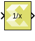

# Reciprocal

Element-wise computation of the reciprocal for a given argument

## Library

Math Functions / Math Operations

## Description

The Reciprocal block returns the output of the function inv(`x`) for
each element in array `x`. The block supports input of all data types
except Boolean. The input can be scalar, vector or matrix.

## Data Type Support

Data types accepted at the inputs of the block:

- Dimension: Input can be scalar, vector, or matrix.

- Data Types:  Input supports signals of integer, fixed-point, and
  floating-point data type. The block does not support Boolean inputs.

- Complex Number Support: No

  The output has the same dimension and type as the input.

## Parameters

The Reciprocal block has no parameters to set.
