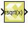
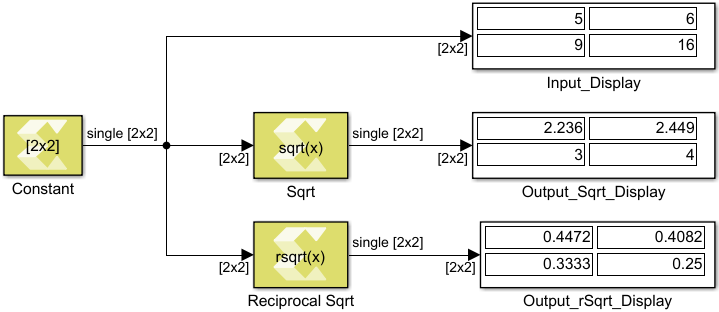

# Reciprocal Sqrt

Element-wise computation of the reciprocal square root for a given
argument

## Library

Math Functions / Math Operations

## Description

The Reciprocal Sqrt block returns the reciprocal square root for each
element in an array. The block supports input of all data types except
Boolean. The input can be a scalar, vector or a matrix.

## Data Type Support

Data type support is:

- Dimension: Input can be scalar, vector or matrix.
- Data Types: Input supports signals of integer, fixed-point, and
  floating point data type. It does not support Boolean inputs.
- Complex Numbers: Complex numbers are not supported.

The output has the same dimension and data type as the input.

## Parameters

The Reciprocal Square root block has no parameters to set.

--------------
Copyright (C) 2024 Advanced Micro Devices, Inc.
All rights reserved.
