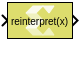

# Reinterpret

Element-wise reinterpretation of the input type into a compatible output
type with the same bit width.

## Library

Signal Attributes

## Description

The Reinterpret block provides a mechanism for interpreting a value from
a different data type. You can specify the output data type with the
restriction that the bit widths of input and output data types must
match.

In the above example, the input is of fixed-point signed number
(x_sfix8_En2) represented with 8 bits, in which 2 bits are used for the
fractional part (i.e., -4 = 1111 00.00). The Reinterpret block
interprets the input type to unsigned fixed-point number (x_ufix8),
represented with 8 bits as that of input, and no bits are used for the
fractional part. The output becomes 240 (1111 0000).

## Data Type Support

The data types of the input can be any integer, Boolean, fixed-point, or
floating-point data type. The input can be any real or complex valued
signal. If the input is real, the output is real. If the input is
complex, the output is complex. The block supports scalar, vector, or
matrix data.

Following are the supported output data types.

| Input Data Type | Supported Output Data Type                                                                                       |
|-----------------|------------------------------------------------------------------------------------------------------------------|
| double          | double, 64 bit fixed-point data                                                                                  |
| single          | single, int32, uint32, 32 bit fixed-point data                                                                   |
| int8            | int8, uint8, 8 bit fixed-point data                                                                              |
| uint8           | uint8, int8, 8 bit fixed-point data                                                                              |
| int16           | int16, uint16, half, 16 bit fixed-point data                                                                     |
| int16           | uint16, int16, half, 16 bit fixed-point data                                                                     |
| uint16          | int32, uint32, single, 32 bit fixed-point data                                                                   |
| int32           | int32, uint32, single, 32 bit fixed-point data                                                                   |
| uint32          | uint32, int32, single, 32 bit fixed-point data                                                                   |
| bool            | bool, 1 bit fixed-point data                                                                                     |
| fixed           | Same bit width fixed-point data with different fractional widths, all native data types if the bit width matches |
| half            | half, int16, uint16, 16 bit fixed-point data type                                                                |

## Parameters

#### Output data type

This parameter specifies the output data type for reinterpreting the
input data. If fixed is specified more parameters are available.

Following are the settings for the Output data type parameter.

##### double
Double precision floating point

##### single
Single precision floating point

##### int8
8-bit signed integer

##### uint8
8-bit unsigned integer

##### int16
16-bit signed integer

##### uint16
16-bit unsigned integer

##### int32
32-bit signed integer

##### uint32
32-bit unsigned integer

##### boolean
Boolean

##### fixed
Fixed-point

##### half
Half precision floating-point

##### data type expression
A string that specifies the output data type. See Working with Data Type Expression in the Vitis Model Composer User Guide ([UG1483](https://docs.xilinx.com/access/sources/dita/map?Doc_Version=2022.2%20English&url=ug1483-model-composer-sys-gen-user-guide)). 

--------------
Copyright (C) 2024 Advanced Micro Devices, Inc.
All rights reserved.

SPDX-License-Identifier: MIT
