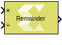
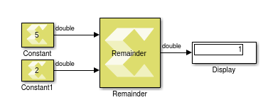

# Remainder

Perform element-wise division on the input signal. The output is the
remainder after the division.

## Library

Math Functions / Math Operations

## Description

The remainder block takes two inputs. The dividend is the top input and
the divisor is the bottom input. The block supports scalar, vector and
matrix dimensions. The dimensions of the inputs must match unless one
input is a scalar. The output has the larger dimension of the two
inputs. The block can handle division by 0 and produces NaN as the
output only for floating-point data types double and single.

## Data Type Support

The Remainder block supports all MATLAB native data types, half
precision floating-point data type, and fixed-point. The block operates
on real type inputs where it requires both inputs to have the same type
of data.

## Parameters

The Remainder block has no parameters to set.

--------------
Copyright (C) 2023 Advanced Micro Devices, Inc. All rights reserved.
SPDX-License-Identifier: MIT
