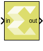

# Reshape Row-Major

Changes the input dimensions in row-major order.

## Library

Math Functions/Math Operations

## Description

The Reshape Row-Major block changes the input dimensions based on the
specified Output dimensionality parameter. The output contains elements
of the input in row-major order, that is the first row of the input
matrix followed by the second row, and so on.

## Data Type Support

- The block supports floating point, integer, boolean, and fixed-point
  data types.
- The block supports real and complex valued inputs.
- The input can be a scalar, 1-D vector, or matrix.
- The output has the same data type as the input.

## Parameters

Output dimensionality  
This parameter specifies how the input should be reshaped. The settings
for Output dimensionality are as follows:

| Choices                          | Description                                                                                                                                                                                                                                                                                                                                                                                                          |
|----------------------------------|----------------------------------------------------------------------------------------------------------------------------------------------------------------------------------------------------------------------------------------------------------------------------------------------------------------------------------------------------------------------------------------------------------------------|
| 1-D array                        | Converts the input to a 1-D vector. For a matrix input, the output consists of input matrix elements in row-major order.                                                                                                                                                                                                                                                                                             |
| Column vector                    | Converts the input to a M x 1 matrix, where M is the number of elements in the input signal. For a matrix input, the output consists of input matrix elements in row-major order.                                                                                                                                                                                                                                    |
| Row vector                       | Converts the input to a 1 x N matrix, where N is the number of elements in the input signal. For a matrix input, the output consists of input matrix elements in row-major order.                                                                                                                                                                                                                                    |
| Custom                           | Converts the input to an output which has dimensions specified by the user using the Output dimensions parameter. The conversion is done in row-major order. The value of the Output dimensions parameter must be a two-element vector. For example, a value of `[M N]` outputs an M x N matrix. The number of elements of the input must match the number of elements specified by the Output dimensions parameter. |
| Derive from reference input port | Creates a second input port on the block and derives the dimensions of the output from the dimensions of the second input port. Selecting this option disables the Output dimensions parameter. Both the inputs to the block must have the same number of elements.                                                                                                                                                  |

Table 1. Output Dimensionality Parameter Settings

Output dimensions  
Specify Output dimensions when Output dimensionality is set to Custom.
The settings for Output dimensions are as follows:

| Choices  | Description                                                                |
|----------|----------------------------------------------------------------------------|
| \[1, 1\] | The value of the Output dimensions parameter must be a two-element vector. |

Table 2. Output Dimensions Parameter Settings
