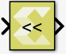
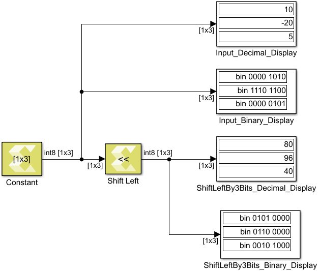

# Shift Left

Perform logical shift left of input over a constant number of bit
positions specified by a non-negative integer parameter

## Library

Logic and Bit Operations

## Description

The shift left block computes element-wise left shift of the input by a
constant amount specified via a parameter. This is also known as a
logical shift left. The shift amount specifies over how many bit
positions bits are shifted. This shift amount must be a non-negative
integer. The default value is 0. The output is of the same type,
dimension, and numeric type (real or complex) as the input. The input
type must be integral or fixed-point.

Figure: Shift Left Block

## Data Type Support

- Input: integer, fixed-point, but not logical or floating point.
- Output: output data type is the same as input data type.

## Parameters

Shift by

This parameter specifies the number of bit positions over which the
shift takes place.

Enter a scalar real non-negative integer for the Shift by parameter.
